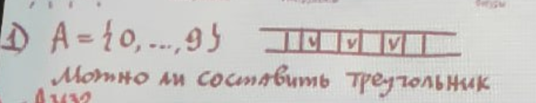
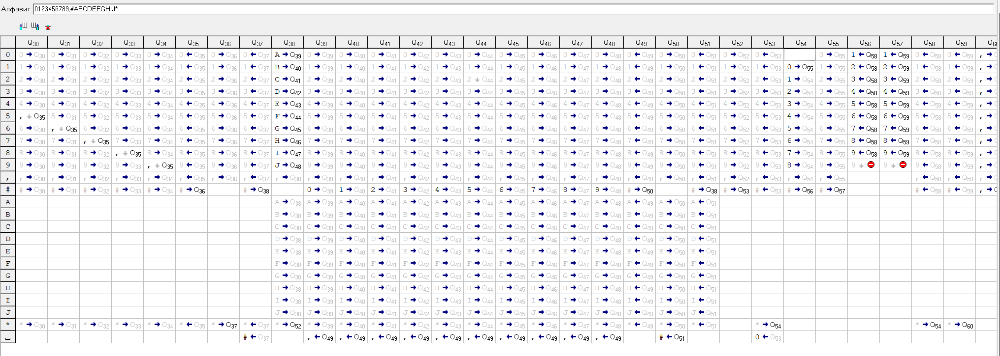
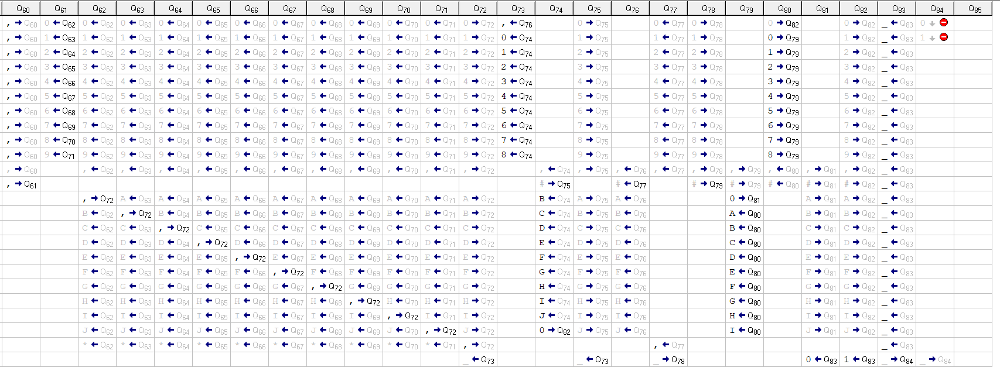

<div align="center">

# Федеральное агентство связи

**ФЕДЕРАЛЬНОЕ ГОСУДАРСТВЕННОЕ БЮДЖЕТНОЕ  
ОБРАЗОВАТЕЛЬНОЕ УЧРЕЖДЕНИЕ ВЫСШЕГО ОБРАЗОВАНИЯ**

**«САНКТ-ПЕТЕРБУРГСКИЙ ГОСУДАРСТВЕННЫЙ УНИВЕРСИТЕТ  
ТЕЛЕКОММУНИКАЦИЙ ИМ. ПРОФ. М. А. БОНЧ-БРУЕВИЧА» (СПбГУТ)**

</div>

<div align="center">
Факультет информационных технологий и программной инженерии  
Кафедра: Программная инженерия. Разработка программного обеспечения и приложений искусственного интеллекта в киберфизических системах  
<br><br>

## Дополнительная работа

по дисциплине **«Математическая логика и теория алгоритмов»**

## **Тема:** Решение задач с помощью Машины Тьюринга

</div>

<div align="right"><br>

**Выполнил:**  
Студент группы ИКПИ-42  
Терещенко М. А.

</div>
<br>
<div align="center">
<br><br>
Санкт-Петербург  
2025  
</div>

## Условие задачи



Построить машину Тьюринга, которая по входу вида «a _ b _ c» (где a, b, c - положительные десятичные цифры, \* - пустая клетка) определяет, можно ли из длин a, b, c составить треугольник (т.е. выполняются ли строгие неравенства треугольника a + b > c, a + c > b, b + c > a).
На выходе машина должна записать 1 (да) или 0 (нет) и остановиться.

## Скриншот решения (эмулятор)





## Мои комментарии к коду

> Инкремент - операция прибавления 1 к числу. Например x = x + 1 - инкремент  
> Декремент - операция вычитания 1 из числа. Например x = x - 1 - декремент  
> ABCDEFGHIJ - специальная замена цифр. То есть A = 0, B = 1 и так далее

```
q1 и q2 - постановка разделителей "," между цифрами и постановка "#"

q3 - вернуться на первый символ слова

q4 помечает символ скопированным, заменяя его на букву, эквивалентную цифре
q5 - q14 запоминает, какую цифру мы тащим в конец
q15 ставит запятую

q16 и q17 удаляют последнюю запятую, заменяя её на *

q18 возвращает каретку в начало слова, поставив перед словом счётчик, который поможет найти максимум

q19 - декремент, который идёт до #

q20 - вернуться в начало слова и инкрементировать счётчик

q19 q21 q22 декрементируют числа (буквы). Параллельно меняя все "A" на "_"
Как только встречается _ - меняется состояние, это помогает считать кол-во _, которое встретилось. Как только на ленте 3 "_" - мы нашли максимум

q19 - как только встретили _ - перешли в q20 (кол-во _ = 1)
q21 - как только встретили _ - перешли в q21 (кол-во _ = 2)
q22 - как только встретили _ - (кол-во _ = 3) - найден максимум


q23 - возвращаемся к найденному максимуму
q24 - запоминаем значение нашего максимума с помощью состояний q25-q34
q35 - вернуться в символу #

q36 - идём до последнего символа (_)
q37 - ставим после него # и возвращаемся к началу слова
q38 - заменяем цифру на эквивалентную ей букву
q39-q48 - запоминаем замененную цифру и ставим её на место # справа
q49 - возвращаемся в начало слова
q50 - идём в конец слова, опять ставим # для дублирования следующего символа
q51 - возвращаемся в начало слова и дублируем ещё один символ
q52 - идём до решётки
q53 - ставим после решётки счётчик для поиска минимального значения и возвращаемся к *

q54 - декремент чисел. Как только встечаем # - q56; 0 - q55
q56 - увеличить счётчик + перейти в q58
q58 - вернуться к началу слова и снова перейти в q54 (декрементирование)
q55 - дойти до конца и в последний раз
q57 - прибавить 1 к счётчику в последний раз
q59 - дойти до начала слова
q60 - убрать все лишние цифры + дойти до минимального числа
q61 - в зависимости от цифры на счётчика переходи в состояние q62-71
q62-71 стираем символ, который на счётчике
q72 - возвращаемся к счётчику, стирая по пути лишние символы


Таким образом, мы отсортировали длины наших сторон слева направо от большего к меньшему

Если вдруг нужно сохранить исходные длины сторон, то именно здесь нужжно встроить блок, который перенесёт все цифры через ",", например, 5,3,4 а затем продублировать исходный ряд и выполнять дальнейшие операции

(**)
Сложение цифр между собой справа. Причём, если у нас получается число, то сразу выходим из программы, потому что любое число больше цифры. (по условию у нас даны цифры):

q73 - декремент счётчика. Если на счётчике 0, то заменяем его на запятую и финально идёт до #
q74 - инкремент большего числа. Если при сложении получаем двузначное число, то выходим из программы, т.к. (**). Если дошли до решётки - смени состояние
q75 - возвращаемся к счётчику, повторяем наши действия, пока счётчик не обнулился.
q76 - счётчик 0, поэтому в последний раз идём до #

й77 - стираем лишние символы _
q78 - возвращаемся к #

Теперь наша задача декрементировать левые и правые числа.
Если слева появится 0 раньше, чем справа - условие выполняется. То есть большая сторона треугольника меньше суммы оставшихся двух сторон.
Если справа 0 появится раньше, то условие существования треугольника не выполняется. Если 0 появился одновременно, то условие тоже не выполняется


q79 - двигаемся вправо. Если встретили букву - уменьшаем её и переходим в q80, которая отвечает за движение влево.
q80 - если встретили цифру - движение вправо (q79)
Если буква обнулилось, то переходим в q81
Если число, то в q82

число | буква
равно 0 | равно B --- треугольник существует
равно 1 | равно A --- треугольник не существует
равно 0 | равно 0 --- треугольник не существует

Так как мы начинаем с проверки справа, то, если буква обнулилась, то у нас в любом случае треугольник не существует. Проверять обнуление числа не следует

q81 - записать в конце слова 0
q82 - записать в конце слова 1

q83 - стереть всё кроме результата и вернуться
q84 - вернуться к ответу и выйти из программы

```

## Алгоритм решения

**Моё предложение (структурированный алгоритм):**

Вход: a _ b _ c (\_ = пустая клетка).

1. **Дублирование входа**
   Сделать копию входа справа, разделив маркером #.
   Лента становится: `a , b , c # a , b , c` (с разделителями для удобства).

2. **Сортировка (через поиск max/min и стирание)**
   Деструктивно найти максимум/минимум, отсортировать стороны по убыванию (большее слева).

3. **Сложение двух меньших**
   Сложить два меньших числа справа, получить сумму.

4. **Проверка неравенства (самое строгое: наибольшая < сумма остальных)**
   Параллельно декрементировать наибольшую сторону (слева) и сумму (справа).
   - Если левая обнулится раньше → сумма > max → треугольник возможен → 1.
   - Если правая раньше или одновременно → сумма ≤ max → треугольник невозможен → 0.

## Тесты программы

| №   | Входные данные (a _ b _ c) | Ожидаемый результат | Обоснование                                    | Результат выполнения |
| --- | -------------------------- | ------------------- | ---------------------------------------------- | -------------------- |
| 1   | 3 _ 4 _ 5                  | 1                   | 3+4>5, 3+5>4, 4+5>3 — классический треугольник | 1 ✅                 |
| 2   | 5 _ 5 _ 5                  | 1                   | Равносторонний, 5+5>5 (строго >) - да          | 1 ✅                 |
| 3   | 1 _ 1 _ 1                  | 1                   | Маленький равносторонний                       | 1 ✅                 |
| 4   | 2 _ 3 _ 6                  | 0                   | 2+3=5 <6 — вырожденный                         | 0 ✅                 |
| 5   | 1 _ 2 _ 3                  | 0                   | 1+2=3 ≤3 — не строгое >                        | 0 ✅                 |
| 6   | 6 _ 7 _ 8                  | 1                   | 6+7>8, 6+8>7, 7+8>6                            | 1 ✅                 |
| 7   | 1 _ 1 _ 2                  | 0                   | 1+1=2 ≤2                                       | 0 ✅                 |
| 8   | 9 _ 9 _ 9                  | 1                   | Равносторонний большой                         | 1 ✅                 |
| 9   | 4 _ 4 _ 8                  | 0                   | 4+4=8 ≤8                                       | 0 ✅                 |
| 10  | 2 _ 2 _ 1                  | 1                   | 2+2>1, 2+1>2, 2+1>2                            | 1 ✅                 |

## Вывод по работе

Машина Тьюринга успешно реализована и решает задачу проверки возможности построения треугольника по трём сторонам.
Использован подход с деструктивными операциями (декремент/инкремент), маркировкой символов буквами и вспомогательными маркерами (\*, #, ,).
Программа корректно обрабатывает все протестированные случаи
