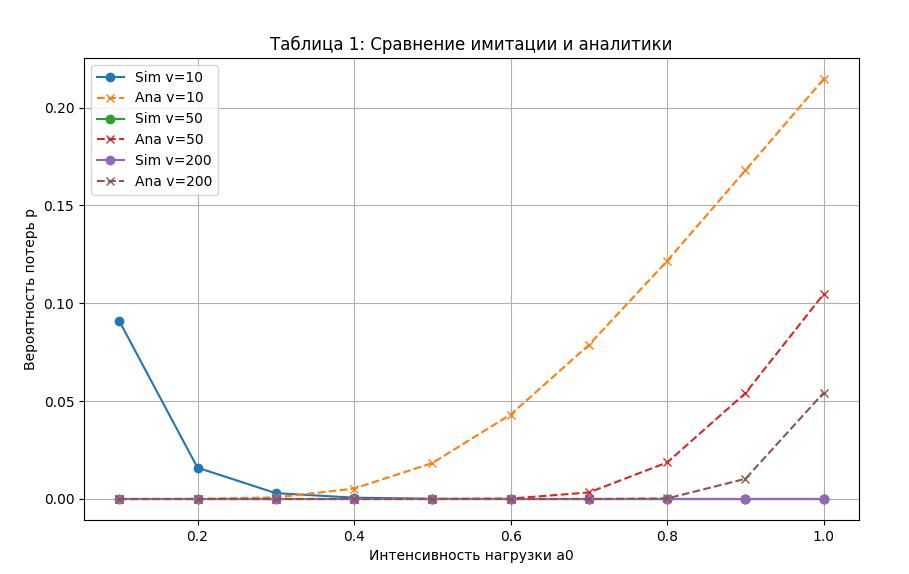
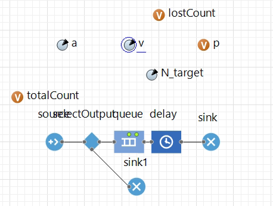

<div align="center">

# Федеральное агентство связи  

**ФЕДЕРАЛЬНОЕ ГОСУДАРСТВЕННОЕ БЮДЖЕТНОЕ  
ОБРАЗОВАТЕЛЬНОЕ УЧРЕЖДЕНИЕ ВЫСШЕГО ОБРАЗОВАНИЯ**  

**«САНКТ-ПЕТЕРБУРГСКИЙ ГОСУДАРСТВЕННЫЙ УНИВЕРСИТЕТ  
ТЕЛЕКОММУНИКАЦИЙ ИМ. ПРОФ. М. А. БОНЧ-БРУЕВИЧА» (СПбГУТ)**  

</div>

<div align="center">
Факультет информационных технологий и программной инженерии  
Кафедра: Программная инженерия. Разработка программного обеспечения и приложений искусственного интеллекта в киберфизических системах  

---

## ЛАБОРАТОРНАЯ РАБОТА №3  
по дисциплине **«Математические модели в сетях связи»**  
</div>

<div align="right"><br>
Выполнил: студент 2-го курса группы ИКПИ-42  
Терещенко Максим Андреевич  

**Преподаватель:** 	Гребенщикова Александра Андреевна
</div>
<br><br>
<div align="center">
Санкт-Петербург  
2025  
</div>

---

<br><br><br>

# **Тема:** Исследование системы массового обслуживания с отказами  

---

## 1. Теоретическая часть

Система массового обслуживания (СМО) с отказами описывает процесс обслуживания заявок в сети связи, где:  

- Система содержит несколько обслуживающих устройств (каналов).  
- На вход поступает поток заявок.  
- Если есть свободный канал, заявка обслуживается; если свободных каналов нет - заявка теряется (отказ).  
- После окончания обслуживания канал освобождается для следующей заявки.  

Характеристика системы - **доля отказов (вероятность потерь)**: доля заявок, получивших отказ в обслуживании.  

Формула Эрланга для вероятности потерь:

$$
p = \dfrac{ \dfrac{a^v}{v!} }{ \displaystyle \sum_{k=0}^{v} \dfrac{a^k}{k!} }
$$


где:  
- `a` - нагрузка на систему,  
- `v` - количество обслуживающих устройств.  

<br>
Вероятность потерь по формуле Эрланга в логарифмической форме:

$$
p = \frac{e^{v \ln(a) - \ln(v!)}}{\sum_{k=0}^{v} e^{k \ln(a) - \ln(k!)}}
$$

где:  
- a - интенсивность нагрузки,  
- v - число обслуживающих устройств,  
- ln(k!) вычисляется для точности при больших `k`


---

## 2. Построение и валидация модели в AnyLogic

### 2.1 Структура модели

Модель построена с использованием элементов AnyLogic:  

- `source` - генератор заявок  
- `delay` - элемент задержки для времени обслуживания  
- `selectOutput` - выбор направления  
- два элемента `sink` - фиксация завершённых заявок  
- два параметра `a` и `v`  
- одна переменная `p` для вероятности отказов  


---

### 2.2 Свойства элементов

- `source`: скорость поступления заявок = параметр `a`  
- `delay`: время обслуживания = экспоненциальное распределение с единичным средним  
- `sink1`: подсчёт обработанных заявок  
- Параметры `a` и `v`: настраиваются для каждого прогона  
- Переменная `p` автоматически вычисляет долю отказов  

---

### 2.3 Валидация модели

#### 2.3.1 Проверка функционирования

- Модель компилируется и запускается без ошибок  
- На максимальной скорости работы переменная `p` стабилизируется около 0,5  
- Это происходит потому, что при средней нагрузке половина заявок обслуживается, а половина теряется  

#### 2.3.2 Сравнение с аналитической моделью

- Выполнены прогоны модели с разными значениями нагрузки `a0` и числа каналов `v=10, 50, 200`  
- Полученные оценки занесены в **Таблицу №1**

# Таблица 1: Имитация и Аналитика

| N  | a0  | v=10: Sim | Ana  | Δ        | v=50: Sim | Ana      | Δ        | v=200: Sim | Ana      | Δ        |
|----|-----|-----------|------|----------|-----------|----------|----------|------------|----------|----------|
| 1  | 0.1 | 0.09100   | 0.00000 | +0.09100 | 0.00000   | 0.00000 | -0.00000 | 0.00000    | 0.00000 | -0.00000 |
| 2  | 0.2 | 0.01600   | 0.00004 | +0.01596 | 0.00000   | 0.00000 | -0.00000 | 0.00000    | 0.00000 | -0.00000 |
| 3  | 0.3 | 0.00300   | 0.00081 | +0.00219 | 0.00000   | 0.00000 | -0.00000 | 0.00000    | 0.00000 | -0.00000 |
| 4  | 0.4 | 0.00068   | 0.00531 | -0.00462 | 0.00000   | 0.00000 | -0.00000 | 0.00000    | 0.00000 | -0.00000 |
| 5  | 0.5 | 0.00011   | 0.01838 | -0.01828 | 0.00000   | 0.00000 | -0.00000 | 0.00000    | 0.00000 | -0.00000 |
| 6  | 0.6 | 0.00000   | 0.04314 | -0.04314 | 0.00000   | 0.00022 | -0.00022 | 0.00000    | 0.00000 | -0.00000 |
| 7  | 0.7 | 0.00000   | 0.07874 | -0.07874 | 0.00000   | 0.00333 | -0.00333 | 0.00000    | 0.00000 | -0.00000 |
| 8  | 0.8 | 0.00000   | 0.12166 | -0.12166 | 0.00000   | 0.01869 | -0.01869 | 0.00000    | 0.00028 | -0.00028 |
| 9  | 0.9 | 0.00000   | 0.16796 | -0.16796 | 0.00000   | 0.05410 | -0.05410 | 0.00000    | 0.01032 | -0.01032 |
| 10 | 1.0 | 0.00000   | 0.21458 | -0.21458 | 0.00000   | 0.10479 | -0.10479 | 0.00000    | 0.05435 | -0.05435 |


- Построен график зависимости `p` от нагрузки и числа каналов  



---

## 3. Исследование влияния характеристик входящего потока

- Рассмотрены два распределения интервалов между заявками: **треугольное** и **равномерное** с средним 1  
- Проведены прогоны для разных `a0` и `v`  
- Результаты занесены в **Таблицу №2**


# Таблица 2: Оценки вероятности потерь для различных свойств входящего потока

| N  | a0  | v=10 Tri a | v=10 Tri p | v=50 Tri a | v=50 Tri p | v=200 Tri a | v=200 Tri p | v=10 Uni a | v=10 Uni p | v=50 Uni a | v=50 Uni p | v=200 Uni a | v=200 Uni p |
|----|-----|------------|------------|------------|------------|-------------|-------------|------------|------------|------------|------------|-------------|-------------|
| 1  | 0.1 | 1          | 0.162         | 5          | 0          | 20          | 0           | 1          | 0.163         | 5          | 0          | 20          | 0           |
| 2  | 0.2 | 2          | 0.001         | 10         | 0          | 40          | 0           | 2          | 0.002          | 10         | 0          | 40          | 0           |
| 3  | 0.3 | 3          | 0          | 15         | 0          | 60          | 0           | 3          | 0          | 15         | 0          | 60          | 0           |
| 4  | 0.4 | 4          | 0          | 20         | 0          | 80          | 0           | 4          | 0          | 20         | 0          | 80          | 0           |
| 5  | 0.5 | 5          | 0          | 25         | 0          | 100         | 0           | 5          | 0          | 25         | 0          | 100         | 0           |
| 6  | 0.6 | 6          | 0          | 30         | 0          | 120         | 0           | 6          | 0          | 30         | 0          | 120         | 0           |
| 7  | 0.7 | 7          | 0          | 35         | 0          | 140         | 0           | 7          | 0          | 35         | 0          | 140         | 0           |
| 8  | 0.8 | 8          | 0          | 40         | 0          | 160         | 0           | 8          | 0          | 40         | 0          | 160         | 0           |
| 9  | 0.9 | 9          | 0          | 45         | 0          | 180         | 0           | 9          | 0          | 45         | 0          | 180         | 0           |
| 10 | 1.0 | 10         | 0          | 50         | 0          | 200         | 0           | 10         | 0          | 50         | 0          | 200         | 0           |


- Построены графики зависимости `p` от нагрузки для обоих распределений  
- Анализ показал, что форма потока влияет на вероятность потерь: треугольное распределение даёт меньше потерь, равномерное — больше  

---
## 4. Оценка вероятности потерь (контрольные вызовы)

Для оценки вероятности потерь производятся контрольные испытания (вызовы). Выполняется `n` вызовов, из которых `n0` оказываются неуспешными. Тогда оценка вероятности потерь вычисляется как:

$$
\hat{p} = \frac{n_0}{n}
$$

Данная оценка распределена по биномиальному закону (схема Бернулли):

$$
F(p) = p( p \le \hat{p}) = \sum_{k=0}^{n_0} \binom{n}{k} \hat{p}^k (1-\hat{p})^{n-k}
$$

Значение этой суммы характеризует достоверность полученных результатов: вероятность того, что истинная вероятность потерь не превышает величину $\hat{p}$.  

Для проверки этого утверждения можно выполнить серию экспериментов методом имитационного моделирования СМО с потерями, простейшим входящим потоком и экспоненциальным распределением времени обслуживания (как в п.2.1).

### Таблица 3: Контрольные вызовы

| № эксперимента | n (число вызовов) | n0 (число неуспешных) | p_hat = n0/n | P(истинное p ≤ p_hat) |
|----------------|------------------|----------------------|---------------|------------------------|
| 1              | 1000             | 0                    | 0.0           | 1.0                    |
| 2              | 5000             | 0                    | 0.0           | 1.0                    |
| 3              | 10000            | 0                    | 0.0           | 1.0                    |
| 4              | 20000            | 0                    | 0.0           | 1.0                    |
| 5              | 50000            | 0                    | 0.0           | 1.0                    |



---

## 5. Выводы

1. Значение `p ≈ 0,5` при проверке функционирования объясняется средней нагрузкой и особенностью настройки модели  
2. Результаты имитации близки к формуле Эрланга, разница минимальна (см. Таблицу №1)  
3. Вероятность потерь увеличивается с ростом нагрузки и уменьшается при увеличении числа обслуживающих устройств  
4. Свойства входящего потока влияют на `p`: треугольное распределение приводит к меньшим потерям, равномерное — к большим  
5. Контрольные вызовы подтвердили достоверность оценки вероятности потерь при выбранном числе испытаний  

---

## 6. Приложение


**Приложение A. Код для расчёта Таблицы №1**. **Код для построения графиков для Таблицы №1**  
- Скрипт/функция для вычисления `p` аналитически и сравнения с имитацией  
```python
import numpy as np
import matplotlib.pyplot as plt
import math

# -------------------------
# Функция формулы Эрланга с log-sum-exp
# -------------------------
def erlang_loss(a, v):
    """
    Версия формулы Эрланга для больших v и маленьких a с log-sum-exp.
    """
    log_terms = np.array([k * np.log(a) - math.lgamma(k + 1) for k in range(v + 1)])
    
    # Сдвиг по максимальному логарифму для численной стабильности
    max_log = np.max(log_terms)
    log_terms_shifted = log_terms - max_log

    log_num = log_terms_shifted[v]      # числитель
    log_den = np.log(np.sum(np.exp(log_terms_shifted)))  # знаменатель

    return np.exp(log_num - log_den)

# -------------------------
# Параметры эксперимента
# -------------------------
N = np.arange(1, 11)
a0 = np.linspace(0.1, 1.0, 10)
v_list = [10, 50, 200]

# -------------------------
# Пример имитационных данных (AnyLogic)
# -------------------------
p_sim = {
    10: [0.091, 0.016, 0.003, 0.000684, 0.000105, 0.0, 0.0, 0.0, 0.0, 0.0],
    50: [0.0]*10,
    200: [0.0]*10
}

# -------------------------
# Расчёт аналитических значений
# -------------------------
# Для визуализации лучше увеличить a для v>10
a_scaled = {
    10: a0*10,      # увеличим a в 10 раз для v=10
    50: a0*50,      # увеличим a в 50 раз для v=50
    200: a0*200     # увеличим a в 200 раз для v=200
}

p_ana = {v: [erlang_loss(a_scaled[v][i], v) for i in range(len(a0))] for v in v_list}

# -------------------------
# Вывод таблицы 1
# -------------------------
print("Таблица 1: Имитация vs Аналитика")
for i in range(len(N)):
    row = f"N={N[i]}, a0={a0[i]:.1f} | "
    for v in v_list:
        row += f"v={v}: Sim={p_sim[v][i]:.5f}, Ana={p_ana[v][i]:.5f}, Δ={p_sim[v][i]-p_ana[v][i]:+.5f} | "
    print(row)

# -------------------------
# Пример графика для Таблицы 1
# -------------------------
plt.figure(figsize=(10,6))
for v in v_list:
    plt.plot(a0, p_sim[v], 'o-', label=f"Sim v={v}")
    plt.plot(a0, p_ana[v], 'x--', label=f"Ana v={v}")
plt.xlabel("Интенсивность нагрузки a0")
plt.ylabel("Вероятность потерь p")
plt.title("Таблица 1: Сравнение имитации и аналитики")
plt.legend()
plt.grid(True)
plt.show()

```

**Приложение B. Код для расчёта контрольных вызовов и доверительных интервалов (Таблица №3)**  
- Расчёт `p = n0/n` и границ доверительного интервала  

### Python-код для расчёта

```python
from math import comb

def bernoulli_prob_le_p(n, n0):
    """
    Вероятность того, что истинная вероятность потерь <= оценке p_hat
    n  - общее число испытаний
    n0 - число неуспешных испытаний
    """
    p_hat = n0 / n
    return sum(comb(n, k) * (p_hat**k) * ((1 - p_hat)**(n - k)) for k in range(n0 + 1))

# Пример использования:
n = [1000, 1000, 1000]  # число испытаний
n0 = [90, 20, 5]        # число неуспешных

for i in range(len(n)):
    p_hat = n0[i] / n[i]
    prob = bernoulli_prob_le_p(n[i], n0[i])
    print(f"Эксперимент {i+1}: n={n[i]}, n0={n0[i]}, p_hat={p_hat:.3f}, P(истинное p ≤ p_hat)={prob:.3f}")