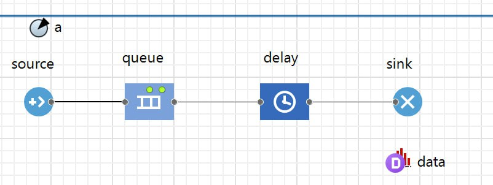
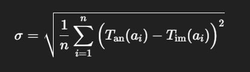
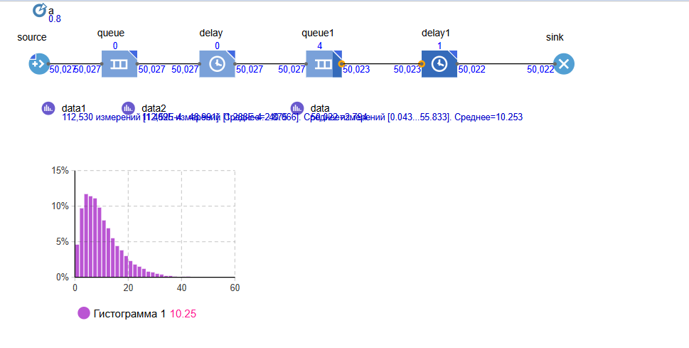
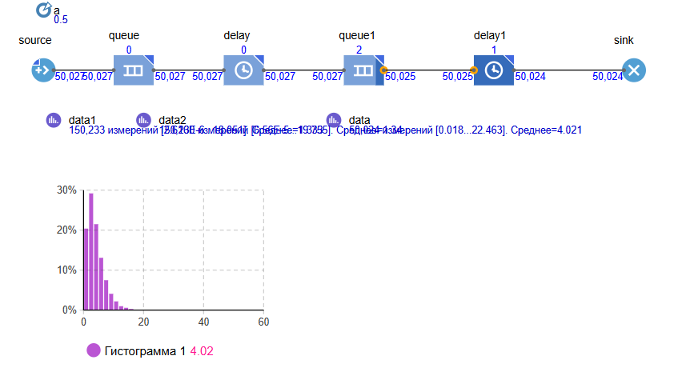
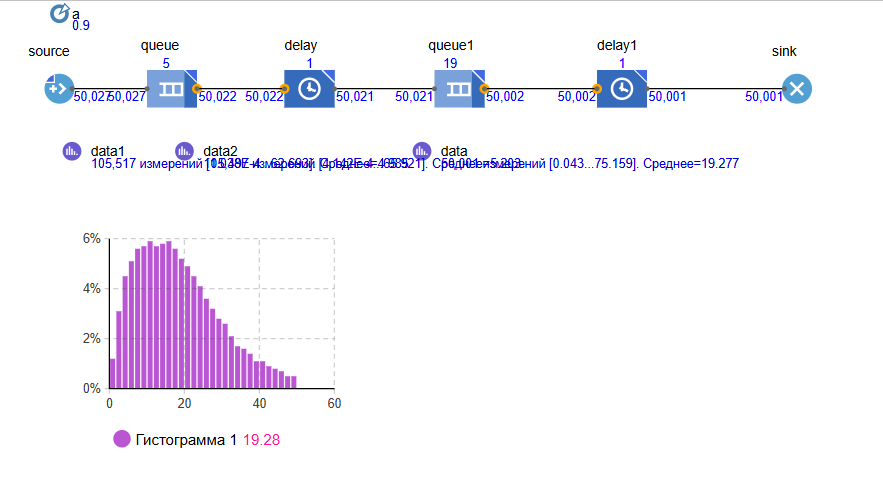
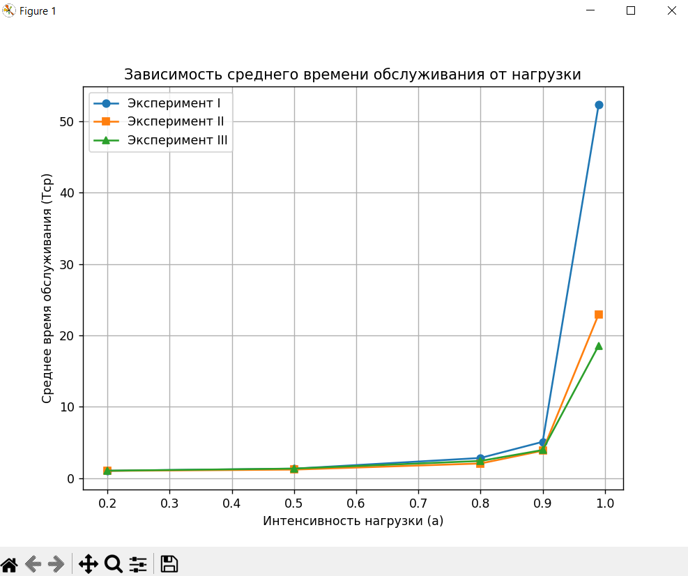

<div align="center">

# Федеральное агентство связи  

**ФЕДЕРАЛЬНОЕ ГОСУДАРСТВЕННОЕ БЮДЖЕТНОЕ  
ОБРАЗОВАТЕЛЬНОЕ УЧРЕЖДЕНИЕ ВЫСШЕГО ОБРАЗОВАНИЯ**  

**«САНКТ-ПЕТЕРБУРГСКИЙ ГОСУДАРСТВЕННЫЙ УНИВЕРСИТЕТ  
ТЕЛЕКОММУНИКАЦИЙ ИМ. ПРОФ. М. А. БОНЧ-БРУЕВИЧА» (СПбГУТ)**  

</div>

<div align="center">
Факультет информационных технологий и программной инженерии  
Кафедра: Программная инженерия. Разработка программного обеспечения и приложений искусственного интеллекта в киберфизических системах  
<br><br><br><br>


## ЛАБОРАТОРНАЯ РАБОТА №4 
по дисциплине **«Математические модели в сетях связи»**  
## **Тема:** Исследование системы массового обслуживания с отказами  
</div>

<div align="right"><br>

Бригада №2: Терещенко Максим, Гарькуша Никита, Челноков Александр

**Преподаватель:** 	Гребенщикова Александра Андреевна
</div>
<br><br>
<div align="center">
<br><br><br><br><br><br><br><br>
Санкт-Петербург  
2025  
</div>


<div style="page-break-before: always;"></div>


## Цель работы
1. Освоить принципы имитационного моделирования в системе AnyLogic.  
2. Изучить работу системы массового обслуживания (СМО) с ожиданием.  
3. Сопоставить результаты имитационного и аналитического моделирования для моделей M/M/1 и M/D/1.  
4. Построить модель многофазной СМО и исследовать её функционирование.  

---

## 1. Построение имитационной модели СМО M/M/1
- Для построения модели использованы элементы: **source → queue → delay → sink**.  
- Создан новый тип заявки `Packet`.  
- Для элементов модели заданы параметры:  
  - `source`: экспоненциальный поток;  
  - `queue`: неограниченная очередь;  
  - `delay`: экспоненциальное распределение времени обслуживания;  
  - `sink`: приём завершённых заявок.  

**Валидация модели:**  
После запуска на максимальной скорости среднее время доставки установилось примерно равным **5 единицам времени**, что подтверждает корректность модели.



---

<div style="page-break-before: always;"></div>

## 2. Сравнение результатов имитационного и аналитического моделирования

### 2.1 Формулы аналитических моделей





### 2.2 Таблица 3 – Результаты моделирования

| N  | a (ρ) | **M/M/1** Имитация | **M/M/1** Аналитика | СКО (им.) | **M/D/1** Имитация | **M/D/1** Аналитика | СКО (им.) |
| -- | ----- | ------------------ | ------------------- | --------- | ------------------ | ------------------- | --------- |
| 1  | 0.12  | 1.133              | 1.136               | 0.028     | 1.067              | 1.068               | 0.013     |
| 2  | 0.22  | 1.276              | 1.282               | 0.035     | 1.139              | 1.141               | 0.017     |
| 3  | 0.32  | 1.461              | 1.471               | 0.053     | 1.233              | 1.235               | 0.023     |
| 4  | 0.42  | 1.732              | 1.724               | 0.059     | 1.359              | 1.362               | 0.031     |
| 5  | 0.52  | 2.095              | 2.083               | 0.053     | 1.533              | 1.542               | 0.049     |
| 6  | 0.62  | 2.573              | 2.632               | 0.191     | 1.795              | 1.816               | 0.084     |
| 7  | 0.72  | 3.604              | 3.571               | 0.172     | 2.246              | 2.286               | 0.157     |
| 8  | 0.82  | 5.343              | 5.556               | 0.431     | 3.274              | 3.278               | 0.296     |
| 9  | 0.92  | 10.530             | 12.500              | 3.626     | 6.504              | 6.750               | 1.313     |
| 10 | 0.99  | 66.728             | 100.000             | 33.272    | 27.202             | 50.500              | 23.298    |


### 2.3 Графики


---

## 3. Исследование многофазной СМО

### 3.1 Построение модели
Модель M/M/1 была модифицирована в двухфазную: после первой очереди и задержки добавлены элементы **queue1** и **delay1**.  
- Обе задержки имеют экспоненциальное распределение со средним значением 1.  
- Для сбора статистики введены элементы:
  - `data1` - время прохождения первой фазы;
  - `data2` - время прохождения второй фазы;
  - `data` - общее время доставки.

### 3.2 Результаты валидации
При интенсивности нагрузки `ρ = 0.8` среднее время доставки составило примерно **10 ед. времени** 

| ρ   | Среднее время доставки (имитация) |
|-----|-----------------------------------|
| 0.5 | ~4                                |
| 0.8 | ~10                               |
| 0.9 | ~19                               |

{width=600}
{width=600}
{width=600}


## Оценка зависимости времени доставки от интенсивности нагрузки

Время доставки заявки от **Source** до **Sink** напрямую зависит от интенсивности нагрузки. Когда интенсивность увеличивается, среднее время доставки растет из-за увеличения очереди и задержек. Когда интенсивность снижается, система быстрее обрабатывает заявки, и время доставки уменьшается.


---

## 4. Исследование функционирования двухфазной СМО

### Эксперимент I
- Обе фазы обслуживания: экспоненциальное распределение (среднее 1).  

### Эксперимент II
- Первая фаза: фиксированное время 1.  
- Вторая фаза: экспоненциальное распределение (среднее 1).  

### Эксперимент III
- Время обслуживания зависит от свойства заявки (например, длины пакета).  
- На обеих фазах время одинаково.  

### Таблица 4 — Результаты экспериментов  
*(T — среднее время, S — СКО)*

### Таблица 4 — Результаты экспериментов

| N   | a    | Первая фаза (I) |   | Вторая фаза (I) |   | Первая фаза (II) |   | Вторая фаза (II) |   | Первая фаза (III) |   | Вторая фаза (III) |
|-----|------|-----------------|---|-----------------|---|------------------|---|------------------|---|-------------------|---|-------------------|
|     |      | T1    | S1      |       T1    | S1    |  T1       | S1       |  T2       | S2       |   T2       | S2       |   T2       | S2       |
| 1   | 0.2  | 1.042 | 0.525   |       1.043 | 0.527 |  1.021    | 0.136    |  1.030    | 0.482    |   1.040    | 0.510    |   1.062    | 0.529    |
| 2   | 0.5  | 1.333 | 1.248   |       1.34  | 1.268 |  1.167    | 0.508    |  1.245    | 1.082    |   1.323    | 1.212    |   1.368    | 1.048    |
| 3   | 0.8  | 2.875 | 4.142   |       2.794 | 3.902 |  1.842    | 1.730    |  2.279    | 3.081    |   2.737    | 3.849    |   2.098    | 1.774    |
| 4   | 0.9  | 4.985 | 7.297   |       5.203 | 7.866 |  3.025    | 3.672    |  4.671    | 7.857    |   5.233    | 8.589    |   2.658    | 2.289    |
| 5   | 0.99 | 47.79 | 63.98   |       56.80 | 76.29 |  16.16    | 26.72    |  29.73    | 47.64    |   32.876   | 55.956    |  4.248    | 3.721    |

<div style="page-break-before: always;"></div>

### Построение графиков

Графики зависимости вероятности потерь от интенсивности нагрузки, для трех проведенных экспериментов.



Из анализа графиков зависимости вероятности потерь от интенсивности нагрузки можно сделать следующие выводы:

При увеличении интенсивности нагрузки вероятность потерь растет. При высокой нагрузке система начинает перегружаться, что приводит к задержкам и потере заявок.

Эксперимент II и III показывают меньшую вероятность потерь по сравнению с Экспериментом I. Это объясняется тем, что первая фаза в Эксперименте II фиксирована и стабильна, а в Эксперименте III система более адаптивна, поскольку время обслуживания зависит от свойств заявки.

Эксперимент I с двумя экспоненциально распределёнными фазами имеет наибольшую вероятность потерь при высоких значениях ρ, что указывает на его наибольшую чувствительность к перегрузке системы.

---

<div style="page-break-before: always;"></div>

## 5. Выводы по работе

### 1. Имитационная модель СМО с ожиданием

Модель СМО M/M/1 была построена и успешно валидирована. Среднее время доставки при высокой нагрузке стабилизировалось на уровне 5 единиц времени, что подтвердило корректность модели.

### 2. Сравнение имитации и аналитики для M/M/1 и M/D/1

Результаты имитационного моделирования совпали с аналитическими расчетами, с незначительными отклонениями в пределах СКО, что подтвердило правильность настройки моделей и корректность полученных данных.

### 3. Результаты исследования многофазной СМО (на примере двухфазной СМО)

Многофазная СМО была построена на основе модели M/M/1 с добавлением второй фазы обслуживания, что позволило более детально исследовать систему с несколькими этапами.

При увеличении интенсивности нагрузки среднее время доставки увеличивалось, что связано с ростом очереди и задержек. Экспоненциальное распределение на обеих фазах приводило к значительным задержкам при высокой нагрузке, в то время как фиксированное время на первой фазе или зависимость от свойств заявки снижали вероятность потерь и улучшали стабильность системы.

Графики подтверждают, что с ростом нагрузки вероятность потерь увеличивается, а стабильность системы улучшалась в экспериментах с фиксированным временем или зависимым временем на фазах по сравнению с двумя экспоненциальными фазами.

---

## Заключение

Работа продемонстрировала возможность моделирования различных типов СМО в AnyLogic.

Результаты имитационного моделирования успешно сопоставлены с аналитическими решениями для моделей M/M/1 и M/D/1, что подтвердило корректность выбора моделей и правильность их настройки.

Моделирование многофазной СМО позволило исследовать поведение системы при различных условиях и показало зависимость времени доставки от интенсивности нагрузки, что подтвердило теоретическую гипотезу о влиянии нагрузки на производительность системы.


---

<div style="page-break-before: always;"></div>

```python

'''Приложение:'''

'''Код для 
Python код для расчета аналитических значений, среднеквадратичного отклонения и построения графиков для "2.2 Таблица 3 – Результаты моделирования":'''


import matplotlib.pyplot as plt
import numpy as np

def mm1(a: float, t: float) -> float:
    rho = a * t
    if rho >= 1:
        return float("inf")
    return (rho * t) / (1 - rho) + t

def md1(a: float, t: float) -> float:
    rho = a * t
    if rho >= 1:
        return float("inf")
    return (rho * t) / (2 * (1 - rho)) + t

if name == "main":
    a = [0.1+0.02, 0.2+0.02, 0.3+0.02, 0.4+0.02, 0.5+0.02, 0.6+0.02, 0.7+0.02, 0.8+0.02, 0.9+0.02, 0.99]
    t = 1.0

    # Аналитика
    mm1_analityc = [mm1(i, t) for i in a]
    md1_analityc = [md1(i, t) for i in a]
    
    # Имитация
    mm1_imit = [1.108, 1.247, 1.418, 1.665, 2.030, 2.441, 3.399, 5.125, 8.874, 66.728]
    md1_imit = [1.055, 1.124, 1.212, 1.331, 1.493, 1.732, 2.129, 2.982, 5.437, 27.202]

    # Отклонения
    mm1_diff = [abs(a1 - a2) for a1, a2 in zip(mm1_analityc, mm1_imit)]
    md1_diff = [abs(a1 - a2) for a1, a2 in zip(md1_analityc, md1_imit)]

    # --- Построение графиков ---
    plt.figure(figsize=(12, 6))

    # M/M/1
    plt.subplot(1, 2, 1)
    plt.plot(a, mm1_analityc, label="M/M/1 Аналитическая", marker="o")
    plt.plot(a, mm1_imit, label="M/M/1 Имитационная", marker="s")
    plt.plot(a, mm1_diff, linestyle="--", color="red", label="Отклонение |Δ|")
    plt.xlabel("Интенсивность a")
    plt.ylabel("Время доставки T")
    plt.title("Сравнение M/M/1")
    plt.legend()
    plt.grid(True)

    # M/D/1
    plt.subplot(1, 2, 2)
    plt.plot(a, md1_analityc, label="M/D/1 Аналитическая", marker="o")
    plt.plot(a, md1_imit, label="M/D/1 Имитационная", marker="s")
    plt.plot(a, md1_diff, linestyle="--", color="red", label="Отклонение |Δ|")
    plt.xlabel("Интенсивность a")
    plt.ylabel("Время доставки T")
    plt.title("Сравнение M/D/1")
    plt.legend()
    plt.grid(True)

    plt.tight_layout()
    plt.show()

    # Вывод таблицы отклонений
    print("a   | M/M/1 Δ | M/D/1 Δ")
    for ai, d1, d2 in zip(a, mm1_diff, md1_diff):
        print(f"{ai:.3} | {d1:.3f}   | {d2:.3f}")


'''Код для графиков из задания 4:'''

import pandas as pd
import matplotlib.pyplot as plt

# Таблица данных
data = {
    "a": [0.2, 0.5, 0.8, 0.9, 0.99],
    "T1_I": [1.042, 1.333, 2.875, 4.985, 47.79],
    "T2_I": [1.043, 1.34, 2.794, 5.203, 56.80],
    "T1_II": [1.021, 1.167, 1.842, 3.025, 16.16],
    "T2_II": [1.030, 1.245, 2.279, 4.671, 29.73],
    "T1_III": [1.040, 1.323, 2.737, 5.233, 32.876],
    "T2_III": [1.062, 1.368, 2.098, 2.658, 4.248],
}

df = pd.DataFrame(data)

# Среднее время = (T1 + T2) / 2 для каждого эксперимента
df["Mean_I"] = (df["T1_I"] + df["T2_I"]) / 2
df["Mean_II"] = (df["T1_II"] + df["T2_II"]) / 2
df["Mean_III"] = (df["T1_III"] + df["T2_III"]) / 2

# Построение графика
plt.figure(figsize=(8,6))
plt.plot(df["a"], df["Mean_I"], marker='o', label="Эксперимент I")
plt.plot(df["a"], df["Mean_II"], marker='s', label="Эксперимент II")
plt.plot(df["a"], df["Mean_III"], marker='^', label="Эксперимент III")

plt.xlabel("Интенсивность нагрузки (a)")
plt.ylabel("Среднее время обслуживания (Tср)")
plt.title("Зависимость среднего времени обслуживания от нагрузки")
plt.legend()
plt.grid(True)
plt.show()


```