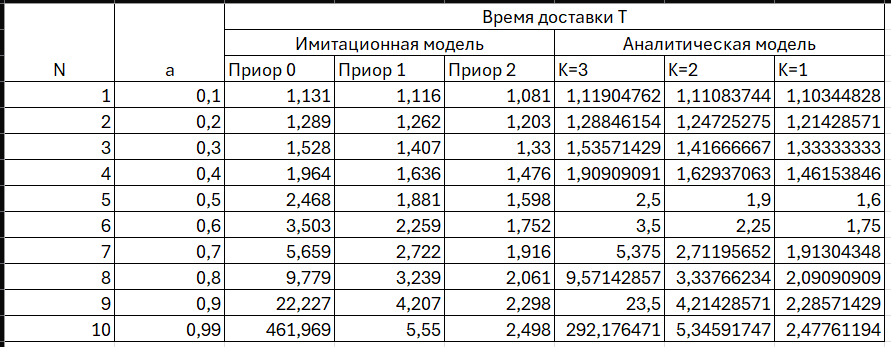
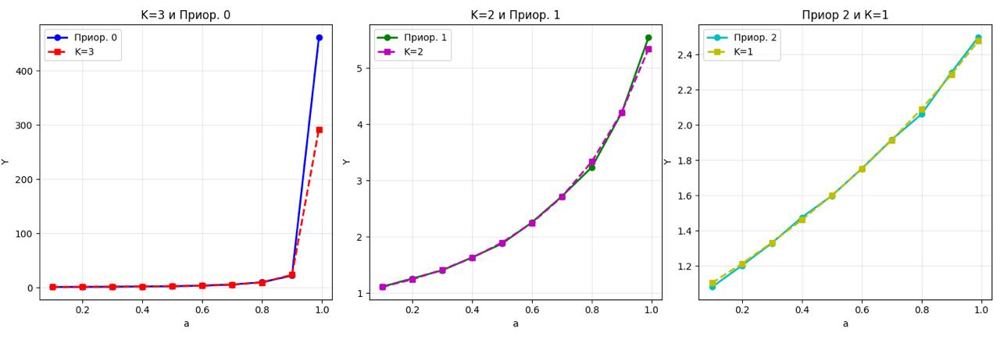
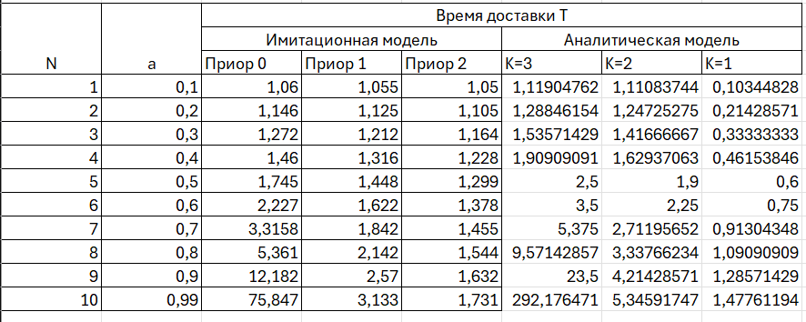
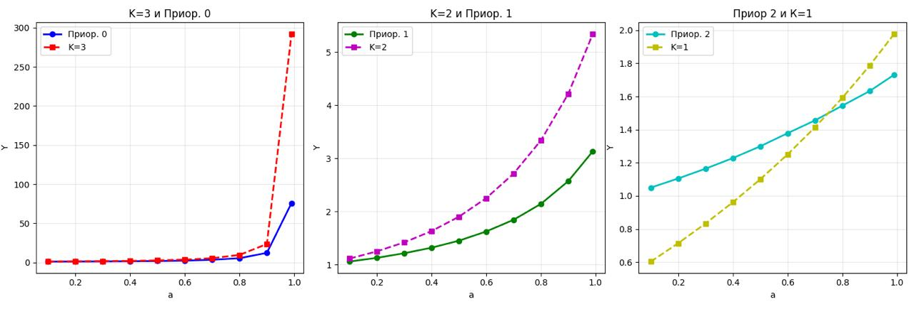

<div align="center">

# Федеральное агентство связи  

**ФЕДЕРАЛЬНОЕ ГОСУДАРСТВЕННОЕ БЮДЖЕТНОЕ  
ОБРАЗОВАТЕЛЬНОЕ УЧРЕЖДЕНИЕ ВЫСШЕГО ОБРАЗОВАНИЯ**  

**«САНКТ-ПЕТЕРБУРГСКИЙ ГОСУДАРСТВЕННЫЙ УНИВЕРСИТЕТ  
ТЕЛЕКОММУНИКАЦИЙ ИМ. ПРОФ. М. А. БОНЧ-БРУЕВИЧА» (СПбГУТ)**  

</div>

<div align="center">
Факультет информационных технологий и программной инженерии  
Кафедра: Программная инженерия. Разработка программного обеспечения и приложений искусственного интеллекта в киберфизических системах  
<br><br><br><br>


## ЛАБОРАТОРНАЯ РАБОТА №6
по дисциплине **«Математические модели в сетях связи»**  
## **Тема:** ИССЛЕДОВАНИЕ МОДЕЛИ СИСТЕМЫ МАССОВОГО ОБСЛУЖИВАНИЯ С ПРИОРИТЕТНЫМ ОБСЛУЖИВАНИЕМ
</div>

<div align="right"><br>

Бригада №2: Терещенко Максим, Гарькуша Никита, Челноков Александр

**Преподаватель:** 	Гребенщикова Александра Андреевна
</div>
<br>
<div align="center">
<br><br><br>
Санкт-Петербург  
2025  
</div>


<div style="page-break-before: always;"></div>


### 1. Система массового обслуживания с приоритетным обслуживанием
 
Цели данной работы:
1. Освоить систему имитационного моделирования.  
2. Изучить модели СМО с приоритетным обслуживанием.

---

### 2. Построение имитационной модели

#### 2.1. Построение структуры модели СМО M/M/1 в AnyLogic

Для построения модели используются элементы:
`source`, `delay`, `queue`, `sink`, `parameter`, четыре элемента *данные гистограммы*, гистограмма и слайдер.  


#### 2.2. Определение свойств элементов модели

Свойства элементов модели соответствуют требованиям СМО M/M/1 с приоритетным обслуживанием.

---

#### 2.3. Валидация модели

##### 2.3.1. Проверка функционирования
  
Интенсивность нагрузки: `a = 0.9 / 3` (три источника дают общую нагрузку 0.9).  
После запуска на максимальной скорости среднее время доставки:
- все заявки — ≈5 ед. вр.  
- приоритет 2 — 2.1 ед. вр.  
- приоритет 1 — 3.3 ед. вр.  
- приоритет 0 — 9.5 ед. вр.  


##### 2.3.2. Сравнение с аналитической моделью

Провести серию прогонов с разными значениями `a`.  
Результаты занести в таблицу 1.

**Аналитические формулы:**

\[
W_K = \frac{\sum_{i=1}^{K} \rho_i}{(1 - R_K)(1 - R_{K-1})}, \quad K=2,3
\]

\[
R_K = \sum_{i=1}^{K} \rho_i
\]

\[
R_{K-1} = \sum_{i=1}^{K-1} \rho_i
\]

\[
\rho_i = a_i = \frac{a}{\mu t}
\]

Для приоритета 1:

\[
W_1 = \frac{\sum_{i=1}^{M} \rho_i}{1 - \rho_1}
\]

\[
T_K = W_K + t
\]

---

<div style="page-break-before: always;"></div>

**Таблица 1 – Оценки времени доставки для различных интенсивностей (M/M/1):**






---

<div style="page-break-before: always;"></div>

### 3. Исследование СМО M/D/1 с приоритетным обслуживанием

Изменить свойства `delay` для перехода к M/D/1.  
Провести серию прогонов и занести результаты в таблицу 2.

**Аналитические формулы:**

\[
W_K = \frac{1 - \sum_{i=1}^{K} \rho_i (1 + (\sigma_i / t_i)^2)}{2(1 - R_K)(1 - R_{K-1})}, \quad K=2,3
\]

\[
R_K = \sum_{i=1}^{K} \rho_i
\]

\[
R_{K-1} = \sum_{i=1}^{K-1} \rho_i
\]

\[
\rho_i = a_i = \frac{a}{\mu t}
\]

Для приоритета 1:

\[
W_1 = \frac{1 - \sum_{i=1}^{M} \rho_i (1 + (\sigma_i / t_i)^2)}{2(1 - \rho_1)}
\]

\[
T_K = W_K + t
\]

---

<div style="page-break-before: always;"></div>




---

<div style="page-break-before: always;"></div>

### 4. Выводы по работе

- Для M/M/1 результаты имитации близки к аналитическим при невысокой нагрузке; при высоких нагрузках задержки низших приоритетов растут сильнее.

- Переход к M/D/1 показал меньшую дисперсию времени обслуживания и более стабильную работу системы.

- Имитационное моделирование наглядно демонстрирует влияние приоритетов и позволяет сравнивать результаты с аналитическими расчётами.

---

<div style="page-break-before: always;"></div>

```python
## Приложение
Код для аналитики таблицы 1
import numpy as np
import matplotlib.pyplot as plt

# Параметры системы
a_values = [0.1, 0.2, 0.3, 0.4, 0.5, 0.6, 0.7, 0.8, 0.9, 0.99]
M = 3
t_avg = 1  # среднее время обслуживания


results_W1 = []
results_W2 = []
results_W3 = []

for a in a_values:
    # Интенсивность нагрузки для каждого приоритета (равномерное распределение)
    a_i = a / M  # интенсивность поступления для каждого приоритета
    rho_i = a_i * t_avg  # ρ_i = a_i * t_avg
    
    # Вычисляем R_K = sum_{i=1}^K ρ_i
    R_0 = 0
    R_1 = rho_i  # для K=1
    R_2 = 2 * rho_i  # для K=2
    R_3 = 3 * rho_i  # для K=3
    
    # Числитель для всех формул: sum_{i=1}^M ρ_i * t_avg
    # Но t_avg = 1, поэтому sum_{i=1}^M ρ_i * 1 = sum_{i=1}^M ρ_i = R_3
    numerator = R_3
    
    # Для приоритета K=1 (высший приоритет)
    W_1 = numerator / (1 - R_1)
    results_W1.append(W_1)
    
    # Для приоритета K=2
    W_2 = numerator / ((1 - R_1) * (1 - R_2))
    results_W2.append(W_2)
    
    # Для приоритета K=3
    W_3 = numerator / ((1 - R_2) * (1 - R_3))
    results_W3.append(W_3)

for i in results_W3:
    print(i)


   Код для второй аналитика
# Версия с σ_i = 1
sigma_i = 1  # среднеквадратическое отклонение

results_W1_MD1_sigma1 = []
results_W2_MD1_sigma1 = []
results_W3_MD1_sigma1 = []
a_values = [0.1, 0.2, 0.3, 0.4, 0.5, 0.6, 0.7, 0.8, 0.9, 0.99]
for a in a_values:
    # Интенсивность нагрузки для каждого приоритета
    a_i = a / 3
    rho_i = a_i * 1
    
    # Вычисляем R_K
    R_1 = rho_i
    R_2 = 2 * rho_i
    R_3 = 3 * rho_i
    
    # Вычисляем сумму с учетом σ_i = 1
    sum_term = 0
    for i in range(3):
        sum_term += rho_i * 1 * (1 + (sigma_i / 1)**2)
    
    # Для приоритета K=1
    W_1 = sum_term / (1 - R_1)
    results_W1_MD1_sigma1.append(W_1)
    
    # Для приоритетов K=2,3 (M/D/1 формула с коэффициентом 1/2)
    W_2 = (1/2) * sum_term / ((1 - R_1) * (1 - R_2))
    results_W2_MD1_sigma1.append(W_2)
    
    W_3 = (1/2) * sum_term / ((1 - R_2) * (1 - R_3))
    results_W3_MD1_sigma1.append(W_3)

for i in results_W3_MD1_sigma1:
    print(i)


import matplotlib.pyplot as plt
import numpy as np

# Данные из таблицы
data = [
    [0.1, 1.131, 1.116, 1.081, 2.131, 2.116, 2.081],
    [0.2, 1.289, 1.262, 1.203, 2.289, 2.262, 2.203],
    [0.3, 1.528, 1.407, 1.33, 2.528, 2.407, 2.33],
    [0.4, 1.964, 1.636, 1.476, 2.964, 2.636, 2.476],
    [0.5, 2.468, 1.881, 1.598, 3.468, 2.881, 2.598],
    [0.6, 3.503, 2.259, 1.752, 4.503, 3.259, 2.752],
    [0.7, 5.659, 2.722, 1.916, 6.659, 3.722, 2.916],
    [0.8, 9.779, 3.239, 2.061, 10.779, 4.239, 3.061],
    [0.9, 22.227, 4.207, 2.298, 23.227, 5.207, 3.298],
    [0.99, 461.969, 5.55, 2.498, 462.969, 6.55, 3.498]
]

# Преобразуем в numpy массив для удобства
data = np.array(data)

# Извлекаем данные
x = data[:, 0]

# Создаем фигуру с тремя субплогами
fig, (ax1, ax2, ax3) = plt.subplots(1, 3, figsize=(18, 5))

# График 1: столбцы 2 и 5
ax1.plot(x, data[:, 1], 'b-o', label='Функция 1', linewidth=2, markersize=6)
ax1.plot(x, data[:, 4], 'r--s', label='Функция 2', linewidth=2, markersize=6)
ax1.set_xlabel('X')
ax1.set_ylabel('Y')
ax1.set_title('График 1: столбцы 2 и 5')
ax1.legend()
ax1.grid(True, alpha=0.3)

# График 2: столбцы 3 и 6
ax2.plot(x, data[:, 2], 'g-o', label='Функция 1', linewidth=2, markersize=6)
ax2.plot(x, data[:, 5], 'm--s', label='Функция 2', linewidth=2, markersize=6)
ax2.set_xlabel('X')
ax2.set_ylabel('Y')
ax2.set_title('График 2: столбцы 3 и 6')
ax2.legend()
ax2.grid(True, alpha=0.3)

# График 3: столбцы 4 и 7
ax3.plot(x, data[:, 3], 'c-o', label='Функция 1', linewidth=2, markersize=6)
ax3.plot(x, data[:, 6], 'y--s', label='Функция 2', linewidth=2, markersize=6)
ax3.set_xlabel('X')
ax3.set_ylabel('Y')
ax3.set_title('График 3: столбцы 4 и 7')
ax3.legend()
ax3.grid(True, alpha=0.3)

# Настраиваем внешний вид
plt.tight_layout()
plt.show()

# Дополнительно: все графики на одном рисунке для сравнения
plt.figure(figsize=(12, 8))

# График 1
plt.subplot(2, 2, 1)
plt.plot(x, data[:, 1], 'b-o', label='Функция 1', linewidth=2)
plt.plot(x, data[:, 4], 'r--s', label='Функция 2', linewidth=2)
plt.xlabel('X')
plt.ylabel('Y')
plt.title('График 1: столбцы 2 и 5')
plt.legend()
plt.grid(True, alpha=0.3)

# График 2
plt.subplot(2, 2, 2)
plt.plot(x, data[:, 2], 'g-o', label='Функция 1', linewidth=2)
plt.plot(x, data[:, 5], 'm--s', label='Функция 2', linewidth=2)
plt.xlabel('X')
plt.ylabel('Y')
plt.title('График 2: столбцы 3 и 6')
plt.legend()
plt.grid(True, alpha=0.3)

# График 3
plt.subplot(2, 2, 3)
plt.plot(x, data[:, 3], 'c-o', label='Функция 1', linewidth=2)
plt.plot(x, data[:, 6], 'y--s', label='Функция 2', linewidth=2)
plt.xlabel('X')
plt.ylabel('Y')
plt.title('График 3: столбцы 4 и 7')
plt.legend()
plt.grid(True, alpha=0.3)

plt.tight_layout()
plt.show() Код для графиков
```