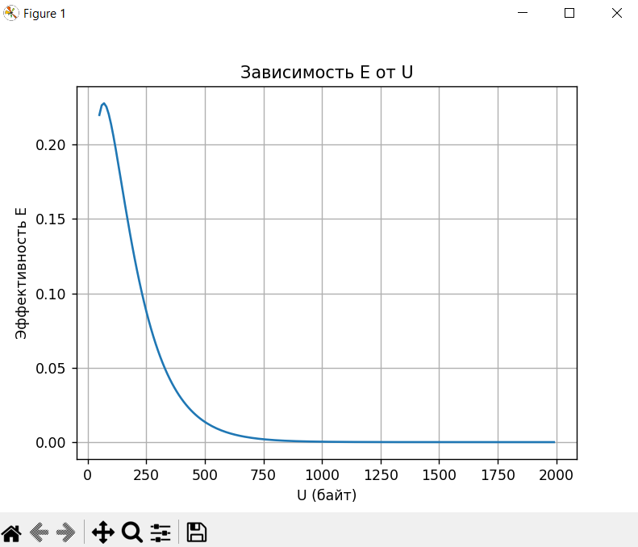
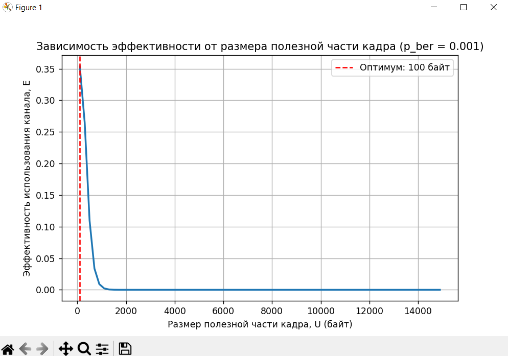

<div align="center">

# Федеральное агентство связи  

**ФЕДЕРАЛЬНОЕ ГОСУДАРСТВЕННОЕ БЮДЖЕТНОЕ  
ОБРАЗОВАТЕЛЬНОЕ УЧРЕЖДЕНИЕ ВЫСШЕГО ОБРАЗОВАНИЯ**  

**«САНКТ-ПЕТЕРБУРГСКИЙ ГОСУДАРСТВЕННЫЙ УНИВЕРСИТЕТ  
ТЕЛЕКОММУНИКАЦИЙ ИМ. ПРОФ. М. А. БОНЧ-БРУЕВИЧА» (СПбГУТ)**  

</div>

<div align="center">
Факультет информационных технологий и программной инженерии  
Кафедра: Программная инженерия. Разработка программного обеспечения и приложений искусственного интеллекта в киберфизических системах  
<br><br><br><br>


## ЛАБОРАТОРНАЯ РАБОТА №7
по дисциплине **«Математические модели в сетях связи»**  
## **Тема:** ИМИТАЦИОННОЕ МОДЕЛИРОВАНИЕ КАНАЛА ПЕРЕДАЧИ ДАННЫХ С ОШИБКАМИ  
</div>

<div align="right"><br>

Бригада №2: Терещенко Максим, Гарькуша Никита, Челноков Александр

**Преподаватель:** 	Гребенщикова Александра Андреевна
</div>
<br>
<div align="center">
<br><br><br>
Санкт-Петербург  
2025  
</div>

---


## Теоретическая справка

### 1. Цель работы и краткое описание проводимых исследований

\[
L = H + U
\]

**L** - общий размер
**U** - длина полезных данных 
**H** - длина заголовка


Канал считается **симплексным** (передача возможна только в одном направлении).  

В канале помимо кадров данных передаются служебные кадры — подтверждения успешной доставки (**ACK**) или запросы на повторную передачу (**NAK**).

---

### Алгоритм работы канала

1. Передатчик формирует поток кадров с интенсивностью **a** (простое пуассоновское распределение).  
2. В канале может произойти ошибка, вероятность ошибки одного бита — **p{ber}**. Ошибки независимы и равномерно распределены.  
3. При успешном приёме кадра приёмник отправляет подтверждение (**ACK**).  
4. При обнаружении ошибки отправляется запрос на повторную передачу (**NAK**).  
5. Передатчик передаёт следующий кадр только после получения подтверждения об успешной доставке предыдущего.  
6. В случае запроса на повтор передатчик повторяет передачу того же кадра.

---

### Эффективность использования канала

\[
E = \frac{U}{(L + l) \cdot k_{ср}  }
\]

где:  
- **U** — объём полезных данных (байт);  
- **L** — общий размер кадра данных (байт);  
- **l** — длина служебного кадра (байт);  
- **k** — среднее количество передач одного кадра.

---

### Вероятность успешной передачи кадра

Среднее количество передач одного кадра выражается как:

\[
k = \frac{1}{(1 - p_{ber})^L}
\]

---

### Итоговое выражение для эффективности

Зависимость эффективности использования канала:

\[
E = \frac{U (1 - p_{ber})^{8L}}{U + H + l}
\]


---

**Цель моделирования:**  
определить оптимальный размер полезной части кадра **U**, при котором достигается **максимальная эффективность** использования канала при заданных параметрах **H**, **l** и **p**_ber.


---

### 2. Результаты проверки функционирования модели  

### 2.1 Имитационная модель

Алгоритм работы модели реализован самостоятельно.  

!!! Для проверки установлен режим согласно рисунку 3 из методички.  

!!! 🖼️ *Вставьте скриншот структуры модели из AnyLogic сюда (аналогично рисунку 2)* 
!!! 🖼️ *Вставьте скриншот настроек запуска модели и результатов из AnyLogic сюда (аналогично рисунку 3)*

### 2.2 Аналитическая модель

## 2.2 Аналитическая модель

### Параметры

| Параметр      | Обозначение | Значение |
|---------------|------------|----------|
| Заголовок     | $H$        | 18 байт  |
| Служебный     | $l$        | 64 байт  |
| BER           | $p_{ber}$  | 0.001    |

### Формулы

$$
L = H + U
$$

$$
E = \frac{U}{(L + l) \cdot k}, \quad k = \frac{1}{(1 - p_{ber})^L}
$$

$$
E(U) = \frac{U (1 - p_{ber})^{8L}}{U + H + l}
$$

### Результаты

$$
U_{opt} = 70, E_{max} = 0.228
$$


!!! 

### 2.3 Сопоставление результатов имитации и аналитики

!!! Полученные результаты имитационного моделирования сравниваются с аналитическими расчетами по формулам (1)-(3) из методических указаний.  

---

### 3. Таблицы с результатами экспериментов

**Таблица 1 – Зависимость оптимального размера полезной части кадра от вероятности битовой ошибки**

| № | Вероятность битовой ошибки | Оптимальный размер полезных данных (байт) |
|---|-----------------------------|-------------------------------------------|
| 1 | 0.000001                   |                                        |
| 2 | 0.00001                    |                                        |
| 3 | 0.0001                     |                                        |
| 4 | 0.0005                     |                                        |
| 5 | 0.0007                     |                                        |
| 6 | 0.001                      |                                        |
| 7 | 0.002                      |                                        |
| 8 | 0.005                      |                                       |
| 9 | 0.01                       |                                      |
| 10 | 0.05                      |                                         |

---

### 4. График зависимости оптимального размера полезной части кадра от вероятности битовой ошибки  

По данным таблицы 1 построен график зависимости оптимального размера полезной части кадра от вероятности битовой ошибки.  
График аппроксимирован аналитической функцией (вид функции подобран самостоятельно).  

!!! 🖼️ *Вставьте сюда график зависимости (график зависимости оптимального размера полезной нагрузки от BER).*  

---

### 5. Выводы по полученным в работе результатам  

**По построению имитационной модели канала с ошибками:**  

!!! Здесь сформулировать выводы на основе результатов моделирования  

**По результатам имитационного и аналитического моделирования канала с ошибками, по сравнению полученных результатов:**  

!!! Здесь сформулировать выводы на основе сравнения имитации и аналитики 

**По результатам исследования оптимального размера полезной части кадра:**  

!!! Здесь сформулировать выводы на основе оптимизации и графика

---

### Приложение  

```python
import numpy as np
import matplotlib.pyplot as plt

H, l, p = 18, 64, 0.001
U = np.arange(50, 2000, 10)
L = H + U
E = U * (1-p)**(8*L) / (U + H + l)

plt.plot(U, E)
plt.xlabel('U (байт)')
plt.ylabel('E')
plt.grid()
plt.savefig('E_vs_U.png')
plt.show()

U_opt = U[np.argmax(E)]
print(f'U_opt = {U_opt}, E_max = {np.max(E):.3f}')


```