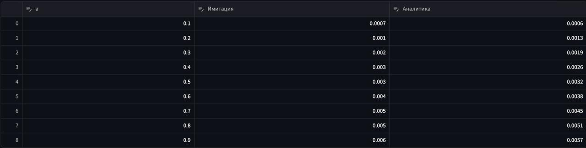
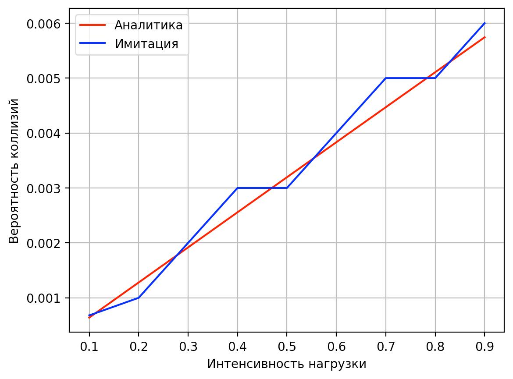
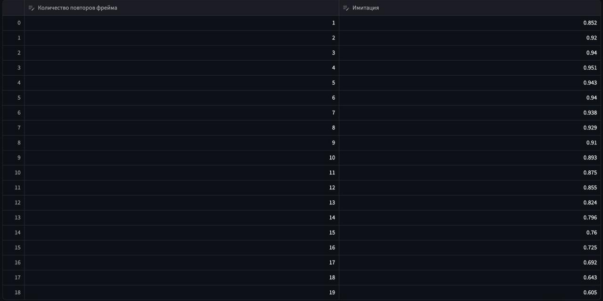
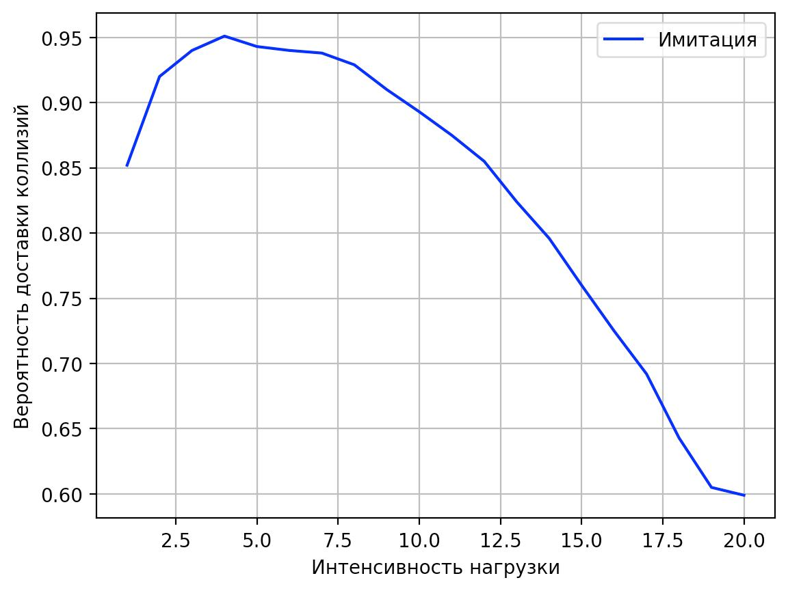
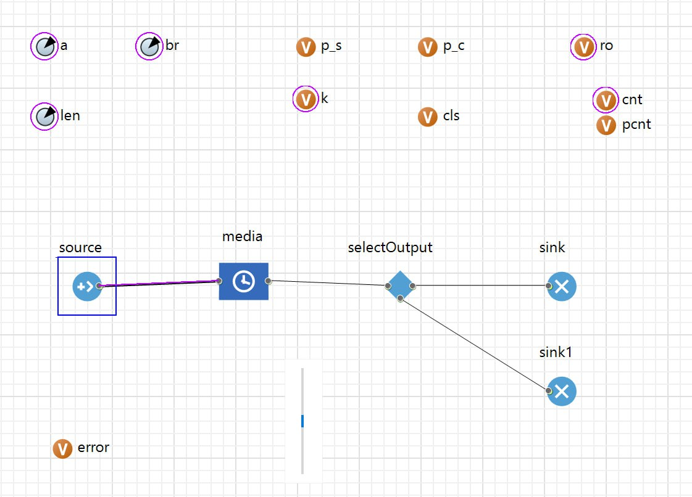

# Федеральное агентство связи  

**ФЕДЕРАЛЬНОЕ ГОСУДАРСТВЕННОЕ БЮДЖЕТНОЕ  
ОБРАЗОВАТЕЛЬНОЕ УЧРЕЖДЕНИЕ ВЫСШЕГО ОБРАЗОВАНИЯ**  

**«САНКТ-ПЕТЕРБУРГСКИЙ ГОСУДАРСТВЕННЫЙ УНИВЕРСИТЕТ  
ТЕЛЕКОММУНИКАЦИЙ ИМ. ПРОФ. М. А. БОНЧ-БРУЕВИЧА» (СПбГУТ)**  

Факультет информационных технологий и программной инженерии  
Кафедра: Программная инженерия. Разработка программного обеспечения и приложений искусственного интеллекта в киберфизических системах  
    

## ЛАБОРАТОРНАЯ РАБОТА №8
по дисциплине **«Математические модели в сетях связи»**  
## **Тема:** ИМИТАЦИОННОЕ МОДЕЛИРОВАНИЕ КАНАЛА ПЕРЕДАЧИ ДАННЫХ С КОЛЛИЗИЯМИ (МНОЖЕСТВЕННЫЙ ДОСТУП) 

 

Бригада №2: Терещенко Максим, Гарькуша Никита, Челноков Александр

**Преподаватель:** 	Гребенщикова Александра Андреевна

 

   
Санкт-Петербург  
2025  

## 1. Цель работы и краткое описание проводимых исследований

**Цель:**  
Исследование зависимости вероятности коллизий от нагрузки канала и определение оптимального количества повторных передач кадра для достижения максимальной вероятности доставки данных в условиях канала с множественным доступом без предотвращения коллизами.

**Задачи:**
1. Построить имитационную модель канала с коллизиями.
2. Проверить функционирование модели.
3. Исследовать зависимость \( p_c \) от нагрузки \( \rho \).
4. Исследовать влияние количества повторов на вероятность доставки.
5. Найти оптимальное количество повторов с помощью оптимизации.

---

## 2. Результаты проверки функционирования модели
  
Параметры: `a = 250`, `len = 100`, `br = 250000`  

 Время передачи кадра: \( \tau = \frac{len \times 8}{br} = \frac{8}{2500}\)   

---

## 3. Таблицы с результатами экспериментов

### Таблица 1 – Зависимость вероятности коллизий от интенсивности нагрузки

 **Аналитическая формула:**  
 \( p_c = 1 - e^{-2a\tau} \)

---

### Таблица 2 – Зависимость вероятности доставки кадра от количества повторов

a = 100

---

## 4. Выводы по полученным результатам

### 1. По построению имитационной модели канала с коллизиями
Была успешно построена имитационная модель канала передачи данных с коллизиями в условиях множественного доступа без предотвращения коллизий.  

Функционирование модели проверено на параметрах *(a = 250, len = 100, br = 250000)*, при которых время передачи кадра **τ = 0,0032 с**.

---

### 2. По результатам имитационного и аналитического моделирования
Результаты имитационного моделирования близки к аналитическим значениям, рассчитанным по формуле:

\[
p_c = 1 - e^{-2a\tau}
\]

На графике зависимости вероятности коллизий от интенсивности нагрузки наблюдается небольшое отклонение:  
имитационные значения немного ниже аналитических

---

### 3. По результатам определения оптимального количества повторов кадра
Оптимальное количество повторов **k = 10–12**, при котором вероятность доставки достигает максимума около **0,916**.  

Дальнейшее увеличение *k* не приводит к заметному росту вероятности доставки (наблюдается **плато**),  
но увеличивает:
- **задержки передачи**;
- **нагрузку на канал**.  

Это делает дополнительные повторы **неэффективными**

---

# Приложение

