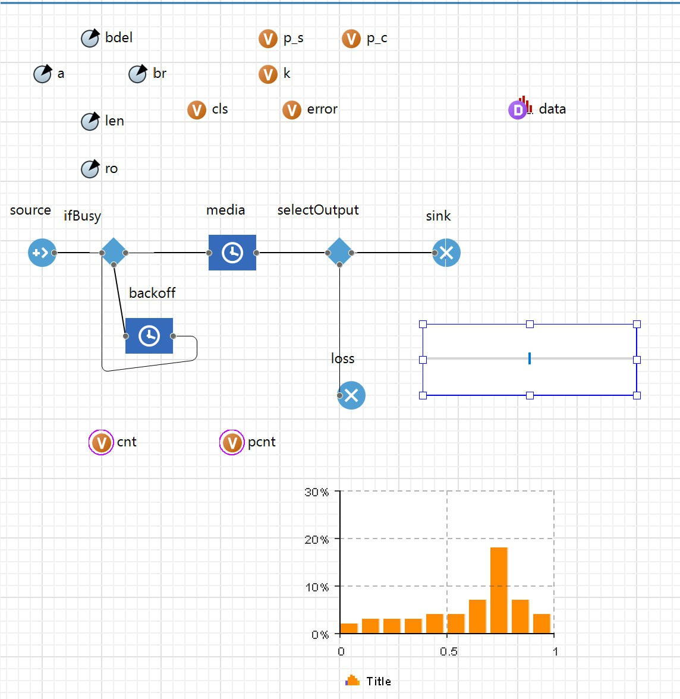
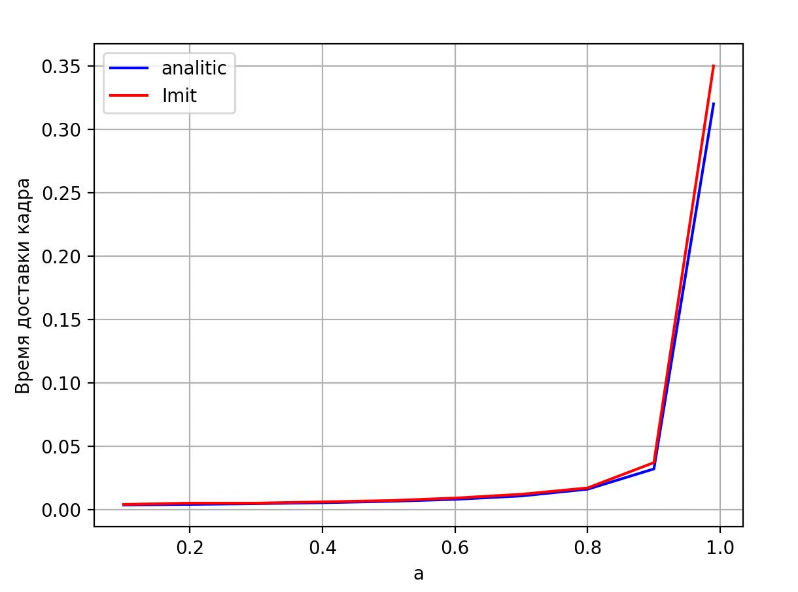
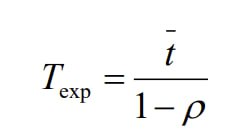

<div align="center">

# Федеральное агентство связи  

**ФЕДЕРАЛЬНОЕ ГОСУДАРСТВЕННОЕ БЮДЖЕТНОЕ  
ОБРАЗОВАТЕЛЬНОЕ УЧРЕЖДЕНИЕ ВЫСШЕГО ОБРАЗОВАНИЯ**  

**«САНКТ-ПЕТЕРБУРГСКИЙ ГОСУДАРСТВЕННЫЙ УНИВЕРСИТЕТ  
ТЕЛЕКОММУНИКАЦИЙ ИМ. ПРОФ. М. А. БОНЧ-БРУЕВИЧА» (СПбГУТ)**  

</div>

<div align="center">
Факультет информационных технологий и программной инженерии  
Кафедра: Программная инженерия. Разработка программного обеспечения и приложений искусственного интеллекта в киберфизических системах  
<br><br><br><br>


## ЛАБОРАТОРНАЯ РАБОТА №9
по дисциплине **«Математические модели в сетях связи»**  
## **Тема:** ИМИТАЦИОННОЕ МОДЕЛИРОВАНИЕ МНОЖЕСТВЕННОГО ДОСТУПА С МЕХАНИЗМОМ ПРЕДОТВРАЩЕНИЯ КОЛЛИЗИЙ
</div>

<div align="right"><br>

Бригада №2: Терещенко Максим, Гарькуша Никита, Челноков Александр

**Преподаватель:** 	Гребенщикова Александра Андреевна
</div>
<br>
<div align="center">
<br><br><br>
Санкт-Петербург  
2025  
</div>


<div style="page-break-before: always;"></div>


## 1. Цель работы и краткое описание проводимых исследований

**Цель работы:** исследование влияния метода формирования таймаута (задержки перед повторной попыткой передачи при занятости канала) на эффективность использования ресурса канала в протоколе множественного доступа с прослушиванием несущей и предотвращением коллизий (non-persistent CSMA).

**Задачи:**
- Модифицировать модель канала с коллизиями, добавив механизм предотвращения коллизий 
- Исследовать зависимость среднего времени доставки кадра от интенсивности нагрузки ρ при фиксированном среднем таймауте.
- Сравнить результаты имитационного моделирования с аналитическими.
- Исследовать влияние среднего значения таймаута (параметр bdel) на среднее время доставки кадра и найти оптимальное значение таймаута.

## 2. Имитационная модель в AnyLogic



### Основные элементы модели:
- **source** – генерация кадров с экспоненциальным интервалом прибытия, интенсивность λ задаётся через параметр **a**.
- **ifBusy** (SelectOutput) – проверяет `media.size() == 0`. Если канал свободен → в **media**, иначе → в **backoff**.
- **backoff** (Delay) – задержка с экспоненциальным распределением, среднее значение задаётся параметром **bdel**. Максимальная вместимость – неограничена.
- **media** (Delay) – имитация времени передачи кадра, длительность `len*8/br`.
- **data** (Dataset/TimeStackChart/Histogram) – сбор статистики о времени доставки.
- Параметр **ro** = `a*len*8/br` – интенсивность нагрузки ρ.

### 3.1 Зависимость среднего времени доставки кадра от интенсивности нагрузки ρ  


| № | ρ (ro) | Время доставки (имитация), усл. ед. | Время доставки (аналитическое), усл. ед. |
|---|--------|-------------------------------------|-------------------------------------------|
| 0 | 0,10   | 0,004                               | 0,003556                                  | 
| 1 | 0,20   | 0,005                               | 0,004000                                  |  
| 2 | 0,30   | 0,005                               | 0,004571                                  |
| 3 | 0,40   | 0,006                               | 0,005333                                  | 
| 4 | 0,50   | 0,007                               | 0,006400                                  |  
| 5 | 0,60   | 0,009                               | 0,008000                                  |  
| 6 | 0,70   | 0,012                               | 0,010667                                  | 
| 7 | 0,80   | 0,017                               | 0,016000                                  |  
| 8 | 0,90   | 0,037                               | 0,032000                                  | 
| 9 | 0,99   | 0,350                               | 0,320000                                  |  



## 4. Аналитическая формула



## 5. Выводы по работе

1. **Модель с предотвращением коллизий**  
Реализованы генерация кадров, проверка занятости канала, очередь backoff с экспоненциальной задержкой и передача. Модель корректно собирает статистику времени доставки.

2. **Сравнение имитации и аналитики**  
При ρ ≤ 0.8 результаты хорошо совпадают (ошибка в пределах ~10–15%). При ρ → 1 расхождение растет из-за накопления в backoff и высокой вариативности.

3. **Оптимальный таймаут**  
Слишком малые задержки вызывают конкуренцию повторов, большие увеличивают ожидание. Наименьшее время доставки достигается при среднем bdel, сопоставимом с временем передачи кадра.

4. **Общий вывод**  
non-persistent CSMA с backoff работает эффективно при средней нагрузке, а при высокой требует дополнительных прогонов и уточнения параметров таймаута.

## Приложение

```python
import matplotlib.pyplot as plt
import numpy as np
import pandas as pd

a = [0.1, 0.2, 0.3, 0.4, 0.5, 0.6, 0.7, 0.8, 0.9, 0.99]

def f(a):
    t = 800/250_000
    return t/(1-a)

anal = [f(i) for i in a]
print(anal)
imit = [0.004, 0.005, 0.005, 0.006, 0.007, 0.009, 0.012, 0.017, 0.037, 0.35]

data = pd.DataFrame({"rho": a, "Имитация": imit, "Аналитика": anal})
print(data)

plt.plot(a, anal, label="analitic", color="blue")
plt.plot(a, imit, label="Imit", color="red")
plt.xlabel("a")
plt.ylabel("Время доставки кадра")
plt.grid(True)
plt.legend()
plt.show()

```