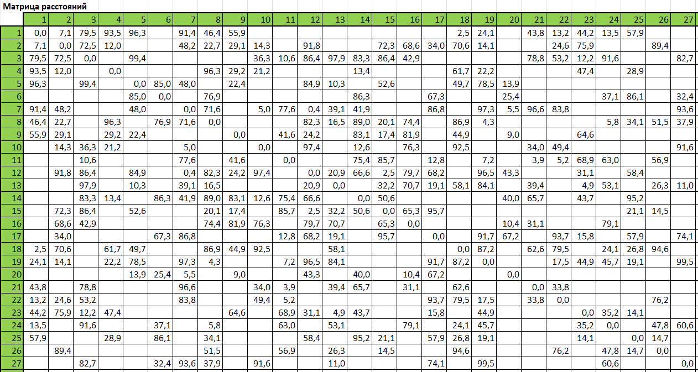
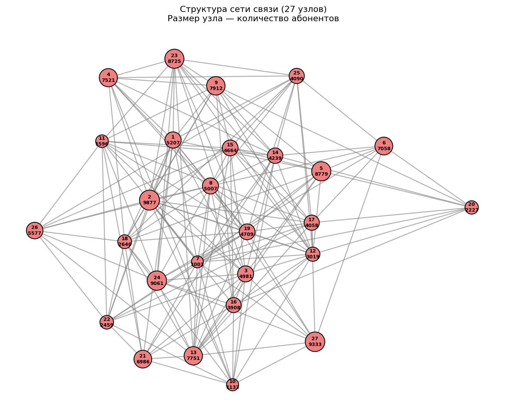
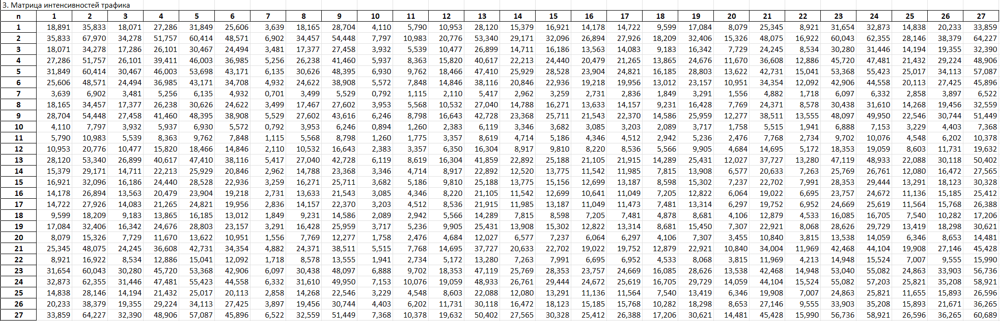
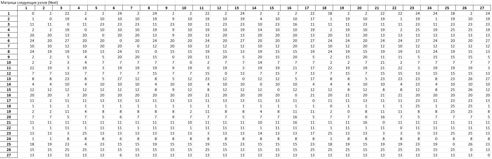
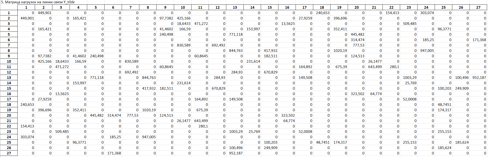
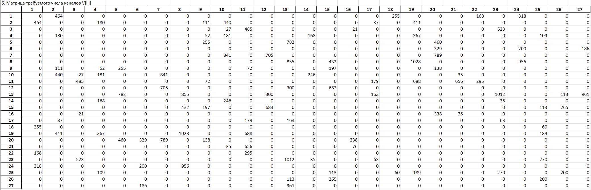
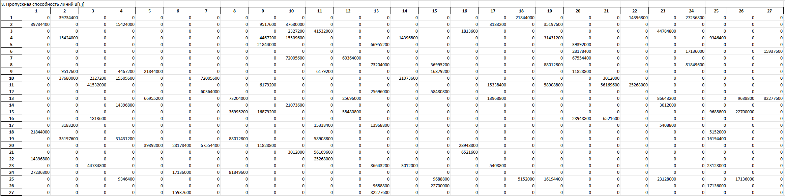
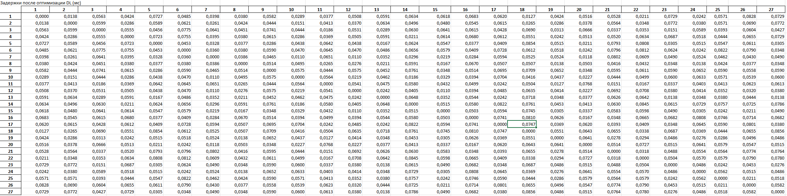

<div align="center">

# Федеральное агентство связи  

**ФЕДЕРАЛЬНОЕ ГОСУДАРСТВЕННОЕ БЮДЖЕТНОЕ  
ОБРАЗОВАТЕЛЬНОЕ УЧРЕЖДЕНИЕ ВЫСШЕГО ОБРАЗОВАНИЯ**  

**«САНКТ-ПЕТЕРБУРГСКИЙ ГОСУДАРСТВЕННЫЙ УНИВЕРСИТЕТ  
ТЕЛЕКОММУНИКАЦИЙ ИМ. ПРОФ. М. А. БОНЧ-БРУЕВИЧА» (СПбГУТ)**  

</div>

<div align="center">
Факультет информационных технологий и программной инженерии  
Кафедра: Программная инженерия. Разработка программного обеспечения и приложений искусственного интеллекта в киберфизических системах  
<br><br>


## Курсовой проект
по дисциплине **«Математические модели в сетях связи»**  
## **Тема:** Расчет пропускной способности линий связи 
</div>

<div align="right"><br>

**Выполнил:**  
Студент группы ИКПИ-42  
Терещенко М. А.  

**Подпись** ______________

**Принял:**  
к.т.н., доцент кафедры СС и ПД
Гребенщикова А. А.
**Подпись** ______________

</div>
<br>
<div align="center">
<br><br>
Санкт-Петербург  
2025  
</div>

---

## Оглавление

- [Цель работы](#цель-работы)
- [Исходные данные](#исходные-данные)
- [Задание](#задание)
- [Расчёт](#расчёт)
  - [4.1 Расчёт интенсивностей производимого в узлах сети трафика](#41-расчёт-интенсивностей-производимого-в-узлах-сети-трафика)
  - [4.2 Расчёт коэффициентов распределения трафика](#42-расчёт-коэффициентов-распределения-трафика)
  - [4.3 Расчёт интенсивностей трафика в направлениях связи](#43-расчёт-интенсивностей-трафика-в-направлениях-связи)
  - [4.4 Расчёт кратчайших расстояний и маршрутов между узлами сети](#44-расчёт-кратчайших-расстояний-и-маршрутов-между-узлами-сети)
  - [4.5 Расчёт интенсивностей нагрузок на линиях связи](#45-расчёт-интенсивностей-нагрузок-на-линиях-связи)
  - [4.6 Расчёт количества потоков в линиях связи](#46-расчёт-количества-потоков-в-линиях-связи)
  - [4.7 Расчёт интенсивностей трафика ПД для линий связи](#47-расчёт-интенсивностей-трафика-пд-для-линий-связи)
  - [4.8 Расчёт пропускной способности линий связи](#48-расчёт-пропускной-способности-линий-связи)
- [Оптимизация пропускной способности линий связи](#оптимизация-пропускной-способности-линий-связи)
- [Выводы](#выводы)
- [Приложение](#приложение)

---

<br><br><br><br><br><br><br>
<br><br><br><br><br><br><br>

## 1. Цель работы  

Определить необходимые пропускные способности линий связи в сети с заданной структурой, а также подобрать их оптимальные значения, обеспечивающие достижение требуемых показателей, в том числе соблюдение целевого уровня задержки.

---

## 2. Исходные данные

**Параметры сети:**

- Количество узлов в сети связи – **27**
- Интенсивность удельной абонентской нагрузки – **y₀ = 0,1 Эрл**
- Тип кодека – **G.711**
- Скорость потока для кодека G.711 – **a₀ = 85,6 кбит/с**
- Длина пакета – **L = 200 байт**
- Начальное требование к величине задержки – **T₀ = 100 мс = 0,1 с**
- Доля вызовов, обслуженных с гарантированным качеством – **q = 98 %** (p₀ = 0,02)

**Таблица распределения абонентов по узлам сети:**

| Узел | Кол-во абонентов | Доля kᵢ   |
|------|------------------|-----------|
| 1    | 5207             | 0,036     |
| 2    | 9877             | 0,069     |
| 3    | 4981             | 0,035     |
| 4    | 7521             | 0,052     |
| 5    | 8779             | 0,061     |
| 6    | 7058             | 0,049     |
| 7    | 1003             | 0,007     |
| 8    | 5007             | 0,035     |
| 9    | 7912             | 0,055     |
| 10   | 1133             | 0,008     |
| 11   | 1596             | 0,011     |
| 12   | 3019             | 0,021     |
| 13   | 7751             | 0,054     |
| 14   | 4239             | 0,030     |
| 15   | 4664             | 0,032     |
| 16   | 3908             | 0,027     |
| 17   | 4058             | 0,028     |
| 18   | 2646             | 0,018     |
| 19   | 4709             | 0,033     |
| 20   | 2227             | 0,016     |
| 21   | 6986             | 0,049     |
| 22   | 2459             | 0,017     |
| 23   | 8725             | 0,061     |
| 24   | 9061             | 0,063     |
| 25   | 4090             | 0,028     |
| 26   | 5577             | 0,039     |
| 27   | 9333             | 0,065     |

### **Матрица расстояний** – индивидуальная, сгенерирована в excel файле для варианта 4222. 



### **Структура сети связи**  

{width=500}


---

## Расчёт

### 3.1 Расчёт интенсивностей производимого в узлах сети трафика

Для расчёта интенсивности трафика необходимо умножить число абонентов в узле на y0 
**yᵢ = Nᵢ × y₀**

Интенсивность трафика от узлов (yi):
| n  | y_i   |
|----|-------|
| 1  | 520.7 |
| 2  | 987.7 |
| 3  | 498.1 |
| 4  | 752.1 |
| 5  | 877.9 |
| 6  | 705.8 |
| 7  | 100.3 |
| 8  | 500.7 |
| 9  | 791.2 |
| 10 | 113.3 |
| 11 | 159.6 |
| 12 | 301.9 |
| 13 | 775.1 |
| 14 | 423.9 |
| 15 | 466.4 |
| 16 | 390.8 |
| 17 | 405.8 |
| 18 | 264.6 |
| 19 | 470.9 |
| 20 | 222.7 |
| 21 | 698.6 |
| 22 | 245.9 |
| 23 | 872.5 |
| 24 | 906.1 |
| 25 | 409.0 |
| 26 | 557.7 |
| 27 | 933.3 |

### 3.2 Расчёт коэффициентов распределения трафика

Для определения вектора коэффициентов распределения трафика по направлениям необходимо разделить интенсивность трафика, генерируемого данным узлом, на суммарную интенсивность трафика, создаваемую всеми узлами сети.

**kᵢⱼ = yⱼ / Σ yᵢ**

| n  | k_ij     |
|----|----------|
| 1  | 0.036279 |
| 2  | 0.068817 |
| 3  | 0.034705 |
| 4  | 0.052402 |
| 5  | 0.061167 |
| 6  | 0.049176 |
| 7  | 0.006988 |
| 8  | 0.034886 |
| 9  | 0.055126 |
| 10 | 0.007894 |
| 11 | 0.011120 |
| 12 | 0.021035 |
| 13 | 0.054004 |
| 14 | 0.029535 |
| 15 | 0.032496 |
| 16 | 0.027229 |
| 17 | 0.028274 |
| 18 | 0.018436 |
| 19 | 0.032809 |
| 20 | 0.015516 |
| 21 | 0.048674 |
| 22 | 0.017133 |
| 23 | 0.060790 |
| 24 | 0.063131 |
| 25 | 0.028497 |
| 26 | 0.038857 |
| 27 | 0.065027 |

<br><br><br><br>

### 3.3 Расчёт интенсивностей трафика в направлениях связи

Матрица интенсивностей трафика в направлениях связи рассчитывается по
формуле

$$
\begin{align*}
\mathbf{Y} &= \left[\mathcal{y}_{i,j}\right], \quad i,j=1,\dots,n \\
y_{i,j} &= k_{i,j}y_i, \quad i,j=1,\dots,n
\end{align*}
$$


**Матрица интенсивностей трафика в направлениях связи Y**



### 3.4 Расчёт кратчайших расстояний и маршрутов между узлами сети

Для построения данной матрицы использован **алгоритм Флойда-Уоршелла**.

Получена **матрица кратчайших расстояний**: 


<br><br>

**Матрица следующего узла**



Матрица содержит номера узлов, выступающих в качестве промежуточных точек на маршруте между парой узлов, обозначенной строкой и столбцом. 

### 3.5 Расчёт интенсивностей нагрузок на линиях связи

Необходимо последовательно обработать всю матрицу интенсивностей трафика по направлениям. Для каждого направления маршрут определяется с использованием матрицы кратчайших путей, после чего соответствующее значение интенсивности прибавляется к каждой линии связи, входящей в найденный маршрут.

**Матрица нагрузок**:


<br><br><br><br>

### 3.6 Расчёт количества потоков в линиях связи

Требуемое число потоков рассчитывается из формулы Эрланга и
необходимого процента обслуженных заявок

$$
\begin{align*}
\mathbf{V} &= \left[\mathbf{v}_{i,j}\right], \quad i,j=1,\dots,n \\
\mathbf{v}_{i,j} &= \arg\min_{\mathbf{v}_{i,j}} \left| \rho\big(\widetilde{\mathbf{y}}_{i,j}, \mathbf{v}_{i,j}\big) - \boldsymbol{\rho}_0 \right|, \\
&\qquad\qquad \rho\big(\widetilde{\mathbf{y}}_{i,j}, \mathbf{v}_{i,j}\big) \leq \boldsymbol{\rho}_0
\end{align*}
$$

$$
\begin{align*}
p\big(\widetilde{\mathbf{y}}_{i,j}, \mathbf{v}_{i,j}\big)
&= \frac{\widetilde{\mathbf{y}}_{i,j}^{\;\;\;\mathbf{v}_{i,j}} / {\;\;\;\mathbf{v}_{i,j}}!}{\displaystyle \sum_{k=0}^{\mathbf{v}_{i,j}} \frac{\widetilde{\mathbf{y}}_{i,j}^{\;\;\;k}}{k!}}
\end{align*}
$$

По формуле Эрланга B с p₀ = 0,02 получена матрица **количества потоков**:


### 3.7 Расчёт интенсивностей трафика ПД для линий связи

Для определения интенсивности трафика на линиях связи необходимо умножить базовую интенсивность 𝑎0 на матрицу количества потоков.

**aᵢⱼ = vᵢⱼ × a₀ = vᵢⱼ × 85600** бит/с:


### 3.8 Расчёт пропускной способности линий связи

Для вычисления требуемой пропускной способности линий связи к значениям матрицы трафика добавляется величина L / T₀

**Матрица пропускных способностей (фрагмент, бит/с)**  




---

## 4 Оптимизация пропускной способности линий связи

Оптимизация пропускной способности направлена на подбор таких значений для линий связи, при которых сквозная задержка стремится к наиболее часто встречающемуся значению - **50 мс**. Для достижения этой цели используется итерационный жадный алгоритм с шагом ( dc = 10,000 ) бит/с.


**Алгоритм**:  
1. Берём начальную матрицу пропускных способностей bᵢⱼ (из пункта 3.8).  
2. Поочерёдно увеличиваем каждую линию на dc и считаем целевую функцию  
   **O = Σ (tᵢⱼ – 0,05)²** по всем парам абонентов.  
3. Выбираем линию, давшую наибольшее уменьшение O.  
4. Фиксируем прирост, повторяем до стабилизации O.

<br><br><br><br><br><br>

**Матрица задержек между узлами после оптимизации**  


Среднее время задержки составляет 47,7 мс

**Оптимизированная матрица пропускных способностей**


---

## 5. Выводы

В ходе работы успешно рассчитаны требуемые пропускные способности линий связи, обеспечивающие заданное качество обслуживания. Реализованы алгоритмы определения и оптимизации пропускных способностей каналов, что позволило достичь целевого значения сквозной задержки. Таким образом, поставленная задача выполнена полностью.

---

## 6. Приложение

**Код программы:**

```python
import pandas as pd
import numpy as np
import matplotlib.pyplot as plt
import networkx as nx


def load_data(path_matrix, path_distr, n1=20, n2=40, y0=0.1, n=31, L=200, a0=85600, T0=0.1, q=98, Y_v0=0.2, a_v0=1, a_IoT=150):
    data = pd.read_csv(path_matrix, delimiter=";", index_col=0, decimal=",")
    distribution = pd.read_csv(path_distr, delimiter=",", index_col=0, decimal=".")
    
    try:
        del distribution["Unnamed: 2"]
    except:
        pass
    
    print(distribution)
    sumAbonents = distribution.sum()["Абонентов"]
    print(data)

    return {
        "data": data,
        "distribution": distribution,
        "sumAbonents": sumAbonents,
        "n1": n1, "n2": n2, "y0": y0, "n": n, "L": L, "a0": a0, "T0": T0, "q": q,
        "Y_v0": Y_v0, "a_v0": a_v0, "a_IoT": a_IoT
    }


def intensity_traffic(state, out=False):
    """1. Интенсивность исходящего трафика от каждого из узлов сети y_i = N_i * y0"""
    dataIntencity = state["distribution"]["Абонентов"] * state["y0"]
    state["dataIntencity"] = dataIntencity
    
    if out:
        print("1. Интенсивность исходящего трафика от каждого из узлов сети:")
        print(dataIntencity)
    
    return dataIntencity


def distribution_coefficients(state, out=False):
    """2. Коэффициенты распределения трафика по направлениям связи kij = yj/sum(yi)"""
    sumIntencity = state["sumAbonents"] * state["y0"]
    dataKij = state["dataIntencity"] / sumIntencity
    state["dataKij"] = dataKij
    
    if out:
        print("2. Коэффициенты распределения трафика по направлениям связи")
        print(dataKij)
    
    return dataKij


def matrix_intensity_traffic(state, out=False):
    """3. Матрица интенсивностей трафика в направлениях связи"""
    # Формируем матрицу интенсивностей трафика Y[i,j] = y_i * k_ij
    matrixIntencity = pd.DataFrame(
        np.outer(state["dataIntencity"], state["dataKij"]),
        index=state["dataIntencity"].index,
        columns=state["dataKij"].index
    )
    state["matrixIntencity"] = matrixIntencity
    
    if out:
        print("3. Матрица интенсивностей трафика в направлениях связи")
        print(matrixIntencity)
    
    return matrixIntencity


def algorhitm_floid(state, out=False):
    """4. Матрица кратчайших маршрутов + матрица путей"""
    D = state["data"].copy()
    D.fillna(1e9, inplace=True)
    D.index = D.index.astype(int)
    D.columns = D.columns.astype(int)

    Next = D.copy()

    # Инициализация матрицы Next
    for i in D.index:
        for j in D.index:
            if i != j and D.loc[i,j] < 1e12:
                Next.loc[i,j] = j

    # Основной цикл алгоритма Флойда
    for k in D.index:  # промежуточная вершина
        for i in D.index:  # начальная вершина
            for j in D.index:  # конечная вершина
                if D.loc[i,k] + D.loc[k,j] < D.loc[i,j]:  # найден более короткий путь
                    D.loc[i,j] = D.loc[i,k] + D.loc[k,j]  # обновляем расстояние
                    Next.loc[i,j] = Next.loc[i,k]  # обновляем следующий узел на пути

    matrixNext = Next 
    R = D

    matrixNext.index = matrixNext.index.astype(int)
    matrixNext.columns = matrixNext.columns.astype(int)

    state["R"] = R
    state["matrixNext"] = matrixNext

    if out:
        print("4. Матрица кратчайших маршрутов между вершинами графа + матрица путей")
        print("Кратчайшие маршруты:")
        print(R)
        print("Пути:")
        print(matrixNext)
    
    return R, matrixNext


def calc_link_load(state, out=False):
    """5. Матрица интенсивностей нагрузки на линии связи Y_tilde"""
    Y = state["matrixIntencity"]
    Next = state["matrixNext"]
    nodes = list(Y.index)  # узлы
    n = len(nodes)  # число узлов

    Y_tilde = pd.DataFrame(np.zeros((n,n)), index=nodes, columns=nodes)

    for i in nodes:
        for j in nodes:
            if i == j or Y.loc[i,j] == 0:
                continue
            path = [i]  # начинаем путь с i
            cur = i  # текущий узел
            while cur != j:  # идём по пути, пока не дойдём до j
                cur = Next.loc[cur,j]  # следующий узел на пути из cur в j
                path.append(cur)  # добавляем его в путь
            
            for u, v in zip(path[:-1], path[1:]):  # распределяем трафик по рёбрам
                Y_tilde.loc[u,v] += Y.loc[i,j]  # нагрузка на ребро u->v

    state["matrixNagruzka"] = Y_tilde

    if out:
        print("#5. Матрица интенсивностей нагрузок на линии связи")
        print(Y_tilde)

    return Y_tilde


def matrix_v(state, out=False):
    """6. Матрица потоков (число каналов)"""
    Y_tilde_sym = state["matrixNagruzka"].copy()
    line_load = pd.DataFrame(0.0, index=Y_tilde_sym.index, columns=Y_tilde_sym.columns) 
    
    # Делаем матрицу нагрузок симметричной
    for i in Y_tilde_sym.index:
        for j in Y_tilde_sym.columns:
            if i >= j:
                continue
            total_load = Y_tilde_sym.loc[i, j]  
            line_load.loc[i, j] = total_load
            line_load.loc[j, i] = total_load

    V_matrix = pd.DataFrame(0, index=line_load.index, columns=line_load.columns, dtype=int)

    # То, сколько нужно каналов, чтобы обслужить нагрузку с вероятностью блокировки ≤ 2%
    for i in line_load.index:
        for j in line_load.columns:
            if i == j:
                continue
            load = line_load.loc[i, j]
            if load > 0:
                v = find_min_channels(load, p_block=(1 - state["q"]/100), max_v=50000)
                V_matrix.loc[i, j] = v
                V_matrix.loc[j, i] = v

    state["V_matrix"] = V_matrix
    if out:
        print("6. Матрица потоков")
        print(V_matrix)
    return V_matrix


def matrix_a(state, out=False):
    """7. Матрица интенсивности трафика A[i,j]"""
    # A[i,j] = V[i,j] * a0
    A_matrix = state["V_matrix"].astype(float) * state["a0"]
    state["A_matrix"] = A_matrix
    if out:
        print("7. Матрица интенсивности трафика")
        print(A_matrix)
    return A_matrix


def matrix_b(state, out=False):
    """8. Матрица пропускных способностей B[i,j]"""
    # B[i,j] = A[i,j] + (L * 8) / T0
    B_matrix = pd.DataFrame(0, index=state["A_matrix"].index, columns=state["A_matrix"].columns, dtype=int)
    L_bits = state["L"] * 8
    for i in state["A_matrix"].index:
        for j in state["A_matrix"].columns:
            if state["A_matrix"].loc[i, j] == 0:
                continue
            B_matrix.loc[i, j] = state["A_matrix"].loc[i,j] + (L_bits / state["T0"])
    
    state["B_matrix"] = B_matrix
    if out:
        print("8. Матрица пропускных способностей")
        print(B_matrix)
    return B_matrix


# Вспомогательные функции

def erlangb(v: int, y: float) -> float:
    if y <= 0: return 0.0
    if v == 0: return 1.0
    inv_b = 1.0
    for i in range(1, v + 1):
        inv_b = 1.0 + inv_b * (i / y)
    return 1.0 / inv_b


def find_min_channels(y: float, p_block: float = 0.02, max_v: int = 50000) -> int:
    # Ищем минимальное число каналов v, чтобы вероятность блокировки ≤ p_block
    # обратная формула Эрланга B
    if y <= 0: return 0
    if y < 1.0: return 1 # при малой нагрузке достаточно 1 канала
    low, high = 1, max_v
    while low < high:
        mid = (low + high) // 2
        if erlangb(mid, y) > p_block:
            low = mid + 1
        else:
            high = mid
    v = low
    while erlangb(v, y) > p_block:
        v += 1
    return v

# Основные функции для оптимизации
def build_paths(state):
    # Строим пути между всеми парами узлов на основе матрицы Next
    nodes = list(state["A_matrix"].index)
    n = len(nodes)
    next_hop = state["matrixNext"].values
    node_to_idx = {node: i for i, node in enumerate(nodes)} # карта узлов к индексам
    
    paths = [[None] * n for _ in range(n)] # paths[a][b] = список индексов узлов на пути из a в b
    for a_idx in range(n):
        for b_idx in range(n):
            if a_idx == b_idx:
                continue
            i = a_idx
            path = [i]
            while i != b_idx:
                next_node = state["matrixNext"].iloc[nodes[i]-1, nodes[b_idx]-1]
                # Переводим номер узла в индекс в списке paths
                i = node_to_idx[next_node]
                path.append(i)
            paths[a_idx][b_idx] = path
    return paths, nodes, n


def calc_dl(B, A_np, L_bits, paths, n):
    # Вычисляем матрицу задержек DL
    DEL = L_bits / (B - A_np) 
    # L_bits / (B - A_np) — сколько секунд нужно, чтобы передать пакет по этой линии. B - A_np — оставшаяся свободная ёмкость
    DEL[np.isinf(DEL)] = 1e9
    DEL[DEL < 0] = 1e9
    DL = np.zeros((n, n), dtype=float)
    for i in range(n):
        for j in range(n):
            if i == j:
                continue
            route = paths[i][j]
            DL[i,j] = sum(DEL[route[k], route[k+1]] for k in range(len(route)-1)) # сумма задержек по всем рёбрам пути
    return DL


def objective_function(B, A_np, L_bits, Topt, paths, n):
    DL = calc_dl(B, A_np, L_bits, paths, n)
    return np.sum((DL - Topt)**2)


def optimization(state, accuracy=0.001, out=False, out_graph_O=False):
    """9. Оптимизация"""
    Topt = state["T0"] / 2  # целевое значение задержки
    dc = 10_000  # шаг изменения пропускной способности
    L_bits = state["L"] * 8  # длина пакета в битах
    Bo = state["B_matrix"].copy()  # начальная матрица пропускных способностей
    A_np = state["A_matrix"].values  # матрица интенсивности трафика

    paths, nodes, n = build_paths(state)

    default_O = objective_function(state["B_matrix"].values, A_np, L_bits, Topt, paths, n)
    best_O = np.inf
    iteration = 0
    sp_o = []
    sp_iteration = []

    while True:
        iteration += 1
        base_O = objective_function(Bo.values, A_np, L_bits, Topt, paths, n)
        best_edge = None

        for i in nodes:
            for j in nodes:
                if i >= j or Bo.loc[i,j] <= 16000:
                    continue
                Bo.loc[i,j] += dc
                Bo.loc[j,i] += dc
                O_try = objective_function(Bo.values, A_np, L_bits, Topt, paths, n)
                if O_try < best_O:
                    best_O = O_try
                    best_edge = (i,j)
                Bo.loc[i,j] -= dc
                Bo.loc[j,i] -= dc

        if best_edge is None or (base_O - best_O) < accuracy:
            print("\nУлучшения не найдено — оптимизация завершена.")
            break

        i, j = best_edge
        Bo.loc[i,j] += dc
        Bo.loc[j,i] += dc
        sp_o.append(base_O)
        sp_iteration.append(iteration)

    state["Bo"] = Bo
    state["DL2"] = pd.DataFrame(calc_dl(Bo.values, A_np, L_bits, paths, n),
                                index=state["A_matrix"].index, columns=state["A_matrix"].columns)

    if out:
        print("Оптимизированная матрица пропускных способностей:")
        print(f"Начальная O: {default_O:.3f}")
        print(f"Финальная O: {best_O:.3f}")
        print(Bo)

    if out_graph_O:
        plt.plot(sp_iteration, sp_o)
        plt.xlabel("Номер итерации")
        plt.ylabel("Значение целевой функции")
        plt.grid(True)
        plt.show()

    return Bo


# Сохранение результатов в Excel
def save_to_excel(state, path="network_results_single_sheet.xlsx"):
    """Сохраняем всё в EXCEL таблицами"""
    excel_file = path

    with pd.ExcelWriter(excel_file, engine="xlsxwriter") as writer:
        start_row = 0

        # Список всех матриц для записи (берём из state)
        matrices = [
            ("1. Интенсивность исходящего трафика Y_i", state["dataIntencity"].to_frame(name="Y_i")),
            ("2. Коэффициенты распределения трафика k_ij", state["dataKij"].to_frame(name="k_ij")),
            ("3. Матрица интенсивностей трафика", state["matrixIntencity"]),
            ("4. Матрица кратчайших путей (расстояния)", state["R"]),
            ("Матрица следующих узлов (Next)", state["matrixNext"]),
            ("5. Матрица нагрузок на линии связи Y_tilde", state["matrixNagruzka"]),
            ("6. Матрица требуемого числа каналов V[i,j]", state["V_matrix"]),
            ("7. Матрица интенсивности трафика ПД A[i,j] (бит/с)", state["A_matrix"]),
            ("8. Пропускная способность линий B[i,j]", state["B_matrix"]),
            ("9. Оптимизированная пропускная способность Bo", state["Bo"]),
            ("Задержки после оптимизации DL (мс)", state["DL2"]),
        ]

        for title, df in matrices:
            # Записываем заголовок
            pd.DataFrame([title]).to_excel(writer, sheet_name="Results", index=False, header=False, startrow=start_row)
            start_row += 1

            # Записываем матрицу
            df.to_excel(writer, sheet_name="Results", startrow=start_row)
            start_row += len(df) + 2  # +2: одна пустая строка + место под сумму

            # Сумма всех значений
            total = df.values.sum()
            sum_df = pd.DataFrame([["Сумма всех значений", total]])
            sum_df.to_excel(writer, sheet_name="Results", index=False, header=False, startrow=start_row)
            start_row += 3  # отступ перед следующей матрицей

    print(f"Все результаты успешно сохранены в файл: {excel_file}")
    return 1


state = load_data("data/only_matrix.csv", "data/Distribution.csv")

intensity_traffic(state, out=True)
distribution_coefficients(state)
matrix_intensity_traffic(state)
algorhitm_floid(state)
calc_link_load(state)
matrix_v(state)
matrix_a(state)
matrix_b(state)
optimization(state, out=True, out_graph_O=True)
save_to_excel(state, path="DATA1.xlsx")


```