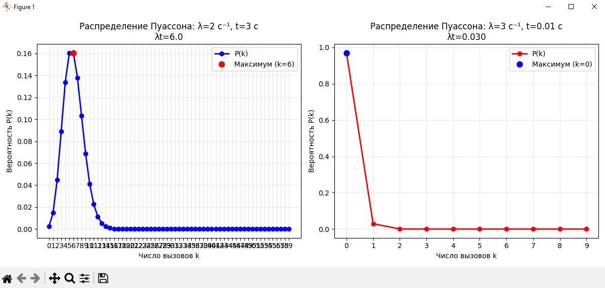
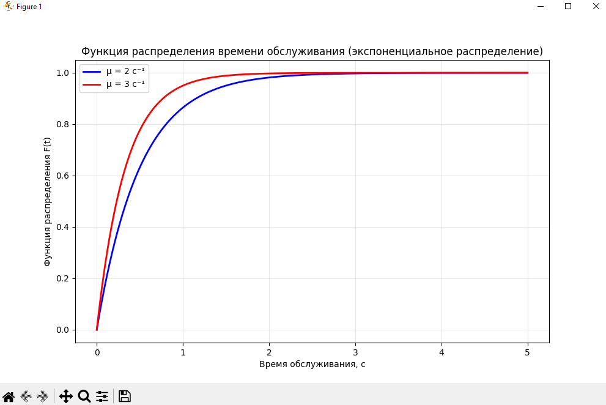

<div align="center">

# Федеральное агентство связи  

**ФЕДЕРАЛЬНОЕ ГОСУДАРСТВЕННОЕ БЮДЖЕТНОЕ  
ОБРАЗОВАТЕЛЬНОЕ УЧРЕЖДЕНИЕ ВЫСШЕГО ОБРАЗОВАНИЯ**  

**«САНКТ-ПЕТЕРБУРГСКИЙ ГОСУДАРСТВЕННЫЙ УНИВЕРСИТЕТ  
ТЕЛЕКОММУНИКАЦИЙ ИМ. ПРОФ. М. А. БОНЧ-БРУЕВИЧА» (СПбГУТ)**  

</div>

<div align="center">
Факультет информационных технологий и программной инженерии  
Кафедра: Программная инженерия. Разработка программного обеспечения и приложений искусственного интеллекта в киберфизических системах  

---

## ЛАБОРАТОРНАЯ РАБОТА №1 
по дисциплине **«Математические модели в сетях связи»**  
## **Тема:** Потоки вызовов и время обслуживания  
</div>

<div align="right"><br>
Выполнил: студент 2-го курса группы ИКПИ-42  
Терещенко Максим Андреевич  

**Преподаватель:** 	Гребенщикова Александра Андреевна
</div>
<br><br>
<div align="center">
Санкт-Петербург  
2025  
</div>


<div style="page-break-before: always;"></div>

---

## 1. **Цель работы**

Получение навыков расчета потоков вызовов и времени обслуживания.  

---

## 2. **Теоретическая часть**

### 2.1 Основные виды потоков вызовов
- **Детерминированный поток вызовов** - последовательность вызовов, поступающих в строго фиксированные моменты времени.  
- **Случайный поток вызовов** - последовательность вызовов с случайными моментами поступления и интервалами.  

**Свойства потока вызовов:**  
1. **Стационарный** - число вызовов за промежуток времени зависит только от длительности промежутка.  
2. **Ординарный** - вероятность двух и более вызовов за бесконечно малый промежуток времени пренебрежимо мала.  
3. **Без последействия** - вероятность поступления вызовов за промежуток времени не зависит от предыдущих событий.  

**Простейший поток вызовов** - ординарный стационарный поток без последействия, также называемый пуассоновским потоком.  

---

### 2.2 Основные характеристики потока вызовов
- **Параметр потока** \(\lambda(\tau)\) – скорость поступления вызовов в момент времени \(\tau\).  
- **Интенсивность потока** \(\lambda\) – среднее число вызовов за время \(t\).  

Для простейшего потока:  
\[
M(k) = D(k) = \sigma^2(k) = \lambda t
\]  

---

### 2.3 Длительность обслуживания
- Время обслуживания может быть случайным (экспоненциальное распределение) или постоянным.  
- **Экспоненциальное распределение:**  
\[
F(t) = 1 - e^{-\mu t}, \quad \mu - \text{интенсивность обслуживания}
\]  

- **Постоянное время обслуживания:**  
\[
H(t) = 
\begin{cases} 
0, & t < t_s \\
1, & t \ge t_s
\end{cases}
\]

---

## 3. **Содержание работы**

### **3.1 Задание 2.1**  
**Условие:** На АТС поступает простейший поток заявок с интенсивностью \(x_1\). Найти вероятность того, что в течение \(x_2\) секунд не поступит ни одного звонка.  

**Результаты работы программы:**  
```
2.1
Интенсивность потока λ = 2 с⁻¹
Время наблюдения t = 3 с
Вероятность отсутствия вызовов: P(0) = 0.002479
Вероятность поступления хотя бы одного вызова: 0.997521
```

**Вывод:**  
Вероятность отсутствия вызовов рассчитана по формуле Пуассона:  
\[
P(0) = e^{-\lambda t}
\]  
Вероятность поступления хотя бы одного вызова: \(1 - P(0)\).  

---

### **3.2 Задание 2.2**  
**Условие:** Определить вероятность поступления \(k\) вызовов при заданных λ и t.  

**Случай 1:** λ = x1, t = x2  
**Случай 2:** λ = x2, t = 0.01  

**Графики распределения Пуассона:**  


**Результаты работы программы:**  

```
2.2
Случай 1: λ = 2 с⁻¹, t = 3 с
k       P(k)            Математическое ожидание: λt = 6
0       0.002479
1       0.014873
2       0.044618
3       0.089235
4       0.133853
5       0.160623
6       0.160623
7       0.137677
8       0.103258
9       0.068838
10      0.041303
11      0.022529
12      0.011264
13      0.005199
14      0.002228
15      0.000891
16      0.000334
17      0.000118
18      0.000039
19      0.000012
20      0.000004
21      0.000001
22      0.000000
23      0.000000
24      0.000000
25      0.000000
26      0.000000
27      0.000000
28      0.000000
29      0.000000
30      0.000000
31      0.000000
32      0.000000
33      0.000000
34      0.000000
35      0.000000
36      0.000000
37      0.000000
38      0.000000
39      0.000000
40      0.000000
41      0.000000
42      0.000000
43      0.000000
44      0.000000
45      0.000000
46      0.000000
47      0.000000
48      0.000000
49      0.000000
50      0.000000
51      0.000000
52      0.000000
53      0.000000
54      0.000000
55      0.000000
56      0.000000
57      0.000000
58      0.000000
59      0.000000

Случай 2: λ = 3 с⁻¹, t = 0.01 с
k       P(k)            Математическое ожидание: λt = 0.03
0       0.970446
1       0.029113
2       0.000437
3       0.000004
4       0.000000
5       0.000000
6       0.000000
k       P(k)            Математическое ожидание: λt = 0.03
0       0.970446
1       0.029113
2       0.000437
3       0.000004
4       0.000000
5       0.000000
6       0.000000
7       0.000000
8       0.000000
9       0.000000
Для первого случая: максимум при k = 6, P(6) = 0.160623
Математическое ожидание λt = 6.0
Для второго случая: максимум при k = 0, P(0) = 0.970446
Математическое ожидание λt = 0.030
```
**Вывод:**  
Максимум распределения совпадает с математическим ожиданием \(λt\), что подтверждает теорию Пуассона.  

---

### **3.3 Задание 2.3**  
**Условие:** Определить функцию распределения окончания обслуживания вызова при заданных μ1 и μ2.  

**График функции распределения:**  


**Результаты работы программы:**  
```
2.3
- При μ = 2 с⁻¹: среднее время обслуживания = 0.50 с
  F(t) = 1 - e^(-2·t)
- При μ = 3 с⁻¹: среднее время обслуживания = 0.33 с
Математическое ожидание λt = 0.030
2.3
- При μ = 2 с⁻¹: среднее время обслуживания = 0.50 с
  F(t) = 1 - e^(-2·t)
- При μ = 3 с⁻¹: среднее время обслуживания = 0.33 с
  F(t) = 1 - e^(-2·t)
- При μ = 3 с⁻¹: среднее время обслуживания = 0.33 с
  F(t) = 1 - e^(-3·t)
```

**Вывод:**  
Для большего значения μ среднее время обслуживания меньше, распределение растёт быстрее.  

---

### **3.4 Задание 2.4**  
**Условие:** Вычислить вероятность поступления \(k = 20 + x1 + x2\) вызовов за \(t = x1/100\) минут при λ = x2.  

**Результаты работы программы:**  
```
2.4
- При μ = 3 с⁻¹: среднее время обслуживания = 0.33 с
  F(t) = 1 - e^(-3·t)
2.4
  F(t) = 1 - e^(-3·t)
2.4
2.4
Число вызовов k = 25
Интенсивность потока λ = 3 с⁻¹
Время наблюдения t = 0.0200 мин = 1.20 с
Параметр распределения λt = 3.600000
Вероятность P(25) = 1.4238252995e-13
Вероятность P(25) = 0.000000000000142
```

**Вывод:**  
Вероятность рассчитана корректно по распределению Пуассона.  

---

## 4. **Приложение**  

```python
import numpy as np
import matplotlib.pyplot as plt
from scipy.stats import poisson, expon
import math

x1 = 2
x2 = 3

print("\n2.1")
lambda1 = x1
t1 = x2

p_no_calls = math.exp(-lambda1 * t1)
print(f"Интенсивность потока λ = {lambda1} с⁻¹")
print(f"Время наблюдения t = {t1} с")
print(f"Вероятность отсутствия вызовов: P(0) = {p_no_calls:.6f}")
print(f"Вероятность поступления хотя бы одного вызова: {1-p_no_calls:.6f}")

print("2.2")

lambda2_1 = x1
t2_1 = x2
k_values_1 = np.arange(0, 60)

print(f"\nСлучай 1: λ = {lambda2_1} с⁻¹, t = {t2_1} с")
print("k\tP(k)\t\tМатематическое ожидание: λt =", lambda2_1 * t2_1)

probabilities_1 = []
for k in k_values_1:
    p = poisson.pmf(k, lambda2_1 * t2_1)
    probabilities_1.append(p)
    print(f"{k}\t{p:.6f}")

lambda2_2 = x2
t2_2 = 0.01
k_values_2 = np.arange(0, 10)

print(f"\nСлучай 2: λ = {lambda2_2} с⁻¹, t = {t2_2} с")
print("k\tP(k)\t\tМатематическое ожидание: λt =", lambda2_2 * t2_2)

probabilities_2 = []
for k in k_values_2:
    p = poisson.pmf(k, lambda2_2 * t2_2)
    probabilities_2.append(p)
    print(f"{k}\t{p:.6f}")

plt.figure(figsize=(12, 5))

plt.subplot(1, 2, 1)
plt.plot(k_values_1, probabilities_1, 'bo-', linewidth=2, markersize=6, label='P(k)')
plt.xlabel('Число вызовов k')
plt.ylabel('Вероятность P(k)')
plt.title(f'Распределение Пуассона: λ={lambda2_1} с⁻¹, t={t2_1} с\nλt={lambda2_1*t2_1:.1f}')
plt.grid(True, alpha=0.3)
plt.xticks(k_values_1)

max_prob_1 = max(probabilities_1)
max_k_1 = k_values_1[np.argmax(probabilities_1)]
plt.plot(max_k_1, max_prob_1, 'ro', markersize=8, label=f'Максимум (k={max_k_1})')
plt.legend()

plt.subplot(1, 2, 2)
plt.plot(k_values_2, probabilities_2, 'ro-', linewidth=2, markersize=6, label='P(k)')
plt.xlabel('Число вызовов k')
plt.ylabel('Вероятность P(k)')
plt.title(f'Распределение Пуассона: λ={lambda2_2} с⁻¹, t={t2_2} с\nλt={lambda2_2*t2_2:.3f}')
plt.grid(True, alpha=0.3)
plt.xticks(k_values_2)

max_prob_2 = max(probabilities_2)
max_k_2 = k_values_2[np.argmax(probabilities_2)]
plt.plot(max_k_2, max_prob_2, 'bo', markersize=8, label=f'Максимум (k={max_k_2})')
plt.legend()

plt.tight_layout()
plt.show()

print(f"Для первого случая: максимум при k = {max_k_1}, P({max_k_1}) = {max_prob_1:.6f}")
print(f"Математическое ожидание λt = {lambda2_1 * t2_1:.1f}")
print(f"Для второго случая: максимум при k = {max_k_2}, P({max_k_2}) = {max_prob_2:.6f}")
print(f"Математическое ожидание λt = {lambda2_2 * t2_2:.3f}")

print("2.3")
mu1 = x1
mu2 = x2

t_values = np.linspace(0, 5, 500)

F1 = 1 - np.exp(-mu1 * t_values)
F2 = 1 - np.exp(-mu2 * t_values)

plt.figure(figsize=(10, 6))
plt.plot(t_values, F1, 'b-', linewidth=2, label=f'μ = {mu1} с⁻¹')
plt.plot(t_values, F2, 'r-', linewidth=2, label=f'μ = {mu2} с⁻¹')
plt.xlabel('Время обслуживания, с')
plt.ylabel('Функция распределения F(t)')
plt.title('Функция распределения времени обслуживания (экспоненциальное распределение)')
plt.legend()
plt.grid(True, alpha=0.3)
plt.show()

print(f"- При μ = {mu1} с⁻¹: среднее время обслуживания = {1/mu1:.2f} с")
print(f"  F(t) = 1 - e^(-{mu1}·t)")
print(f"- При μ = {mu2} с⁻¹: среднее время обслуживания = {1/mu2:.2f} с")
print(f"  F(t) = 1 - e^(-{mu2}·t)")

print("2.4")

k = 20 + x1 + x2
lambda4 = x2
t4_min = x1 / 100
t4_sec = t4_min * 60

lambda_t = lambda4 * t4_sec

p_k = poisson.pmf(k, lambda_t)

print(f"Число вызовов k = {k}")
print(f"Интенсивность потока λ = {lambda4} с⁻¹")
print(f"Время наблюдения t = {t4_min:.4f} мин = {t4_sec:.2f} с")
print(f"Параметр распределения λt = {lambda_t:.6f}")
print(f"Вероятность P({k}) = {p_k:.10e}")
print(f"Вероятность P({k}) = {p_k:.15f}")

print("end")
```

