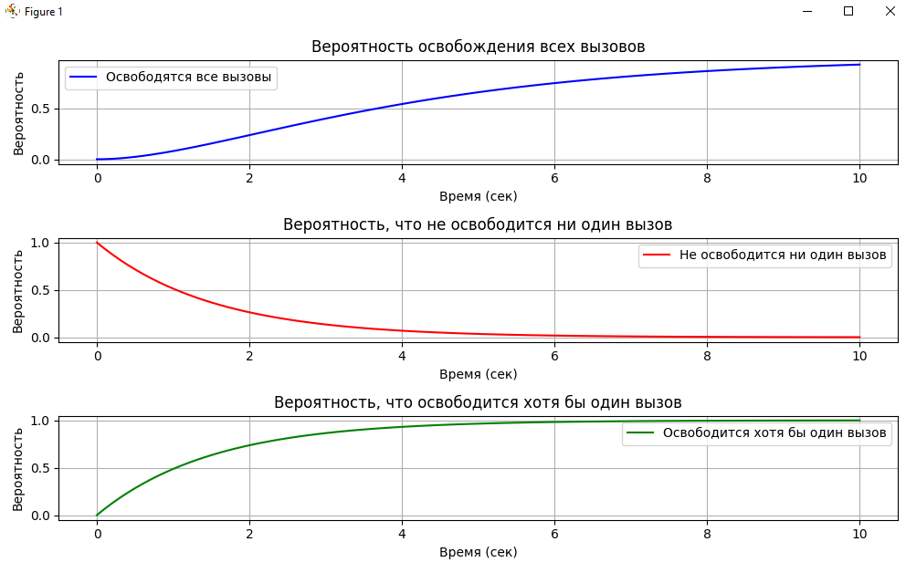

<div align="center">

# Федеральное агентство связи  

**ФЕДЕРАЛЬНОЕ ГОСУДАРСТВЕННОЕ БЮДЖЕТНОЕ  
ОБРАЗОВАТЕЛЬНОЕ УЧРЕЖДЕНИЕ ВЫСШЕГО ОБРАЗОВАНИЯ**  

**«САНКТ-ПЕТЕРБУРГСКИЙ ГОСУДАРСТВЕННЫЙ УНИВЕРСИТЕТ  
ТЕЛЕКОММУНИКАЦИЙ ИМ. ПРОФ. М. А. БОНЧ-БРУЕВИЧА» (СПбГУТ)**  

</div>

<div align="center">
Факультет информационных технологий и программной инженерии  
Кафедра: Программная инженерия. Разработка программного обеспечения и приложений искусственного интеллекта в киберфизических системах  

---

## ЛАБОРАТОРНАЯ РАБОТА №2 
по дисциплине **«	Математическое и программное обеспечение киберфизических систем»**  
## **Тема:** Расчет нагрузки 
</div>

<div align="right"><br>
Выполнил: студент 2-го курса группы ИКПИ-42  
Терещенко Максим Андреевич  

**Преподаватель:** 	Гребенщикова Александра Андреевна
</div>
<br><br>
<div align="center">
Санкт-Петербург  
2025  
</div>


<div style="page-break-before: always;"></div>

## 1. Основные сведения

### 1.1. Нагрузка  
Нагрузка есть суммарное время обслуживания вызовов за фиксированное время t. Единицей измерения нагрузки является часозанятие, т.к. величина нагрузки складывается из промежутков времени, соответствующих отдельным занятиям.  
Одно часо-занятие – нагрузка, которая может быть обслужена одним соединительным устройством (одним выходом коммутационного поля – КП) при его непрерывном занятии в течение одного часа.  

**Виды телефонной нагрузки**:
1. Поступающая
2. Обслуженная
3. Потерянная

Нагрузка обладает аддитивным свойством:
$$ Y(0, t1+t2) = Y(0,t1) + Y(t1,t2) $$

### 1.2. Интенсивность нагрузки  
Интенсивность нагрузки – математическое ожидание нагрузки в единицу времени. Единица измерения интенсивности нагрузки – Эрланг:
$$ 1 Эрл = 1 часо-занятие / час $$

**Параметры**:
- Параметр поступающего потока вызовов ($\lambda_0$) – число пакетов, поступающих в единицу времени.
- Средняя длительность занятия $t_s$, зависящая от скорости прохождения вызова через КП.

Поступающая нагрузка $A_0$, создаваемая простейшим потоком вызовов, численно равна:
$$ A_0 = \lambda_0 t_s $$

Обслуженная нагрузка $A_s$ равна среднему числу одновременно занятых соединительных линий (выходов КП):
$$ A_s = \lambda_s t_s = V $$

Потерянная нагрузка $A_L$:
$$ A_L = A_0 - A_s $$

### 1.3. Поток освобождений  
Поток освобождения представляет собой последовательность моментов окончания обслуживания вызовов и зависит от поступающего потока вызовов, качества работы коммутационной системы и закона распределения длительности обслуживания.

$$
P(i, x, t) = C_x \left( 1 - e^{-\mu t} \right)^i e^{-(x-i)\mu t}
$$

$$
P(T \leq t) = H(t) = 1 - e^{-\mu t}
$$


---

## 2. Содержание работы

### 2.1. Вычислить поступающую нагрузку, если абонент в течение часа произвел **x1 = 2** вызова со средней длительностью **x2 = 3/10 минут**.

Среднее время обслуживания $t_s$:
$$ t_s = \frac{3}{10} \text{ мин} = \frac{3}{10} \times 60 = 18 \text{ секунд} $$

Интенсивность поступающей нагрузки:
$$ A_0 = \lambda_0 t_s = 2 \times 18 = 36 \text{ часо-занятий} $$

---

<div style="page-break-before: always;"></div>

### 2.2. Вычислите нагрузку, создаваемую пакетом длиной 800 байт на интерфейсе со скоростью 10 Мбит/с.

Скорость интерфейса:  
$$ 10 \text{ Мбит/с} = 10 \times 10^6 \text{ бит/с} $$

Размер пакета:
$$ 800 \text{ байт} = 800 \times 8 = 6400 \text{ бит} $$

Время передачи одного пакета:
$$ T_{\text{packet}} = \frac{6400}{10 \times 10^6} = 6.4 \times 10^{-4} \text{ секунд} $$

Нагрузка, создаваемая пакетом:
$$ A_0 = \lambda_0 t_s = \frac{1}{6.4 \times 10^{-4}} = 1562.5 \text{ часо-занятий} $$

---

### 2.3. В обслуживании системы находится **x1 = 2** вызова, новые вызовы не поступают. Среднее время обслуживания вызова **x2 = 3** секунд. Определите вероятности того, что за время **t**:
- а) освободятся все вызовы;
- б) не освободится ни один вызов;
- в) освободится хотя бы один вызов.

Используем экспоненциального распределение времени обслуживания с интенсивностью освобождения $\mu = 1 / x2$.

<div style="page-break-before: always;"></div>

#### а) Вероятность освобождения всех вызовов:
Используем формулу для вероятности освобождения **i** линий из **x** занятых:
$$ P(i, x, t) = C_x \left( 1 - e^{-\mu t} \right)^i e^{-(x-i)\mu t} $$

#### б) Вероятность, что не освободится ни один вызов:
Используем формулу для вероятности, что **i = 0**:
$$ P(0, x, t) = C_x \left( 1 - e^{-\mu t} \right)^0 e^{-x \mu t} = C_x e^{-x \mu t} $$

#### в) Вероятность, что освободится хотя бы один вызов:
Это дополнение к вероятности, что не освободится ни один вызов:
$$ P(\text{освободится хотя бы один}) = 1 - P(0, x, t) $$

Графическое представление вероятностей:


---

### 2.4. В течение 5 минут на систему поступило **10 × x1 = 20** вызовов со средней длительностью занятия **x2 = 3** секунды. Принято к обслуживанию 7 вызовов. Определите вероятность потерь, обслуженную нагрузку, потерянную нагрузку.

Общее количество вызовов: 20

Принятые вызовы: 7

Потерянные вызовы: 13

Вероятность потерь:
$$ P(\text{потери}) = \frac{13}{20} = 0.65 $$

Обслуженная нагрузка:
$$ A_s = 7 \times 18 = 126 \text{ часо-занятий} $$

Потерянная нагрузка:
$$ A_L = 13 \times 18 = 234 \text{ часо-занятий} $$

---

<div style="page-break-before: always;"></div>

```python

### Приложение:
### Python код для построения графиков в пункте 2.3:


import numpy as np
import matplotlib.pyplot as plt
from scipy.special import comb

# Параметры
x1 = 2  # Количество вызовов в обслуживании
x2 = 3  # Среднее время обслуживания в секундах
mu = 1 / x2  # Интенсивность освобождения
t_values = np.linspace(0, 10, 100)  # Время (t) от 0 до 10 секунд

# Формула для вероятности освобождения i вызовов из x
def probability_all_released(i, x, t, mu):
    return comb(x, i) * (1 - np.exp(-mu * t))**i * np.exp(-(x - i) * mu * t)

# Формула для вероятности, что не освободится ни один вызов
def probability_none_released(x, t, mu):
    return np.exp(-x * mu * t)

# Формула для вероятности, что освободится хотя бы один вызов
def probability_at_least_one_released(x, t, mu):
    return 1 - probability_none_released(x, t, mu)

# Рассчитываем вероятности
prob_all_released = [probability_all_released(i, x1, t, mu) for t in t_values for i in [x1]]
prob_none_released = [probability_none_released(x1, t, mu) for t in t_values]
prob_at_least_one_released = [probability_at_least_one_released(x1, t, mu) for t in t_values]

# Построение графиков
plt.figure(figsize=(10, 6))

# График для вероятности освобождения всех вызовов
plt.subplot(3, 1, 1)
plt.plot(t_values, prob_all_released, label="Освободятся все вызовы", color='blue')
plt.title("Вероятность освобождения всех вызовов")
plt.xlabel("Время (сек)")
plt.ylabel("Вероятность")
plt.grid(True)
plt.legend()

# График для вероятности, что не освободится ни один вызов
plt.subplot(3, 1, 2)
plt.plot(t_values, prob_none_released, label="Не освободится ни один вызов", color='red')
plt.title("Вероятность, что не освободится ни один вызов")
plt.xlabel("Время (сек)")
plt.ylabel("Вероятность")
plt.grid(True)
plt.legend()

# График для вероятности, что освободится хотя бы один вызов
plt.subplot(3, 1, 3)
plt.plot(t_values, prob_at_least_one_released, label="Освободится хотя бы один вызов", color='green')
plt.title("Вероятность, что освободится хотя бы один вызов")
plt.xlabel("Время (сек)")
plt.ylabel("Вероятность")
plt.grid(True)
plt.legend()

plt.tight_layout()
plt.show()

```