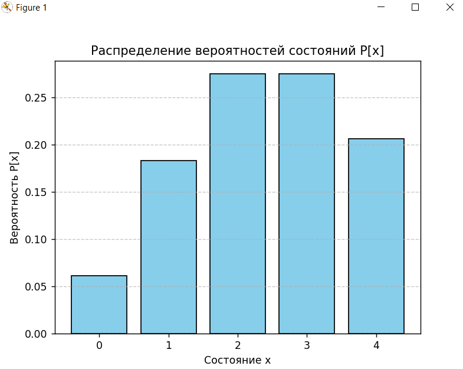
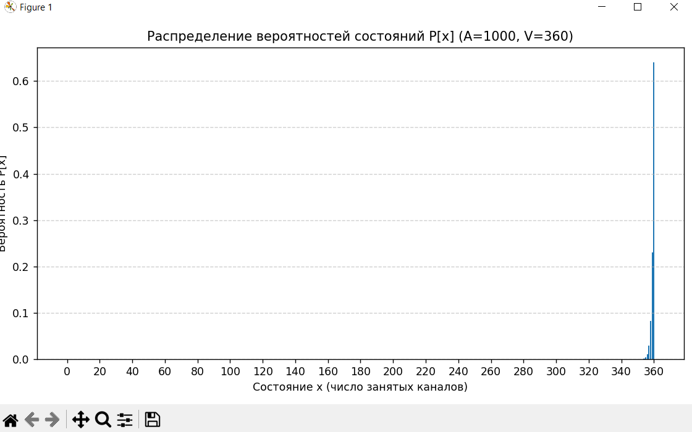

# Лабораторная работа №3
## Модель Эрланга M/M/V/0

### Теоретические сведения
Нагрузка **первого рода A** измеряется в Эрлангах:
\[
A = \frac{\lambda}{\mu}
\]
где  
- \( \lambda \) – интенсивность поступающего пуассоновского потока вызовов,  
- \( \mu \) – интенсивность обслуживания одного вызова.  

Нагрузка показывает среднее число одновременно занятых каналов, если бы система имела бесконечное число обслуживающих приборов.

Вероятности состояний системы:
\[
P(x) = \frac{A^x / x!}{\sum_{k=0}^{V} A^k / k!},\quad x=0,1,\dots,V
\]

Потери по времени (первая формула Эрланга):
\[
E_V(A) = P(V) = \frac{A^V / V!}{\sum_{k=0}^{V} A^k / k!}
\]

Для вычисления при больших A и V используется рекуррентная формула:
\[
E_0(A) = 1, \qquad
E_V(A) = \frac{A\,E_{V-1}(A)}{V + A\,E_{V-1}(A)}
\]

---

## 2.1. Пуассоновская нагрузка первого рода

- Поступающая нагрузка: \( A = x_1 + 1 = 2 + 1 = 3 \) Эрланга  
- Число приборов: \( V = x_2 + 1 = 5 + 1 = 6 \)

### 1) Распределение вероятностей
\[
P(x) = \frac{A^x / x!}{\sum_{k=0}^{6} A^k / k!}
\]
\[
P(x) = \frac{3^x / x!}{\sum_{k=0}^{6} 3^k / k!}
\]

Потери по Эрлангу
\[
E_6(3) = \frac{3^6/6!}{\sum_{k=0}^{6} 3^k / k!}
\]




##### Код
```python
import math
import matplotlib.pyplot as plt

# Данные
A = 3                # Эрланг
V = 6                # количество приборов

# Расчёт знаменателя
den = sum(A**k / math.factorial(k) for k in range(V+1))

# Распределение вероятностей
P = [ (A**x / math.factorial(x)) / den for x in range(V+1) ]

# Потери по Эрлангу (вероятность занятости всех каналов)
E_V = P[-1]

print("Вероятности состояний:")
for x, p in enumerate(P):
    print(f"P({x}) = {p:.5f}")
print(f"\nПотери по Эрлангу E_{V}({A}) = {E_V:.5f}")

# График
plt.figure(figsize=(6,4))
plt.bar(range(V+1), P)
plt.xlabel("Число занятых каналов x")
plt.ylabel("P(x)")
plt.title("Распределение вероятностей для A=3 Эрл., V=6")
plt.grid(axis='y')
plt.show()
```
## Задание 2.2
На систему M/M/V/0 поступает 1000 Эрланг, система имеет 360
обслуживающих приборов. Вычислите распределение вероятностей.
Объясните результат. Вычислите потери по рекуррентной формуле
Эрланга.
**Дано:**  
- Нагрузка \( A = 1000 \) Эрланг  
- Количество обслуживающих приборов \( V = 360 \)

---

### 1. Потери по рекуррентной формуле Эрланга
Формула:
\[
E_{0}(A) = 1 ,
\qquad
E_{v}(A) = \frac{A\,E_{v-1}(A)}{\,v + A\,E_{v-1}(A)\,}, \quad v = 1,2,\dots,V
\]

Вычисляем последовательно от \(v=1\) до \(v=360\).  
Результат последней итерации — вероятность отказа в обслуживании:

\[
E_{360}(1000) \approx 0{,}64
\]


#### Код
```python
def erlang_loss(A, V):
    E = 1.0               # E0(A) = 1
    for v in range(1, V + 1):
        E = (A * E) / (v + A * E)
    return E

A = 1000     # нагрузка, Эрланг
V = 360      # количество обслуживающих приборов

E_V = erlang_loss(A, V)
print(f"Потери по Эрлангу E_{V}({A}) = {E_V}")
```


---

### 2. Распределение вероятностей состояний
\[
P(x) = \frac{\dfrac{A^{x}}{x!}}
             {\displaystyle\sum_{k=0}^{V} \dfrac{A^{k}}{k!}}, \quad x = 0,1,\dots,V
\]

##### Код
```python
import math
import matplotlib.pyplot as plt

A = 1000
V = 360

# --- вычисляем логарифмы членов суммы ---
# ln( A^k / k! ) = k*ln(A) - ln(k!)
log_terms = [k * math.log(A) - math.lgamma(k + 1) for k in range(V + 1)]

# находим максимум для нормализации, чтобы не переполнялось
m = max(log_terms)

# знаменатель: sum( exp(term - m) )
den = sum(math.exp(t - m) for t in log_terms)

# ln(знаменателя) = m + ln(den)
ln_norm = m + math.log(den)

# вероятности P(x) = exp( log_term - ln_norm )
P = [math.exp(t - ln_norm) for t in log_terms]

# проверим
print("Первые 10 вероятностей:")
for x in range(10):
    print(f"P({x}) = {P[x]:.6e}")

print(f"\nP(V={V}) = {P[-1]:.6e}")
print(f"Сумма вероятностей = {sum(P):.6f}")
```

**Вывод:** при такой нагрузке почти всё время заняты все 360 каналов,
потери по времени и по вызовам очень высоки.


## Задание 2.3

### M/M/50/0
- Пуассоновский поток заявок (M),
- экспоненциальное время обслуживания (M),
- 50 обслуживающих приборов,
- ожидания нет (0) — при занятости всех каналов вызов теряется.  
**Пример трафика:** обычная телефонная станция с большим числом абонентов и 50 линиями.  
**Состав СМО:** множество источников вызовов, управляющее устройство, 50 каналов.

---

### M/D/30/0
- Пуассоновский поток заявок (M),
- **постоянное** время обслуживания (D),
- 30 обслуживающих приборов,
- ожидания нет (0).  
**Пример трафика:** цифровая АТС с фиксированным временем установления соединения.  
**Состав СМО:** множество источников вызовов, управляющее устройство, 30 каналов.

---

### D/M/10/0
- **Детерминированный** поток заявок (D) — заявки приходят через равные интервалы,
- экспоненциальное время обслуживания (M),
- 10 обслуживающих приборов,
- ожидания нет (0).  
**Пример трафика:** автоматическая система периодических запросов с фиксированными интервалами прихода заявок и случайным временем обработки.  
**Состав СМО:** детерминированные источники, управляющее устройство, 10 каналов.

---
