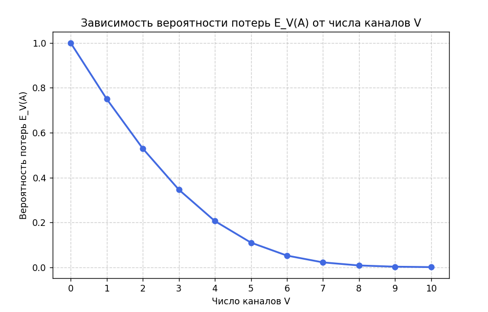

<div align="center">

# Федеральное агентство связи  

**ФЕДЕРАЛЬНОЕ ГОСУДАРСТВЕННОЕ БЮДЖЕТНОЕ  
ОБРАЗОВАТЕЛЬНОЕ УЧРЕЖДЕНИЕ ВЫСШЕГО ОБРАЗОВАНИЯ**  

**«САНКТ-ПЕТЕРБУРГСКИЙ ГОСУДАРСТВЕННЫЙ УНИВЕРСИТЕТ  
ТЕЛЕКОММУНИКАЦИЙ ИМ. ПРОФ. М. А. БОНЧ-БРУЕВИЧА» (СПбГУТ)**  

</div>

<div align="center">
Факультет информационных технологий и программной инженерии  
Кафедра: Программная инженерия. Разработка программного обеспечения и приложений искусственного интеллекта в киберфизических системах  

---

## ЛАБОРАТОРНАЯ РАБОТА №3 
по дисциплине **«Математическое и программное обеспечение киберфизических систем»**
## **Тема:** Модель Эрланга (M/M/V/0)
</div>

<div align="right"><br>
Выполнил: студент 2-го курса группы ИКПИ-42  
Терещенко Максим Андреевич  

**Преподаватель:** 	Гребенщикова Александра Андреевна
</div>
<br><br>
<div align="center">
Санкт-Петербург  
2025  
</div>


<div style="page-break-before: always;"></div>


**Цель работы:**  
Получение навыков расчёта качества обслуживания по модели Эрланга.

---

## 1. Теоретические сведения

### 1.1. Общие положения

В системе с коммутацией каналов большой ёмкости, когда число источников нагрузки **N** велико, а параметр потока от одного источника **a** мал, поведение одного источника мало влияет на суммарный поток вызовов.  
Тогда суммарный поток вызовов:

\[
A = N \cdot a
\]

является практически постоянной величиной и не зависит от состояния системы.

Такой поток называется **простейшим**, и для него выполняется:

\[
\lambda_0 = \lambda_1 = \ldots = \lambda_{V-1} = \lambda > 0, \quad \mu_x = x \mu
\]

---

### 1.2. Предположения модели Эрланга

Модель Эрланга справедлива при следующих условиях:

- вызовы поступают по **пуассоновскому потоку** интенсивности λ;
- время обслуживания подчиняется **экспоненциальному распределению** с параметром μ > 0;
- если все линии заняты, вызов **теряется**;
- любая свободная линия доступна для любого поступающего вызова;
- система работает в **стационарном режиме**.

---

### 1.3. Основные зависимости

#### Распределение вероятностей состояний:

\[
P[x] = \frac{(A^x / x!)}{\sum_{i=0}^{V} (A^i / i!)}
\]

где  
\(A = \frac{\lambda}{\mu}\) – **поступающая нагрузка первого рода**,  
\(x = 0, 1, 2, ..., V\).

#### Вероятность потерь (формула Эрланга, первая форма):

\[
E_V(A) = \frac{A^V / V!}{\sum_{i=0}^{V} (A^i / i!)}
\]

Потери по времени, вызовам и нагрузке совпадают:

\[
\text{Потери} = E_V(A)
\]

#### Рекуррентная формула Эрланга:

\[
E_0(A) = 1
\]

\[
E_V(A) = \frac{A \cdot E_{V-1}(A)}{V + A \cdot E_{V-1}(A)}
\]

---

## 2. Ход работы

### 2.1. Система M/M/V/0 с параметрами x₁ = 2, x₂ = 3

Пусть:  
- нагрузка первого рода \(A = x_1 + 1 = 3\) Эрланга,  
- число обслуживающих приборов \(V = x_2 + 1 = 4\).

#### 1) Нагрузка первого рода

**Нагрузка первого рода** – это среднее число занятых линий при поступающем потоке вызовов интенсивности λ и среднем времени обслуживания 1/μ.  
Физически это мера средней занятости системы вызовами.

\[
A = \frac{\lambda}{\mu}
\]

---

#### 2) Распределение вероятностей состояний

Для системы M/M/V/0 с параметрами:

- x₁ = 2 → нагрузка первого рода: A = x₁ + 1 = 3 Эрланга  
- x₂ = 3 → число обслуживающих приборов: V = x₂ + 1 = 4

Вероятность того, что в системе будет занято x каналов, рассчитывается по формуле:

\[
P[x] = \frac{A^x / x!}{\sum_{i=0}^{V} A^i / i!}
\]

Вычислим сумму для нормировки:

\[
\sum_{i=0}^{4} \frac{3^i}{i!} = 1 + 3 + 4.5 + 4.5 + 3.375 = 16.375
\]

Тогда вероятности состояний:

| Состояние x | Формула \(P[x] = \frac{A^x / x!}{\Sigma}\) | Вероятность |
|--------------|---------------------------------------------|-------------|
| 0            | 1 / 16.375                                  | 0.061       |
| 1            | 3 / 16.375                                  | 0.183       |
| 2            | 4.5 / 16.375                                | 0.275       |
| 3            | 4.5 / 16.375                                | 0.275       |
| 4            | 3.375 / 16.375                              | 0.206       |


---

#### 3) Вероятность потерь (по рекуррентной формуле)

Рассчитаем:

\[
E_0 = 1
\]
\[
E_1 = \frac{3}{1 + 3} = 0.75
\]
\[
E_2 = \frac{3 \cdot 0.75}{2 + 3 \cdot 0.75} = 0.529
\]
\[
E_3 = \frac{3 \cdot 0.529}{3 + 3 \cdot 0.529} = 0.346
\]
\[
E_4 = \frac{3 \cdot 0.346}{4 + 3 \cdot 0.346} = 0.206
\]

**Результат:**  
Потери \(E_4(A) = 0.206\), что соответствует вероятности отказа ≈ **20.6%**.



---

### 2.2. Система M/M/360/0 при A = 1000 Эрланг

Для больших A и V точный прямой расчёт невозможен из-за переполнения чисел, поэтому используется рекуррентная формула.

```bash
P[V] (вероятность, что все V=360 каналов заняты) = 0.64055978
Процент отказов = 64.06%
Доля обслуженных вызовов = 35.9440%
Обслуженная нагрузка (carried traffic) = 359.440222 Эрл.
Средняя загрузка одного канала = 0.998445 (≈99.84%)
```

---

### 2.3. Описание систем различных типов

| Система | Расшифровка | Характер потока | Характер обслуживания | Пример |
|----------|--------------|------------------|-----------------------|---------|
| **M/M/50/0** | Поток пуассоновский, время обслуживания экспоненциальное, 50 каналов, нет ожидания | Случайный поток вызовов | Случайная длительность обслуживания | Телефонная станция с 50 линиями |
| **M/D/30/0** | Пуассоновский поток, детерминированное обслуживание, 30 каналов | Поток случайный | Время обслуживания фиксированное | 30 одинаковых автоматов с одинаковым временем работы |
| **D/M/10/0** | Детерминированный поток, случайное обслуживание, 10 каналов | Вызовы приходят строго через одинаковые интервалы | Случайное время обслуживания | Система контроля, где события происходят периодически, но обслуживаются случайно |


---

## 3. Выводы

1. Модель Эрланга позволяет оценивать эффективность обслуживания систем с ограниченным числом каналов.  
2. При увеличении нагрузки вероятность потерь растет, но не линейно, а по насыщаемой зависимости.  
3. Рекуррентная формула Эрланга удобна для вычислений при больших A и V, где прямой расчёт невозможен.  
4. Для системы с A=3, V=4 потери составляют 20.6%, что соответствует умеренной загруженности.  
5. Для больших систем (A=1000, V=360) вероятность потерь высока — ≈64.06%, что означает сильное блокирование при высокой нагрузке на канал.

---

```python
### Приложение
### Код для графика:

import math
import matplotlib.pyplot as plt

# Исходные данные
A = 3      # нагрузка (Эрланг)
V = 4      # число каналов

# Расчёт знаменателя (суммы Σ)
denominator = sum(A**i / math.factorial(i) for i in range(V + 1))

# Расчёт вероятностей состояний
probabilities = [(A**x / math.factorial(x)) / denominator for x in range(V + 1)]

# Вывод таблицы
print("| Состояние x | Формула (A^x / x!) / Σ | Вероятность |")
print("|--------------|---------------------------|--------------|")
for x, p in enumerate(probabilities):
    formula = f"{A**x / math.factorial(x):.3f} / {denominator:.3f}"
    print(f"| {x} | {formula} | {p:.3f} |")

# Построение графика
plt.bar(range(V + 1), probabilities, color='skyblue', edgecolor='black')
plt.title("Распределение вероятностей состояний P[x]")
plt.xlabel("Состояние x")
plt.ylabel("Вероятность P[x]")
plt.xticks(range(V + 1))
plt.grid(axis='y', linestyle='--', alpha=0.7)
plt.show()


# # Пересчёт блокировки по рекуррентной формуле Эрланга (Erlang B recurrence):
A = 1000          # нагрузка (Эрланг)
V = 360           # число каналов

E = 1.0           # E0 = 1
for v in range(1, V + 1):
    E = (A * E) / (v + A * E)

print(f"E_{V}({A}) = {E:.8f}")
print(f"Процент отказов = {E * 100:.2f}%")
print(f"Доля обслуженных вызовов = {(1 - E) * 100:.2f}%")

# Дополнительно: обслуженная нагрузка и загрузка канала
carried_traffic = A * (1 - E)            # обслуженная нагрузка
utilization_per_channel = carried_traffic / V
print(f"Обслуженная нагрузка (carried traffic) = {carried_traffic:.3f} Эрл.")
print(f"Средняя загрузка одного канала = {utilization_per_channel:.4f} (≈{utilization_per_channel*100:.2f}%)")
```