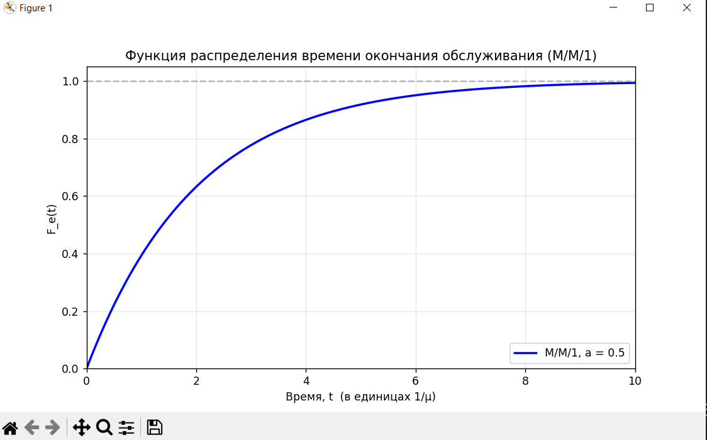
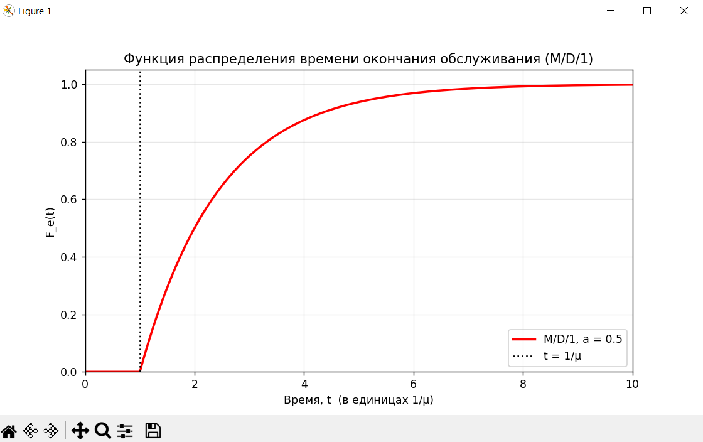

Лабораторная работа №5
Системы с ожиданием без потерь (M/M/1 и M/D/1)
Выполнил: [Ваше ФИО]
Группа: [Ваша группа]
Дата: 28.10.2025

Исходные данные (по доске преподавателя)

Rинт = L / Vинт
Tв.п. = L / Vа (мс)
A = λ · tср (ср. время обслуживания)
P = λпр · Tв.п. (теория)
M/M/1 → БАГ, M/D/1 → БАГ
P0 = 1 – 0.5, t = 1/μ

Вывод из доски:

Система M/M/1
P₀ = 1 – 0.5 = 0.5 → a = 0.5
t = 1/μ → среднее время обслуживания tₛ = 1/μ

Расчёт по методичке (M/M/1, a = 0.5)
Дано:
$$a = \frac{\lambda}{\mu} = 0.5$$

1. Вероятность немедленного обслуживания
$$P_0 = [0] = 1 - a = 1 - 0.5 = \boxed{0.5}$$

2. Среднее время ожидания начала обслуживания
$$t_w = \frac{a}{\mu (1 - a)} = \frac{0.5}{\mu \cdot 0.5} = \frac{1}{\mu}$$
Так как $ t_s = \frac{1}{\mu} $, то:
$$\boxed{t_w = t_s = \frac{1}{\mu}}$$

3. Вероятность нахождения в очереди трёх заявок
$$[x] = a^x (1 - a) \quad \Rightarrow \quad [3] = (0.5)^3 \cdot (0.5) = 0.125 \cdot 0.5 = \boxed{0.0625}$$

4. Средняя длина очереди
$$Q_w = \frac{a^2}{1 - a} = \frac{0.5^2}{0.5} = \frac{0.25}{0.5} = \boxed{0.5}$$

2.2. График ФРВ конца обслуживания (M/M/1)
$$F_e(t) = 1 - e^{-\mu (1 - a) t} = 1 - e^{-\mu \cdot 0.5 t} = 1 - e^{-0.5 \mu t}$$

!!!! !

График: плавная экспоненциальная функция, достигает 1 при $ t \to \infty $.

2.3. Средние времена

ПоказательM/M/1 (a=0.5)$ t_w $ — ожидание начала$ \frac{1}{\mu} $$ t_e $ — ожидание конца$ t_w + t_s = \frac{1}{\mu} + \frac{1}{\mu} = \boxed{\dfrac{2}{\mu}} $

Сравнение с M/D/1 (для справки)
$$t_w = \frac{a}{2\mu (1-a)} = \frac{0.5}{2\mu \cdot 0.5} = \frac{0.5}{\mu} = \boxed{\dfrac{1}{2\mu}}$$
$$t_e = t_s + t_w = \frac{1}{\mu} + \frac{1}{2\mu} = \boxed{\dfrac{3}{2\mu}}$$

M/D/1 даёт меньшее время ожидания начала обслуживания!

Выводы по заданию с доски

P₀ = 0.5 — вероятность немедленного обслуживания.
t_w = 1/μ — среднее ожидание начала = времени обслуживания.
P(3 в очереди) = 0.0625 — малая вероятность.
Q_w = 0.5 — в среднем ползаявки в очереди.
ФРВ конца обслуживания — экспоненциальная с параметром 0.5μ.
M/D/1 эффективнее по времени ожидания начала.

