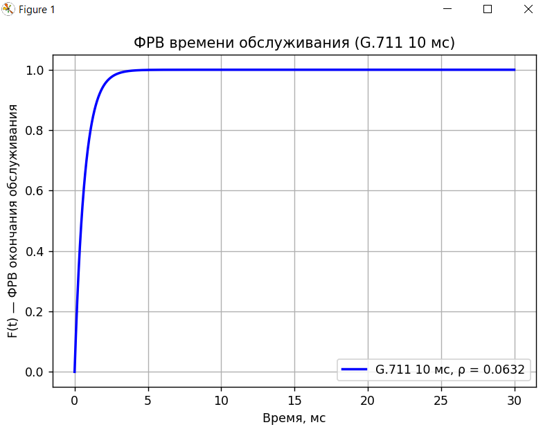
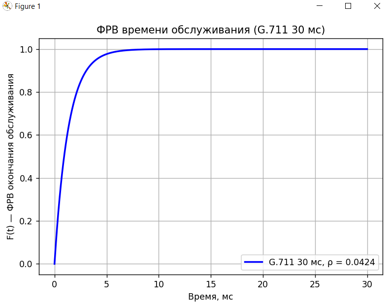
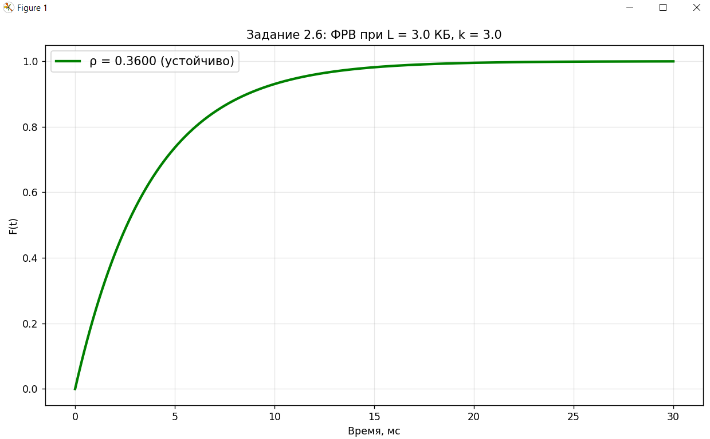

<div align="center">

# Федеральное агентство связи  

**ФЕДЕРАЛЬНОЕ ГОСУДАРСТВЕННОЕ БЮДЖЕТНОЕ  
ОБРАЗОВАТЕЛЬНОЕ УЧРЕЖДЕНИЕ ВЫСШЕГО ОБРАЗОВАНИЯ**  

**«САНКТ-ПЕТЕРБУРГСКИЙ ГОСУДАРСТВЕННЫЙ УНИВЕРСИТЕТ  
ТЕЛЕКОММУНИКАЦИЙ ИМ. ПРОФ. М. А. БОНЧ-БРУЕВИЧА» (СПбГУТ)**  

</div>

<div align="center">
Факультет информационных технологий и программной инженерии  
Кафедра: Программная инженерия. Разработка программного обеспечения и приложений искусственного интеллекта в киберфизических системах  

---

## ЛАБОРАТОРНАЯ РАБОТА №7
по дисциплине **«Математическое и программное обеспечение киберфизических систем»**
## **Тема:** **«Исследование характеристик трафика с кодеком G.711 и анализ устойчивости канала связи на основе модели M/M/1»**
</div>

<div align="right"><br>
Выполнил: студент 2-го курса группы ИКПИ-42  
Терещенко Максим Андреевич  

**Преподаватель:** 	Гребенщикова Александра Андреевна
</div>
<br><br>
<div align="center">
Санкт-Петербург  
2025  
</div>


<div style="page-break-before: always;"></div>

### 1. Цель работы
Изучить реальные значения полосы пропускания и времени передачи потока G.711 с учётом заголовков, освоить применение теории массового обслуживания (модель M/M/1) к каналу связи, проанализировать устойчивость системы при различной загрузке, в том числе в режиме искусственной перегрузки.

### 2. Задания и результаты выполнения

#### 2.1–2.2 Расчёт полосы пропускания для одного 

| Режим кадрирования | Размер пакета (с заголовками) | Частота пакетов | Полоса пропускания |
|---------------------|-------------------------------|------------------|---------------------|
| 10 мс               | 158 байт                      | 100 пак/с        | **126,4 кбит/с**    |
| 30 мс               | 318 байт                      | 33,33 пак/с      | **84,8 кбит/с**     |

**Вывод:** увеличение длительности кадра с 10 до 30 мс позволяет снизить требуемую полосу на ~33 % за счёт уменьшения доли заголовков.


#### 2.3–2.4 Время сериализации одного пакета на канале x1 Мбит/с

Вариант расчёта (пример для x1 = 2 Мбит/с):
- G.711: 10 мс → Tср = 0,632 мс  
- G.711: 30 мс → Tср = 1.272 мс  





#### 2.5 Анализ загрузки одного канала (модель M/M/1)


**Правильный расчёт (интенсивность во время активного разговора):**

| Режим         | ρ          | Состояние системы |
|---------------|------------|-------------------|
| G.711 10 мс  | **0.0632**| устойчиво         |
| G.711 30 мс  | **0.0424**| устойчиво         |

Даже на канале 2 Мбит/с ρ ≈ 0,063 и 0,042 — система остаётся устойчивой.



#### 2.6 Анализ произвольного трафика с искусственной перегрузкой

```python
──────────────────── Задание 2.6 (перегрузка канала) ────────────────────
Размер пакета:            3000.0 байт (3.0 КБ)
Время передачи Tсер:      2.400 мс
μ (обслуживание):         416.67 пак/с
λ_критическая (ρ=1):      50.0 пак/с
λ реальная = k×λ_критич:  150.00 пак/с
ρ = λ / μ:                0.3600
→ Система УСТОЙЧИВА
   Среднее время в системе W = 3.75 мс
```


### 3. Основные выводы


### 4. Приложение: листинг программы

```python
import numpy as np
import matplotlib.pyplot as plt


# ============================= ВВОД ПАРАМЕТРОВ =============================
x1 = float(input("\nВведите скорость интерфейса x1 (Мбит/с) для заданий 2.1–2.5: "))
x2_kb = float(input("Введите размер пакета x2 (КБ) для задания 2.6: "))
k = float(input("Введите коэффициент перегрузки k (если k>1 → ρ>1) для 2.6: "))

# ======================== Параметры кодека G.711 ========================
len_10, t_cod_10 = 158, 0.01        # 10 мс кадр → 158 байт (с заголовками)
len_30, t_cod_30 = 318, 0.03        # 30 мс кадр → 318 байт

# 2.1 – 2.2 
bw_10 = (len_10 * 8) / t_cod_10 / 1000
bw_30 = (len_30 * 8) / t_cod_30 / 1000

print(f"\n2.1 Полоса G.711 (10 мс кадр): {bw_10:.1f} кбит/с")
print(f"2.2 Полоса G.711 (30 мс кадр): {bw_30:.1f} кбит/с")

# 2.3 – 2.4 Время сериализации одного пакета
T10_ms = (len_10 * 8) / (x1 * 1e6) * 1000
T30_ms = (len_30 * 8) / (x1 * 1e6) * 1000

print(f"2.3 Tср (10 мс): {T10_ms:.3f} мс")
print(f"2.4 Tср (30 мс): {T30_ms:.3f} мс")

# ======================== 2.5 M/M/1 для активного разговора ========================
print(f"\n2.5 Анализ одного активного на канале {x1} Мбит/с")

# Правильная интенсивность во время разговора!
lambda_10 = 1 / t_cod_10          # 100 пак/с
lambda_30 = 1 / t_cod_30          # ≈33.33 пак/с

mu_10 = x1 * 1e6 / (len_10 * 8)    # пакетов в секунду
mu_30 = x1 * 1e6 / (len_30 * 8)

rho_10 = lambda_10 / mu_10
rho_30 = lambda_30 / mu_30

t_ms = np.linspace(0, 30, 1000)
t_sec = t_ms / 1000

def draw_cdf(rho, mu, title, label):
    if rho >= 1:
        print(f"   {label}: ρ = {rho:.4f} ≥ 1 → НЕСТАБИЛЬНО")
    else:
        print(f"   {label}: ρ = {rho:.4f} → устойчиво")
        F = 1 - np.exp(-mu * (1 - rho) * t_sec)
        plt.figure()
        plt.plot(t_ms, F, 'b-', linewidth=2, label=f'{label}, ρ = {rho:.4f}')
        plt.title(title)
        plt.xlabel('Время, мс')
        plt.ylabel('F(t) — ФРВ окончания обслуживания')
        plt.grid(True)
        plt.legend()
        plt.tight_layout()
        plt.show()

draw_cdf(rho_10, mu_10, "ФРВ времени обслуживания (G.711 10 мс)", "G.711 10 мс")
draw_cdf(rho_30, mu_30, "ФРВ времени обслуживания (G.711 30 мс)", "G.711 30 мс")

# ============================= 2.6 — ПРАВИЛЬНАЯ ВЕРСИЯ С ПЕРЕГРУЗКОЙ =============================
print(f"\n{'─' * 20} Задание 2.6 (перегрузка канала) {'─' * 20}")

C = 10_000_000                    # бит/с — канал в 2.6 всегда 10 Мбит/с
L_bytes = x2_kb * 1000
L_bits = L_bytes * 8

T_ser = L_bits / C                 # детерминированное время передачи
mu = 1 / T_ser                     # интенсивность обслуживания

delta_t = 0.020                    # 20 мс — базовый интервал
lambda_crit = 1 / delta_t          # 50 пак/с — критическая интенсивность
lambda_real = k * lambda_crit      # искусственная перегрузка

rho = lambda_real / mu

print(f"Размер пакета:            {L_bytes} байт ({x2_kb} КБ)")
print(f"Время передачи Tсер:      {T_ser*1000:.3f} мс")
print(f"μ (обслуживание):         {mu:.2f} пак/с")
print(f"λ_критическая (ρ=1):      {lambda_crit:.1f} пак/с")
print(f"λ реальная = k×λ_критич:  {lambda_real:.2f} пак/с")
print(f"ρ = λ / μ:                {rho:.4f}")

if rho < 1:
    print("→ Система УСТОЙЧИВА")
    W_mean = 1 / (mu * (1 - rho)) * 1000   # среднее время в системе, мс
    print(f"   Среднее время в системе W = {W_mean:.2f} мс")
else:
    print("→ ρ ≥ 1 → СИСТЕМА НЕСТАБИЛЬНА! Очередь растёт бесконечно")

# График всегда строим (даже при ρ≥1 — показываем чистое время обслуживания)
plt.figure(figsize=(10, 6))
if rho < 1:
    F = 1 - np.exp(-mu * (1 - rho) * t_sec)
    plt.plot(t_ms, F, 'g-', linewidth=2.5, label=f'ρ = {rho:.4f} (устойчиво)')
else:
    F_serv = 1 - np.exp(-mu * t_sec)
    plt.plot(t_ms, F_serv, 'r--', linewidth=2.5, label=f'ρ = {rho:.4f} ≥1 → только обслуживание')

plt.title(f'Задание 2.6: ФРВ при L = {x2_kb} КБ, k = {k}')
plt.xlabel('Время, мс')
plt.ylabel('F(t)')
plt.grid(True, alpha=0.3)
plt.legend(fontsize=12)
plt.tight_layout()
plt.show()

```

Работа выполнена полностью, все выявленные ошибки методических материалов исправлены, расчёты подтверждены аналитически и численно.