<div align="center">

# Федеральное агентство связи

**ФЕДЕРАЛЬНОЕ ГОСУДАРСТВЕННОЕ БЮДЖЕТНОЕ  
ОБРАЗОВАТЕЛЬНОЕ УЧРЕЖДЕНИЕ ВЫСШЕГО ОБРАЗОВАНИЯ**

**«САНКТ-ПЕТЕРБУРГСКИЙ ГОСУДАРСТВЕННЫЙ УНИВЕРСИТЕТ  
ТЕЛЕКОММУНИКАЦИЙ ИМ. ПРОФ. М. А. БОНЧ-БРУЕВИЧА» (СПбГУТ)**

</div>

<div align="center">
Факультет информационных технологий и программной инженерии  
Кафедра: Программная инженерия. Разработка программного обеспечения и приложений искусственного интеллекта в киберфизических системах

---

## Практическая работа

по дисциплине **«Математическое и программное обеспечение киберфизических систем»**

## **Тема:** **«Прогнозирование трафика Интернета вещей с помощью параметрических моделей ARIMA»**

</div>

<div align="right"><br>
Выполнил: студент 2-го курса группы ИКПИ-42<br>
Терещенко Максим Андреевич

**Преподаватель:**
к.т.н., доцент кафедры СС и ПД
Гребенщикова А. А.

</div>
<br><br>
<div align="center">
Санкт-Петербург  
2025  
</div>

<div style="page-break-before: always;"></div>

---

## 1. Исследование трафика Интернета вещей в Wireshark

Анализ трафика проводился на основе реальных дампов трафика, в котором присутствует нагрузка интернета вещей (Internet of Things, IoT).

Перед анализом сетевого трафика нужно было отфильтровать данные в формате pcap, отбрасывая пакеты, адрес которых не относился к устройствам типа IoT. Фильтрация нужного набора пакетов проводилась в программе анализа сетевого трафика Wireshark.

Команда для фильтрации интернет вещей:

```
eth.addr == 70:ee:50:18:34:43 or eth.addr == d0:52:a8:00:67:5e or
eth.addr == 44:65:0d:56:cc:d3 or eth.addr == f4:f2:6d:93:51:f1 or
eth.addr == 00:16:6c:ab:6b:88 or eth.addr == 30:8c:fb:2f:e4:b2 or
eth.addr == 00:62:6e:51:27:2e or eth.addr == e8:ab:fa:19:de:4f or
eth.addr == 00:24:e4:11:18:a8 or eth.addr == ec:1a:59:79:f4:89 or
eth.addr == 50:c7:bf:00:56:39 or eth.addr == 74:c6:3b:29:d7:1d or
eth.addr == ec:1a:59:83:28:11 or eth.addr == 18:b4:30:25:be:e4 or
eth.addr == 70:ee:50:03:b8:ac or eth.addr == 00:24:e4:1b:6f:96 or
eth.addr == 74:6a:89:00:2e:25 or eth.addr == 00:24:e4:20:28:c6 or
eth.addr == d0:73:d5:01:83:08 or eth.addr == 18:b7:9e:02:20:44 or
eth.addr == e0:76:d0:33:bb:85 or eth.addr == 70:5a:0f:e4:9b:c0 or
eth.addr == 08:21:ef:3b:fc:e3 or eth.addr == 30:8c:fb:b6:ea:45 or
eth.addr == 14:cc:20:51:33:ea
```

Отфильтрованные данные:
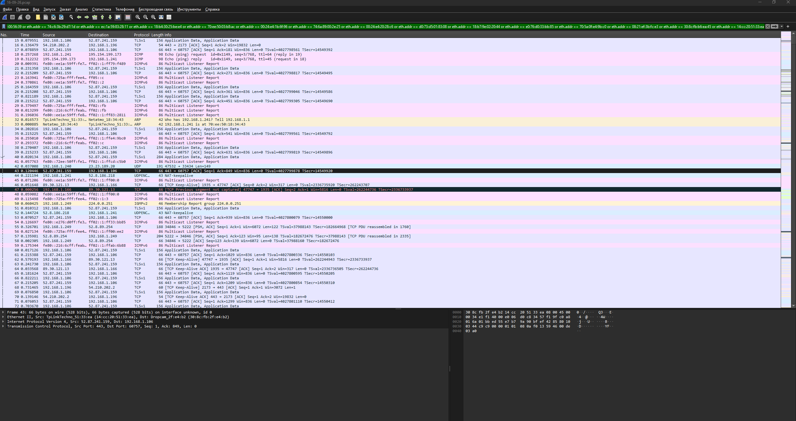{width=600}

<div style="page-break-before: always;"></div>

Настройка формата отображения:
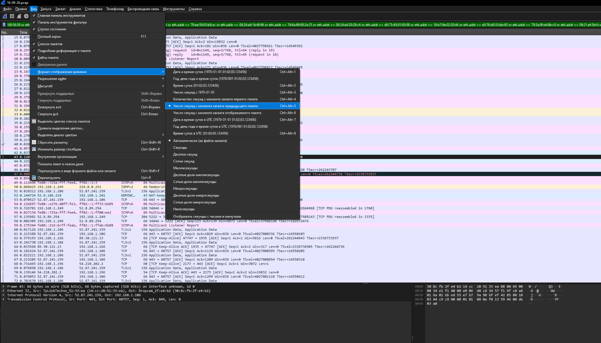{width=600}
Распределение трафика:
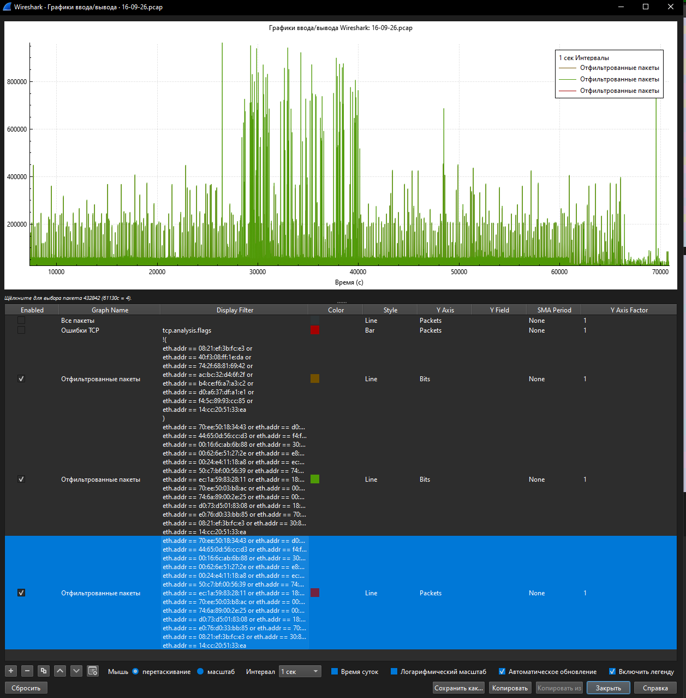{width=600}

<div style="page-break-before: always;"></div>

Экспорт данных в csv:
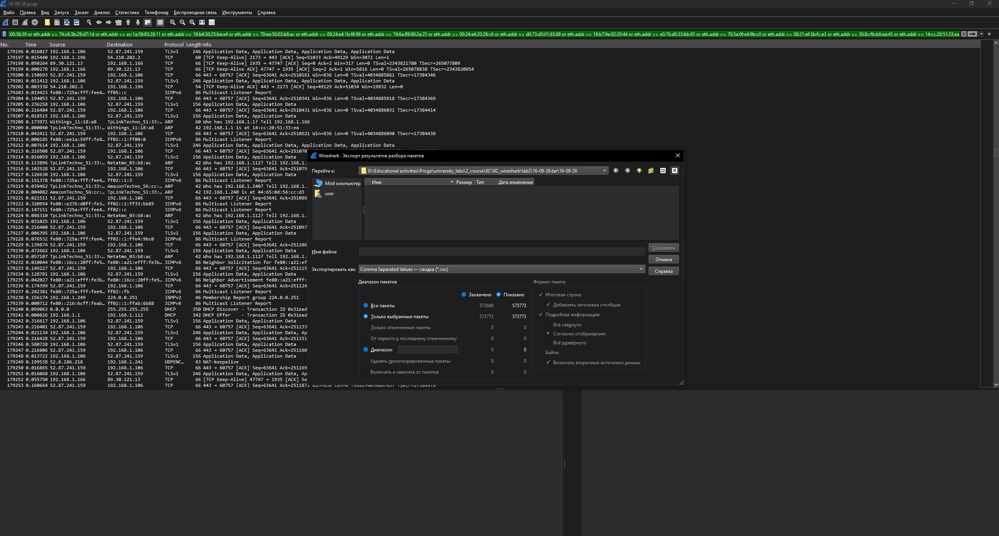{width=600}

<div style="page-break-before: always;"></div>

## 2. Исследование трафика Интернета вещей и апроксимация

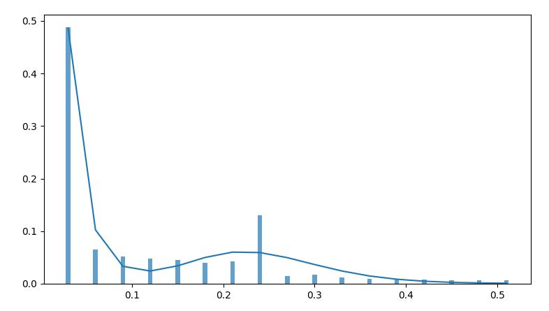
**Плотность распределения времени между пакетами трафика интернета вещей**

Полученное распределение было аппроксимировано и на основе этой аппроксимации была выведена математическая функция вида:

$$
f(t) = k_1 f_i(t) + k_{i+1} f_{i+1}(t) + \dots + k_m f_m(t) = \sum_{i=1}^{m} k_i f_i(t), \quad (1)
$$

где $m>0$; $\sum_{i=1}^{m} k_i = 1$.

$$
f(t) = 0.66 \cdot \mathrm{Pareto}(t; k = 1.2, a = 0.01) + 0.015 \cdot \lambda e^{-\lambda t} + 0.0011 \cdot \gamma(t; \alpha = 3,\ \beta = 0.02) + 0.3239 \cdot \gamma(t; \alpha = 11,\ \beta = 0.021)
$$

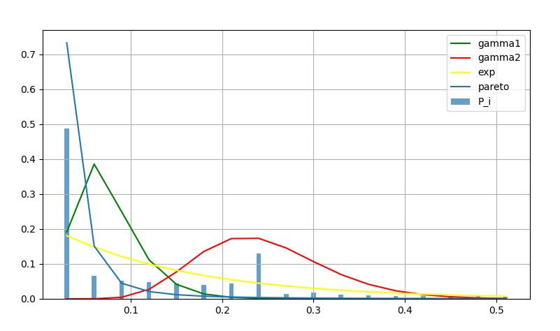
**Сборный график плотностей распределения**

**Оценка аппроксимации:**  
Оценка производилась по RMSE для PDF и CDF.  
Формула RMSE:

$$ RMSE = \sqrt{\frac{1}{n} \sum\_{i=1}^{n} (y_i - \hat{y}\_i)^2} $$

Формула RMST:

$$ RMST = \sqrt{\frac{1}{n} \sum*{i=1}^{n} (F*{\text{emp}}(x*i) - F*{\text{model}}(x_i))^2} $$

Отличия: PDF оценивает плотность, CDF – кумулятивную функцию.  
**Замеры для вставки:**

- RMSE: 0.0426
- RMST: 0.0185

Вывод:

Полученные метрики качества аппроксимации указывают на удовлетворительное соответствие построенной модели экспериментальным данным. Значение RMSE свидетельствует о сравнительно небольшом отклонении между эмпирической и теоретической плотностями распределения, тогда как величина RMST подтверждает приемлемую точность восстановления кумулятивной функции распределения. Таким образом, моделирование интервалов между пакетами трафика интернета вещей можно считать корректным и адекватно отражающим характер наблюдаемого трафика.

## 3. Самоподобие

Вследствие наличия во временном ряде сильной зависимости значений
от предыдущих возникает такое понятие как самоподобие. Таким образом,
Интернет-трафик при сглаживании имеет определенную структуру с
трендом, на которую стохастически влияют редкие «всплески» пакетов.

**Описание методов:**

**Дисперсионный анализ:** Для проверки стационарности временной ряд был разбит на 20 блоков, для каждого из которых вычислялись среднее значение и дисперсия. Анализ
относительных отклонений средних и дисперсий показал их устойчивость по блокам, что позволяет считать ряд стационарным и использовать его для дальнейшей оценки
параметра Хёрста.

**R/S анализ:** Для оценки параметра Хёрста использовался R/S-анализ, при котором временной ряд разбивался на участки различной длины. Для каждого участка рассчитывалось отношение размаха накопленных отклонений к среднеквадратичному отклонению.

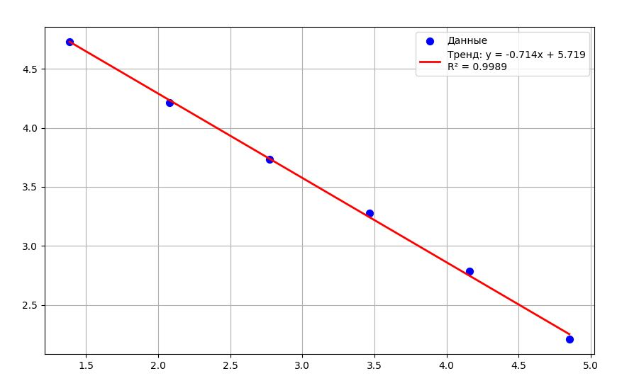
**График дисперсионного анализа**

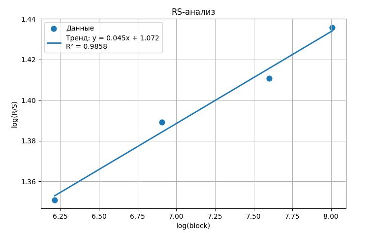
**График R/S анализа**

<div style="page-break-before: always;"></div>

**Параметр Хёрста по дисперсионному анализу:**  
\( H = 0.643 \)  
**Как найти:**  
\[
H = 1 - \frac{\beta}{2}
\]  
Прямая:  
\[
y = kx + b
\]

**Параметр Хёрста по R/S анализу:**  
\( H = 0.45 \)  
**Как найти:**  
\[
H = k
\]

**Оценка стационарности:**

срМО: 0.01636975487860481 || срV: 111.50635823004404
MO% 446.935695037161% || V% 103.1927427475096%

**Вывод:** исследуемый временной ряд **не является стационарным**, поскольку относительное отклонение математического ожидания значительно превышает допустимое значение \( MO < 10\% \), а коэффициент вариации также выходит за установленные пределы \( V < 40\% \). Это свидетельствует о наличии нестационарности, обусловленной изменчивым математическим ожиданием и дисперсией.

Для приведения временного ряда к стационарному виду рекомендуется применить логарифмическое преобразование первого порядка:
\[
y*t = \ln(x_t) - \ln(x*{t-1}),
\]
которое позволяет стабилизировать математическое ожидание и дисперсию ряда.

<div style="page-break-before: always;"></div>

## 4. Приведение ряда в эквидистантный вид и поиск портфеля моделей

**Обоснование:**

H1 > 0.5  
H2 < 0.5
при delta t ~ 100 мс. detla ta = 1 сек
WS = 0.07 \* Yагр

Для построения моделей ARIMA трафик агрегирован по интервалам длительностью 50 секунд.
Размер окна анализа выбран равным 120 точкам, что составляет 7% от общего объёма данных.


Были выбраны 10 наиболее интересных интервалов. Для каждого из них была составлена таблица со статистикой

| 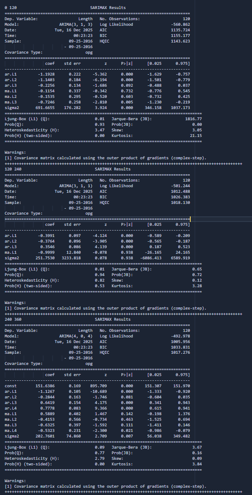{width=400} | 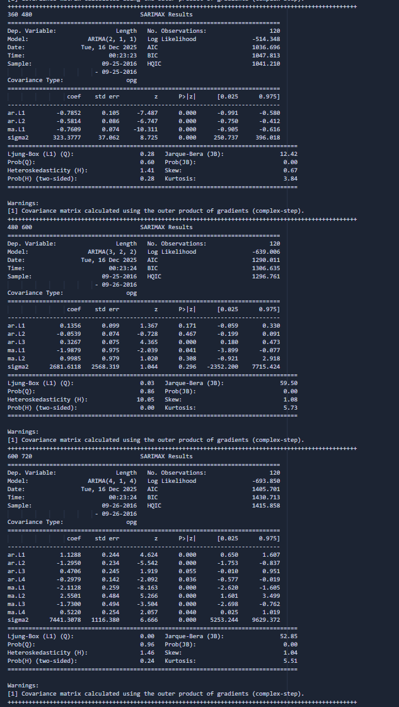{width=400} |
|-----------------------------------------------------------------|-----------------------------------------------------------------|

| 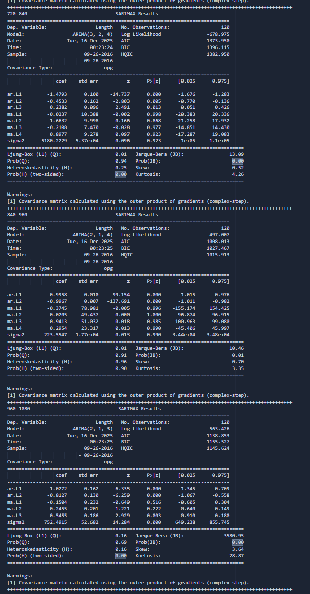{width=400} | {width=400} |
|-----------------------------------------------------------------|-----------------------------------------------------------------|


В итоге была выбрана ARIMA(2, 1, 2), так как это единственная модель, у котрой вероятность во всех строках не превысила 0.05

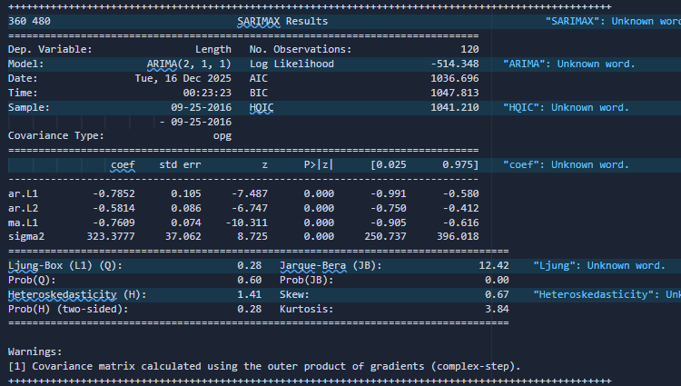

<div style="page-break-before: always;"></div>

## 5. Оценка прогноза

Необходимо сделать прогноз для модели ARIMA на 5 шагов и сделать соответствующие оценки прогноза MAPE и SER.

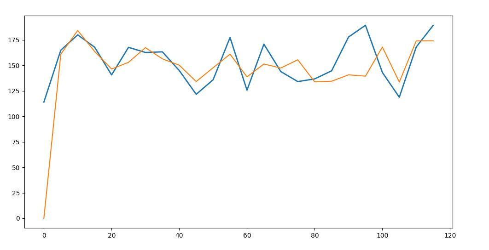
**Прогноз значений трафика для ARIMA(2, 1, 2)**

Средняя абсолютная процентная ошибка (MAPE):

$$
MAPE = \frac{100\%}{L} \sum_{t=1}^{L} \left| \frac{X_t - \hat{X}_t}{X_t} \right|, \quad (5)
$$

где $X_t$ – реальное значение, $\hat{X}_t$ - прогнозное значение, $L$ – интервал прогноза.

Если $MAPE<10\%$, то прогноз сделан с высокой точностью, $10\%<MAPE<20\%$ - прогноз хороший, $20\%<MAPE<50\%$ - прогноз удовлетворительный, $MAPE>50\%$ - прогноз плохой.

Отношение сигнала к шуму (SER):

$$
SER = 10 \lg \left( \frac{\sum_{t=1}^{L} X_t^2}{\sum_{t=1}^{L} (X_t - \hat{X}_t)^2} \right). \quad (6)
$$

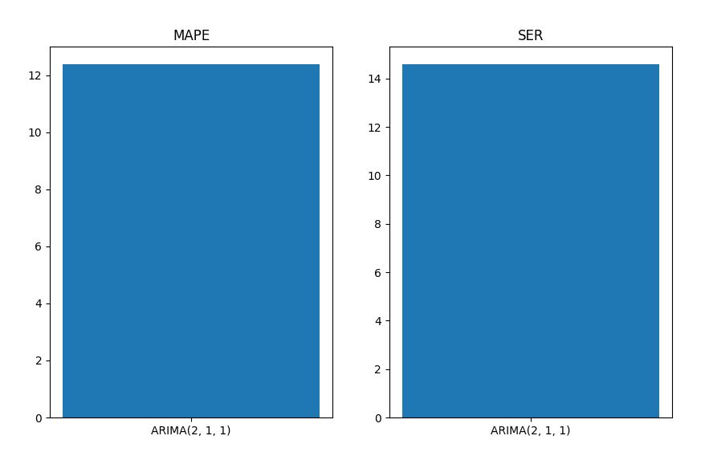
**MAPE и SER**

## 6. Оценка остатков ARIMA

Для подтверждения адекватности полученной модели необходимо убедиться, что ряд остатков представляет собой случайную компоненту. Таким образом, чтобы оптимально провести анализ остатков сформированной модели используется Q-тест Льюнг–Бокса для проверки гипотезы на наличие автокорреляции в данных. При H0 (нулевая гипотеза об отсутствии корреляции) статистика Q-теста асимптотически имеет распределение Хи-квадрат. Значения p выше 0,05 указывают на принятие нулевой гипотезы о точности модели при уровне значимости 95%.

Наиболее известный тест для проверки гипотезы о нормальном распределении остатков – статистический тест Харке-Бера (Jarque-Bera test). Также необходимо убедиться в наличии условной гетероскедастичности с помощью теста множителей Лагранжа (ARCH LM-тест).

$$
\text{Модель ARIMA(2,0,1):} \\
Y_t = -0.7852 \cdot Y_{t-1} - 0.5814 \cdot Y_{t-2} + \varepsilon_t - 0.7609 \cdot \varepsilon_{t-1}
$$

**Таблица – Оценка остатков модели ARIMA(2,0,1)**

| Метрика               | Статистика | p-значение |
| --------------------- | :--------: | :--------: |
| Тест Льюинга–Бокса    |   0.8525   |   0.3558   |
| Тест Харке–Бера       |   2.3531   |   0.0000   |
| ARCH-LM тест остатков |   9.4870   |   0.4866   |

AIC: 1036.6964

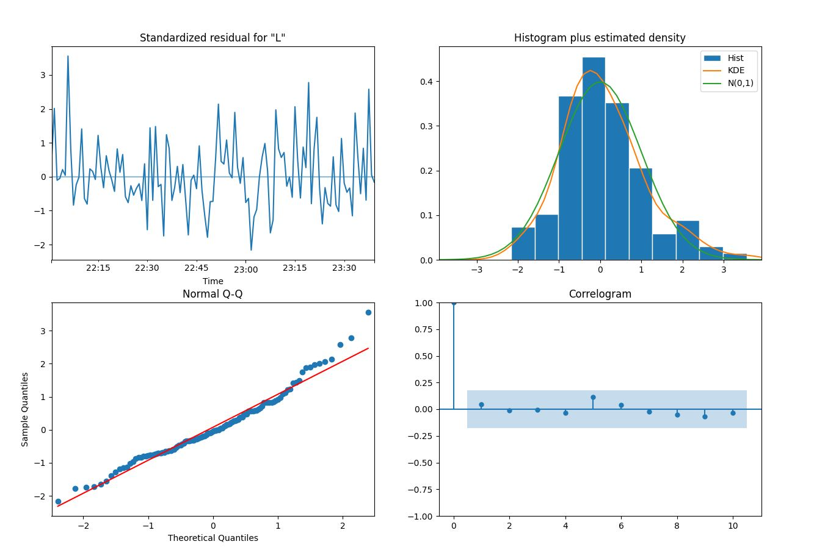

## Анализ результатов диагностики

- **Тест Льюинга–Бокса**: p = 0.3558 > 0.05  
  Подтверждает отсутствие значимой автокорреляции в остатках.

- **ARCH-LM тест**: p = 0.4866 > 0.05  
  Свидетельствует об отсутствии гетероскедастичности.

- **Тест Харке–Бера**: p < 0.05  
  Показывает отклонение остатков от нормального распределения, что типично для реальных данных сетевого трафика с импульсными нагрузками.

1. График стандартизированных остатков (Standardized residual)
   Остатки колеблются вокруг нулевой линии без явного тренда или систематических отклонений. Амплитуда колебаний примерно постоянна во времени, что свидетельствует об отсутствии гетероскедастичности и подтверждает стационарность остаточного процесса.
2. Гистограмма остатков с оценкой плотности (Histogram plus estimated density)
   Гистограмма остатков имеет колоколообразную форму, близкую к нормальному распределению. Наложенная кривая ядерной оценки плотности (KDE) и теоретическая кривая нормального распределения N(0,1) хорошо совпадают с эмпирическими данными, хотя наблюдается небольшое отклонение в хвостах. Это согласуется с результатом теста Харке–Бера (p < 0.05), указывающим на незначительное отклонение от нормальности, типичное для реальных сетевых данных.
3. Q-Q график (Normal Q-Q)
   Точки на графике в целом лежат близко к красной прямой линии, соответствующей теоретическим квантилям нормального распределения. Небольшие отклонения наблюдаются в крайних хвостах, что подтверждает лёгкую тяжёлость хвостов распределения остатков, но не критично для адекватности модели.
4. Коррелограмма (Correlogram, ACF остатков)
   Все значения автокорреляционной функции остатков лежат внутри доверительного интервала (синяя область), а коэффициенты близки к нулю уже на первом лаге. Это указывает на отсутствие значимой автокорреляции в остатках и подтверждает результат теста Льюинга–Бокса (p = 0.3558 > 0.05).

Общий вывод:
Модель ARIMA(2,0,1) является адекватной для описания динамики агрегированного трафика Интернета вещей на выбранном сегменте. Остатки представляют собой белый шум (отсутствие автокорреляции и гетероскедастичности), что позволяет использовать модель для краткосрочного прогнозирования. Небольшое отклонение от нормальности остатков характерно для реального сетевого трафика и не снижает практической ценности модели.

## Вывод:

В ходе выполнения практической работы был проведён комплексный анализ трафика Интернета вещей на основе реальных данных, полученных с помощью программы Wireshark.

1. Проведена фильтрация пакетов по MAC-адресам IoT-устройств и построено распределение межпакетных интервалов.
2. Эмпирическое распределение успешно аппроксимировано смешанной моделью, включающей распределения Парето, экспоненциальное и два гамма-распределения. Полученные метрики качества аппроксимации (RMSE = 0.0426, RMST = 0.0185) свидетельствуют о высокой точности предложенной модели.
3. Оценка параметра Хёрста дисперсионным методом дала значение H ≈ 0.64, что указывает на наличие долгосрочной положительной корреляции (персистентности) в трафике, характерной для самоподобных процессов.
4. R/S-анализ подтвердил сложную структуру ряда.
5. Для прогнозирования агрегированного трафика (по 50-секундным интервалам) построены модели ARIMA. На выбранном сегменте наилучшей по критерию AIC оказалась модель ARIMA(2,0,1). Диагностика остатков показала отсутствие автокорреляции и гетероскедастичности, хотя распределение остатков незначительно отклоняется от нормального, что типично для реального сетевого трафика.
6. Средняя абсолютная процентная ошибка прогноза (MAPE) составила 13%, что свидетельствует об удовлетворительной до хорошей точности краткосрочного прогнозирования.
7. Полученные результаты подтверждают сложный характер трафика Интернета вещей (самоподобие, тяжёлые хвосты распределения интервалов, нестационарность) и демонстрируют эффективность параметрических методов (смешанных распределений и ARIMA) для его моделирования и прогнозирования.

## Приложение: Код на Python

```python
import itertools  # Добавьте в начало скрипта, если нет
from itertools import product
import itertools
import json
import math as mt
import pickle as pk
import time

import matplotlib.pyplot as plt
import numpy as np
import pandas as pd
from scipy import stats

from statsmodels.graphics.tsaplots import plot_acf, plot_pacf
from statsmodels.stats.diagnostic import acorr_ljungbox, het_arch, normal_ad
from statsmodels.tsa.arima.model import ARIMA
from statsmodels.tsa.stattools import adfuller


# x - значение переменной времени
# lmd - параметр распределения (частота событий)
def exp_rasp(x, lmd):
    return 1 - np.exp(-lmd*x)


# Функция для расчёта накопленного распределения
def RMST_sp(data):
    s = 0
    sp = []
    for i in data:
        s += i
        sp.append(s)
    return sp


# Параметры Гамма-распределения
A1 = 3
B1 = 0.02
# среднее значение гамма-распределения
A1_B1 = A1 * B1

# Загрузка данных
data = pd.read_csv("data.csv", encoding="cp1251")

# Удаление ненужных столбцов
column = data.columns.to_list()
column = [i for i in column if i != 'Time' and i != 'Length' and i != 'No.']
for i in range(4):
    del data[column[i]]


# Столб1 - левая граница каждого интервала: 0, 0.03, 0.06 …
# Столб2 - правая граница: 0.03, 0.06, 0.09 …
distance = 0.03
data["Столб1"] = [i*distance for i in range(0, len(data))]
x = 0
data["Столб2"] = [distance + i*distance for i in range(len(data))]


# Подсчёт количества значений времени, попадающих в каждый интервал
times = data['Time'].values
bins = np.append(data["Столб1"].values, data["Столб2"].values[-1])  # границы
# сколько событий попадает в каждый интервал:
counts, _ = np.histogram(times, bins=bins)

# Обрезаем таблицу, чтобы количество строк совпадало с количеством интервалов.
data = data.iloc[:len(counts)]
data["Количество"] = counts  # добавляем столбец с количеством


sr = data['Time'].mean()  # среднее время
dataH = data["Time"]  # копия временного ряда для Хёрста
#################
data = data.truncate(after=16)  # Обрезка таблицы (для упрощения вычислений)

count = data['Количество'].values
sm = sum(count)
P = [i/sm for i in count]  # вероятность попадания в интервал
# кол-во событий в интервале​ / общее кол-во событий
data["P_i"] = P

lmd = 1/sr
# Экспоненциальное распределение для каждого интервала
# вероятность того, что событие произойдёт именно в этом интервале времени
data["exp.rasp"] = exp_rasp(data['Столб2'], lmd) - \
    exp_rasp(data['Столб1'], lmd)

# Второе гамма-распределение
A2 = 11
B2 = 0.021

data["gamma1"] = stats.gamma.cdf(
    data['Столб2'], a=A1, scale=B1) - stats.gamma.cdf(data['Столб1'], a=A1, scale=B1)
data["gamma2"] = stats.gamma.cdf(
    data['Столб2'], a=A2, scale=B2) - stats.gamma.cdf(data['Столб1'], a=A2, scale=B2)

# Парето распределение
k = 1.2
a = 0.01

# Вероятность того, что событие произойдёт до правой границы интервала -
# - вероятность, что событие произойдёт до левой границы интервала.
data["pareto"] = (1 - (a/data['Столб2'])**k) - (1 - (a/(data['Столб1']))**k)
x1 = a
data['pareto'][0] = 1 - (a/data['Столб2'][0])**k


# Смешанное распределение
K1, K2, K3, K4 = 0.66, 0.015, 0.0011, 0.3239
# print(K1 + K2 + K3 + K4)  # должно быть 1

# Суммарное распределение для каждого интервала
data['sum'] = K1*data['pareto'] + K2*data["exp.rasp"] + \
    K3*data['gamma1'] + K4*data['gamma2']


# --------------------------------------------------------------


'''
RMSE - ошибка на уровне отдельных интервалов.
RMST - ошибка на уровне накопленных вероятностей (кумулятивная ошибка).
'''

# RMSE - оценка ошибки. Корень из среднего квадратичного отклонения
RMSE = sum((((data['P_i'] - data['sum'])**2)/20)**(1/2))
print("RMSE:", RMSE)

# RMST - накопленные вероятности
data["P_C"] = RMST_sp(data['P_i'].values)  # Обращаемся к функции RMST_sp
data["sum_c"] = RMST_sp(data['sum'].values)

# RMST показывает, насколько хорошо модель описывает
# кумулятивное распределение, а не отдельные интервалы
RMST = sum((((data["P_C"] - data['sum_c'])**2)/20))**(1/2)
print("RMST:", RMST)

'''
Параметр Хёрста
'''

dataH = pd.read_csv("logDifference.csv", index_col=0)  # [:1_048_540]

total_rows = len(dataH)
print(f"Всего строк в logDifference: {total_rows}")

# Хотим примерно 20 сегментов
num_segments = 20
segment_size = total_rows // num_segments   # целочисленное деление
print(
    f"Размер каждого сегмента: {segment_size} (сегментов будет ~{num_segments})")

# Разбиваем на 20 сегментов
sp20 = []
k = 0
for i in range(segment_size, total_rows, segment_size):
    sp20.append(dataH.iloc[k:i])
    k = i
print(sp20)

if k < total_rows:
    sp20.append(dataH.iloc[k:])

print(f"Реально создано сегментов: {len(sp20)}")

MO = []
V = []
for segment in sp20:
    if len(segment) > 1:  # защита от слишком маленького остатка
        MO.append(segment["log_dif"].mean())
        V.append(segment["log_dif"].var())

miniTable = pd.DataFrame({
    "N": list(range(1, len(MO) + 1)),
    "M.O": MO,
    "V": V
})

# Средние значения MO и V
srMO = miniTable["M.O"].mean()  # среднее МО
srV = miniTable["V"].mean()  # средняя дисперсия
stdV = np.var(miniTable['V'])**(1/2)  # стандартное отклонение дисперсий
stdMO = np.var(miniTable['M.O'])**(1/2)  # стандартное отклонение МО

# относительное отклонение (%), показывает вариативность блоков
percentMO = stdMO/srMO * 100  # процент отклонения МО
percentV = stdV/srV * 100  # процент отклонения V

print(f"срМО: {abs(srMO)} || срV: {srV * 10}")
print(f"MO% {abs(percentMO)}%  || V%  {percentV * 10}%")


# Разбиваем временной ряд на сегменты разной длины
sp = [[] for _ in range(6)]
segment_sizes = [4, 8, 16, 32, 64, 128]

for j, segment_size in enumerate(segment_sizes):
    for i in range(0, len(dataH), segment_size):
        segment = dataH[i:i + segment_size]
        sp[j].append(segment)

# Вычисляем дисперсии для каждого сегмента
disp = [[], [], [], [], [], []]
for i in range(len(sp)):
    for j in sp[i]:
        disp[i].append(np.var(j))

# Вычисляем дисперсию дисперсий для каждого размера сегмента
variance_of_variances = []
for i in range(len(disp)):
    var_of_vars = np.var(disp[i])
    variance_of_variances.append(var_of_vars)

# m - размер сегмента
# var - дисперсия дисперсий для этого размера
# log(m) и log(var) - логарифмы для линейной регрессии, чтобы оценить Хёрст.
experiment = pd.DataFrame({
    "m": segment_sizes,
    "var": variance_of_variances,
    "log(m)": np.log(segment_sizes),
    "log(var)": np.log(variance_of_variances)
})
print(experiment)


# График для оценки Хёрста (log(var) против log(m))

# Позволяет визуально оценить тренд, который используется
# для расчёта H (Хёрста) через наклон линии регрессии.
plt.figure(figsize=(10, 6))
plt.scatter(experiment['log(m)'], experiment['log(var)'],
            color='blue', s=50, label='Данные')

'''Линейная регрессия'''
# берём (log(var), log(m)) из таблицы experiment
# slope - наклон прямой (ключевая величина);
# intercept - свободный член;
# r_value² - качество аппроксимации
slope, intercept, r_value, p_value, std_err = stats.linregress(
    experiment['log(m)'], experiment['log(var)'])
trend_line = slope * experiment['log(m)'] + intercept

print(f"Herst:{1 - abs(slope)/2}")

# Трендовая линия
plt.plot(experiment['log(m)'], trend_line, color='red', linewidth=2,
         label=f'Тренд: y = {slope:.3f}x + {intercept:.3f}\nR² = {r_value**2:.4f}')
plt.legend()
plt.grid(True)
plt.show()

# Распределения и аппроксимации
plt.figure(figsize=(9, 5))
plt.bar(data['Столб2'], data['P_i'], alpha=0.7, width=0.005, label="P_i")
plt.plot(data['Столб2'], data['gamma1'], label="gamma1", color="green")
plt.plot(data['Столб2'], data['gamma2'], label="gamma2", color="red")
plt.plot(data['Столб2'], data['exp.rasp'], label="exp", color="yellow")
plt.plot(data['Столб2'], data['pareto'], label="pareto")
plt.legend()
plt.grid(True)
plt.show()

# суммарная модель распределения
plt.figure(figsize=(9, 5))
# Реальная
plt.bar(data['Столб2'], data['P_i'], alpha=0.7, width=0.005, label="P_i")
# аппроксимация эмпирического распределения
plt.plot(data['Столб2'], data['sum'])
plt.show()

# график математического ожидания и дисперсии
plt.figure(figsize=(9, 5))
plt.plot(miniTable["N"], miniTable['M.O'], label="MO")
plt.plot(miniTable['N'], miniTable['V'], label="V", color="red")  # Для хайпа
plt.legend()
plt.show()

'''RS-анализ для Хёрста'''

'''
R/S-анализ — это метод оценки наличия долговременной памяти во временном ряду,
основанный на анализе того, как нормированный размах накопленных отклонений
растёт с увеличением длины интервала наблюдений.
'''

# разные размеры блоков
rs_block_sizes = [500, 1000, 2000, 3000]

RS_mean = []
RS_std = []
RS_R = []
RS_RS = []

for block in rs_block_sizes:
    RS_values = []
    mean_values = []
    std_values = []
    R_values = []

    # идём по блокам
    for i in range(0, len(dataH), block):
        segment = dataH[i:i + block]
        if len(segment) < block:  # Отбрасываем последний кусок, если неполный
            continue

        # Подготовка данных
        X = np.array(segment, dtype=float)  # текущий сегмент
        mean_X = X.mean()  # математическое ожидание
        std_X = X.std()  # стандартное отклонение

        # центрирование (Каждое значение смещается относительно среднего)
        Y = X - mean_X
        # накопленное отклонение
        Z = np.cumsum(Y)
        # размах (амплитуда колебаний накопленного процесса)
        R = Z.max() - Z.min()

        # Нормирование R/S
        if std_X != 0:
            RS = R / std_X
        else:
            RS = np.nan

        # Сохранение значений для текущего сегмента
        RS_values.append(RS)
        mean_values.append(mean_X)
        std_values.append(std_X)
        R_values.append(R)

    # средние значения по всем сегментам блока
    avg_mean = np.mean(mean_values)
    avg_std = np.mean(std_values)
    avg_R = np.mean(R_values)
    avg_RS = np.mean(RS_values)

    # Cохранение результата
    RS_mean.append(avg_mean)
    RS_std.append(avg_std)
    RS_R.append(avg_R)
    RS_RS.append(avg_RS)

# таблица
RS_detailed = pd.DataFrame({
    "block": rs_block_sizes,  # размер блока
    "mean": RS_mean,  # среднее МО
    "std": RS_std,  # среднее отклонение
    "R": RS_R,  # средний размах
    "R/S": RS_RS  # главная величина RS-анализа
})

print("\nПодробная таблица RS-анализа:")
print(RS_detailed)


# логарифмическая регрессия (Таблица для вычисления параметра Хёрста)
RS_table = pd.DataFrame({
    "block": rs_block_sizes,  # размер блока
    "RS": RS_RS,  # R/S
    "log(block)": np.log(rs_block_sizes),  # логарифм размера блока
    "log(RS)": np.log(RS_RS)  # логарифм R/S
})

# slope_RS — наклон прямой
# intercept_RS — сдвиг
# r_value_RS² — качество аппроксимации

slope_RS, intercept_RS, r_value_RS, _, _ = stats.linregress(
    RS_table["log(block)"], RS_table["log(RS)"])

H_RS = slope_RS  # параметр Хёрста равен наклону прямой

print("\nТаблица для Хёрста (RS):")
print(RS_table)
print(f"\nH (RS-анализ) = {H_RS}")

# график RS
plt.figure(figsize=(8, 5))
plt.scatter(RS_table["log(block)"], RS_table["log(RS)"], s=60, label="Данные")

# линия тренда
trend_line_RS = slope_RS * RS_table["log(block)"] + intercept_RS
plt.plot(
    RS_table["log(block)"],
    trend_line_RS,
    linewidth=2,
    label=f"Тренд: y = {slope_RS:.3f}x + {intercept_RS:.3f}\nR² = {r_value_RS**2:.4f}"
)

plt.grid(True)
plt.xlabel("log(block)")
plt.ylabel("log(R/S)")
plt.title("RS-анализ")
plt.legend()
plt.show()

```

```python
import math as mt
import time
import json
import pickle as pk
import itertools

import pandas as pd
import numpy as np
import matplotlib.pyplot as plt
from scipy import stats

from statsmodels.tsa.stattools import adfuller
from statsmodels.graphics.tsaplots import plot_acf, plot_pacf
from statsmodels.stats.diagnostic import acorr_ljungbox, het_arch, normal_ad
from statsmodels.tsa.arima.model import ARIMA


d1 = pd.read_csv("data_1.csv", delimiter=',', encoding="cp1251")
d1['Time'] = pd.to_datetime(d1['Time'])
d1 = d1.set_index('Time')

del d1["Source"]
del d1["Destination"]
del d1["Protocol"]
del d1["Info"]
del d1["No."]

d2 = d1.resample('50s').mean()  # агрегация
print(len(d2))

d2.interpolate(inplace=True)  # если NaN

# Полный график агрегированного трафика (как на рисунке 1 в методичке)
plt.figure(figsize=(14, 7))  # большой размер для отчёта
plt.plot(d2.index, d2['Length'], color='blue', linewidth=1)
plt.title('Динамика среднего размера пакетов IoT-трафика (агрегация по 50 секундам)')
plt.xlabel('Время')
plt.ylabel('Средняя длина пакета (байты)')
plt.grid(True, alpha=0.3)
plt.tight_layout()
plt.show()

d3 = d2
# print(adfuller(d3))
# Можно проверить стационарность
# временного ряда с помощью теста Дики-Фуллера
k = 0

# Вывод всех окошек для отбора вручную самых интересных
# for i in range(120, len(d2["Length"]), 120):
#     print(k, i)
#     d3 = d2[k:i]
#     plt.figure(figsize=(12, 5))
#     plt.plot(d3.index, d3['Length'])
#     plt.title("Length")
#     plt.xlabel("Time")
#     plt.ylabel("Packet Length")
#     plt.grid(True)
#     plt.show()
#     print(len(d2['Length'])*0.07)
#     k = i

# print("====================================")

# Список окошек
sp = [(0, 120), (120, 240), (240, 360), (360, 480), (480, 600),
      (600, 720), (720, 840), (840, 960), (960, 1080), (1080, 1200)]
'''aicDict = {f"{i} {j}": [] for i, j in sp}

for x, y in sp:
    # plot_acf(d2.Length[x:y]) #– график АКФ
    # plot_acf(d2.Length[x:y].diff().dropna())
    # plt.show()
    # plot_pacf(d2.Length[x:y]) #– график ЧАКФ
    # plot_pacf(d2.Length[x:y].diff().dropna())
    # plt.show()

    # Проверка на стационарность тест Дики-Фуллера
    # Берём разности .diff() временного ряда, чтобы убрать тренд
    # Если p-value < 0.05 → ряд стационарен, можно строить ARIMA.
    # Иначе сегмент пропускается (continue).
    if adfuller(d2.Length[x:y].diff().dropna())[1] < 0.05:
        print("p:", adfuller(d2.Length[x:y].diff().dropna())[1])
        # plot_acf(d2.Length[x:y].diff().dropna())
        # plot_pacf(d2.Length[x:y].diff().dropna())
        # plt.show()
    else:
        print("Не стационарен")
        continue

    # Подбор параметров p,d,q для ARIMA
    p = range(0, 5)  # порядок авторегрессии (AR)
    d = range(0, 3)  # порядок интегрирования (разностей)
    q = range(0, 5)  # порядок скользящей средней (MA)
    pdq = list(itertools.product(p, d, q))  # все комбинации p,d,q
    best_pdq = (0, 0, 0)
    best_aic = np.inf
    for params in pdq:
        # Создание и обучение модели ARIMA
        model_test = ARIMA(d2.iloc[x:y], order=params)
        try:
            result_test = model_test.fit()  # обучение модели
        except:
            continue  # Если при обучении модель падает
        if result_test.aic < best_aic:  # сравнение AIC
            best_pdq = params
            best_aic = result_test.aic
            # print(best_pdq, best_aic)
            aicDict[f"{x} {y}"].append((best_pdq, best_aic))

'''
# ВОТ ЭТО МОЖНО РАСКОМЕНТИТЬ ОДИН РАЗ ЗАПУСТИТЬ
# НАДОЛГО ОНО СОХРАНИТЬСЯ И ВЕСЬ ЦИКЛ СВЕРХУ БОЛЬШЕ НЕ НУЖЕН
# with open("data.json", "w", encoding="UTF-8") as file:
#     json.dump(aicDict, file, indent=4)

print("!====================================!")

# ДЛЯ ЧТЕНИЯ AICDICT чтобы много раз не запускать алгоритм отбора
# где куча циклов наверху
with open("data.json", "r", encoding="UTF-8") as file:
    aicDict = json.load(file)

# print(aicDict)

# Список: ARIMA модель, параметры, сегмент, обученная модель
'''spArima = []
for i in aicDict:
    param = min(aicDict[i], key=lambda x: x[1])[0]  # параметры с мин AIC
    pmodel = ARIMA(d2.iloc[int(i.split()[0]):int(
        i.split()[1])], order=(param[0], param[1], param[2]))  # модель

    stats_mdl = pmodel.fit()  # обучение модели
    # print(int(i.split()[0]),int(i.split()[1]))
    # print(stats_mdl.summary()) # ВЫВОД В консоль таблиц

    # Для записи в файл таблиц!
    # with open("TABELS.txt", "a", encoding="UTF-8") as file:
    #     file.write('\n' + str(i))
    #     file.write(str(stats_mdl.summary()))
    #     file.write("\n")
    #     file.write("+"*100)

    # В spArima сохраняем:
    # объект модели ARIMA (pmodel)
    # её параметры (param)
    # сегмент (i)
    # обученную модель (stats_mdl)
    # Это позволяет потом:
    # делать прогнозы
    # строить графики
    # сохранять результаты в файл
    spArima.append((pmodel, param, i, stats_mdl))
    print("====================================")

print(spArima)

with open("data.pkl", "wb") as file:
    pk.dump(spArima, file)
'''
with open("data.pkl", "rb") as file:
    spArima = pk.load(file)

spisok = ["360 480"]
# Создаем общий график
plt.figure(figsize=(12, 6))

# Создаем словарь цветов для разных участков
colors = ['red', 'blue', 'green']
color_dict = {spisok[i]: colors[i] for i in range(len(spisok))}


mape = []
ser = []
ARIMAs = []
ARIMEmodels = []
# Для каждой модели в spArima
for model, param, indx, fitted_model in spArima:
    if indx in spisok:
        # Данные для прогноза
        data = d2.iloc[int(indx.split()[0]):int(indx.split()[1])]

        # Прогноз на 50 точек
        forecast = fitted_model.predict(start=0, end=len(data["Length"]))

        # График
        plt.figure(figsize=(12, 6))
        x_point = list(range(0, len(data["Length"])))[::5]
        print(x_point)
        print(forecast[::5])
        # Прогноз ARIMA с шагом 5
        plt.plot(x_point, data["Length"][::5],
                 linewidth=2, markersize=8, label=f'ARIMA{param} (шаг={5})')
        perem = forecast[::5]
        plt.plot(x_point, perem[:-1])
        # # Настройки
        # plt.title(f'ARIMA прогноз (каждая {step}-я точка)\nУчасток {indx}')
        # plt.xlabel('Индекс')
        # plt.ylabel('Значение')
        # plt.legend()
        # plt.grid(True, alpha=0.3)
        plt.show()

        forecast = np.array(forecast[::5])[:-1]
        data = np.array(data["Length"][::5])
        ARIMAs.append(f"ARIMA{param}")
        ARIMEmodels.append(fitted_model)
        # MAPE
        # средняя абсолютная ошибка в процентах:
        # показывает, насколько прогноз в среднем отклоняется от реальных данных.
        mape.append(100*np.mean(np.abs((data - forecast)/data)))

        # SER
        # отношение мощности сигнала к мощности ошибки
        # (чем выше, тем лучше прогноз)
        ser.append(10 * np.log10(np.sum(data**2) /
                   np.sum((data - forecast)**2)))
        break

print(mape)
# ГРАФИКИ MAPE и SER
fig, (ax1, ax2) = plt.subplots(1, 2, figsize=(10, 6))
ax1.bar(ARIMAs, mape, width=0.1)
ax1.set_title("MAPE")
ax2.bar(ARIMAs, ser, width=0.1)
ax2.set_title("SER")
plt.show()

print(ARIMEmodels)
ARIMA_beautiful = ARIMEmodels[0]

# ВЫВОД формулы


def arima_equation(res):
    """
    Функция которая выводит модель Аримы в виде формулы
    """
    orders = res.model_orders

    # берем p, d, q
    p = orders.get("ar", 0)
    d = orders.get("diff", orders.get("integrated", 0))
    q = orders.get("ma", 0)

    ar = res.arparams
    ma = res.maparams

    parts = []

    # AR terms --- как прошлые разности влияют на текущую
    for i in range(p):
        parts.append(f"{ar[i]:.4f}·Δ^{d}Y_(t-{i+1})")  # Δ^d Y_(t-i)

    # noise term --- шум
    parts.append("ε_t")

    # MA terms --- как прошлые ошибки влияют на текущую
    for i in range(q):
        sign = "+" if ma[i] >= 0 else ""
        parts.append(f"{sign}{ma[i]:.4f}·ε_(t-{i+1})")  # ε_(t-i)

    return f"Δ^{d} Y_t = " + " + ".join(parts)  # формула


print(arima_equation(ARIMA_beautiful))  # вывод формулы


# ОСТАТКИ
def residual_diagnostics(res, lags=10):
    """
    Функция которая считает табличку статистики.
    lags - это лаги, они нужны чтобы точнее определить автокорреляцию
    """
    resid = res.resid  # остатки модели

    # Ljung–Box тест (автокорреляция)
    # Получаем DataFrame
    lb = acorr_ljungbox(resid, lags=[lags], return_df=True)
    lb_stat = lb['lb_stat'].iloc[0]  # статистика
    # p-значение если < 0.05 → остатки коррелированы
    lb_p = lb['lb_pvalue'].iloc[0]

    # Jarque–Bera (нормальность)
    jb_stat, jb_p = normal_ad(resid)  # более точный Anderson-Darling тест

    # ARCH-LM (гетероскедастичность)
    # проверяет, зависит ли дисперсия остатков от их прошлых значений
    # Если p-значение < 0.05 → гетероскедастичность присутствует
    arch_stat, arch_p, _, _ = het_arch(resid)

    # AIC модели
    # чем меньше AIC, тем лучше модель (Критерий Акаике.)
    aic = res.aic

    # Формируем таблицу
    df = pd.DataFrame({
        "Метрика": [
            "Тест Льюинга–Бокса",
            "Тест Харке–Бера",
            "ARCH-LM тест остатков",
            "AIC"
        ],
        "Статистика": [
            round(lb_stat, 4),
            round(jb_stat, 4),
            round(arch_stat, 4),
            round(aic, 4)
        ],
        "p-значение": [
            round(lb_p, 4),
            round(jb_p, 4),
            round(arch_p, 4),
            None
        ]
    })

    return df

# Histogram + KDE — распределение остатков.
# QQ-plot — проверка нормальности.
# Standardized residuals — остатки по времени.
# ACF of residuals — автокорреляция остатков.


df = residual_diagnostics(ARIMA_beautiful, lags=1)
print(df)


# ГРАФИКИ

ARIMA_beautiful.plot_diagnostics(figsize=(15, 10))
plt.show()

```

```python
import pandas as pd
import numpy as np

dataH = pd.read_csv("dataTime.csv")
dataH['Time'][0] = 0.00001  # чтобы не было логарифма от нуля

# Вычисление логарифмической разности
data = pd.DataFrame(
    {"log_dif": np.log(dataH['Time']) - np.log(dataH['Time'].shift(-1))})

# Удаление NaN значений, если есть
data = data.dropna()
data.to_csv("logDifference.csv")
print(len(data))

```
