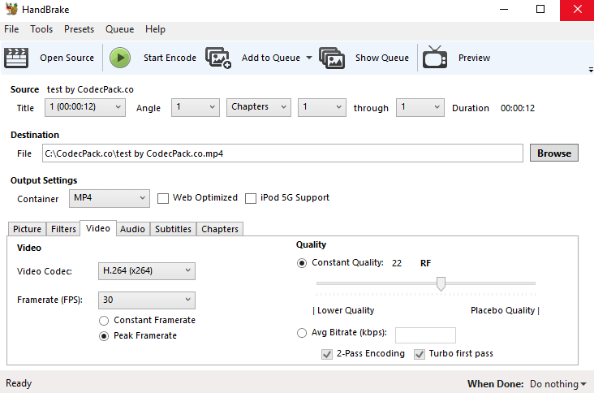
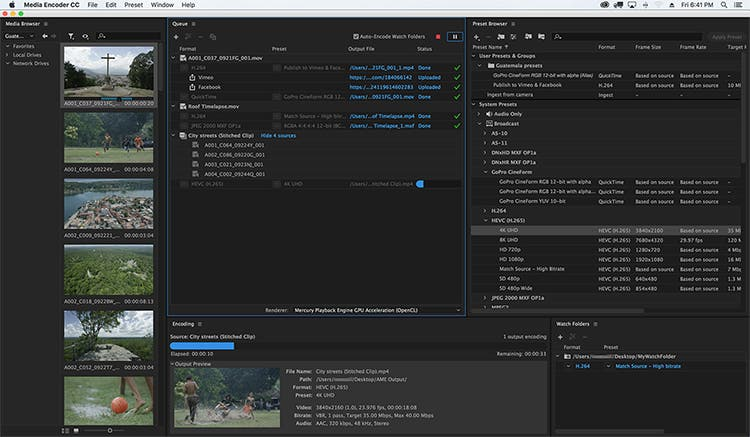
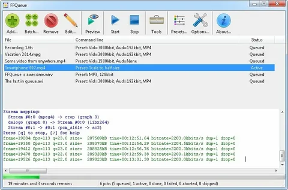
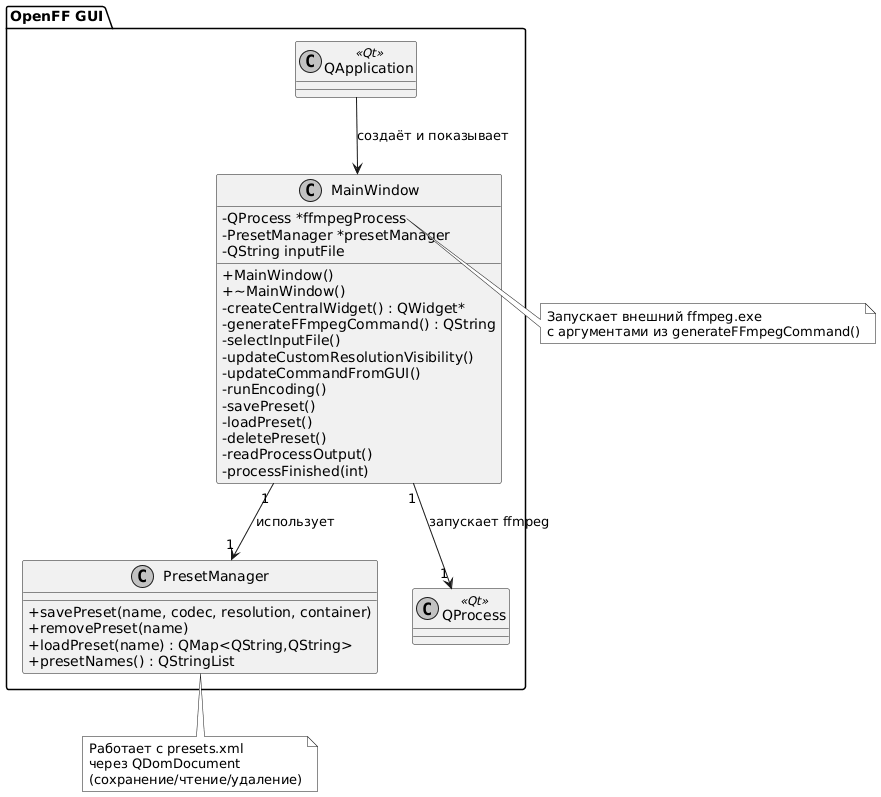
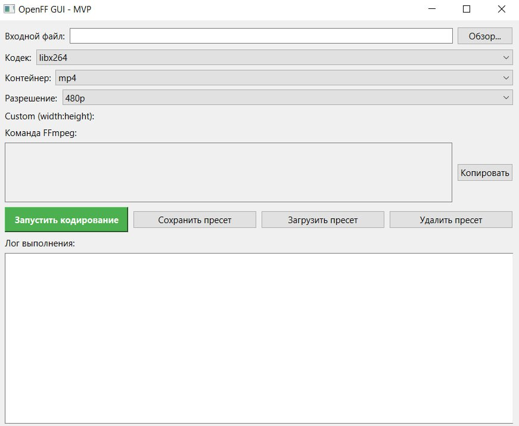

<style>
  @page {
    size: A4;
    margin: 2cm 1.5cm 3cm 1.5cm;
  }

  /* Титульный лист — без номера */
  @page title {
    @bottom-center { content: none; }
  }

  /* Все остальные страницы — обычная нумерация, начинаем с 1 */
  @page normal {
    @bottom-center {
      content: counter(page);
      font-size: 10pt;
      color: #333;
    }
  }

  /* Применяем нужные типы страниц */
  .title-page { 
    page: title; 
    page-break-after: always;   /* после титульника — разрыв */
  }
  .content { 
    page: normal; 
    counter-reset: page 1;      /* нумерация начинается с 1 именно здесь */
  }
</style>

<!-- 1. ТИТУЛЬНЫЙ ЛИСТ -->
<div class="title-page">

<div style="text-align: center;">

### МИНИСТЕРСТВО ЦИФРОВОГО РАЗВИТИЯ, СВЯЗИ И МАССОВЫХ КОММУНИКАЦИЙ РОССИЙСКОЙ ФЕДЕРАЦИИ  
### ФЕДЕРАЛЬНОЕ ГОСУДАРСТВЕННОЕ БЮДЖЕТНОЕ ОБРАЗОВАТЕЛЬНОЕ УЧРЕЖДЕНИЕ ВЫСШЕГО ОБРАЗОВАНИЯ  
#### «САНКТ-ПЕТЕРБУРГСКИЙ ГОСУДАРСТВЕННЫЙ УНИВЕРСИТЕТ ТЕЛЕКОММУНИКАЦИЙ ИМ. ПРОФ. М.А. БОНЧ-БРУЕВИЧА» (СПбГУТ)

---

**КАФЕДРА ПРОГРАММНОЙ ИНЖЕНЕРИИ И ВЫЧИСЛИТЕЛЬНОЙ ТЕХНИКИ**

---

**Дисциплина:** «Объектно-ориентированное программирование»

**Курсовая работа**  
**Вариант: OpenFF GUI - графическая оболочка для FFmpeg**

</div>

---

<div style="text-align: right;">

**Выполнил:**  
Студент группы ИКПИ-42  
Терещенко М. А.  

**Подпись** ______________

**Принял:**  
Старший преподаватель кафедры ПИиВТ  
Петрова О. Б.  

**Подпись** ______________

</div>

---

</div>

<div class="content">

## Оглавление

- [Оглавление](#оглавление)
- [1. Постановка задачи](#1-постановка-задачи)
- [2. Анализ задачи](#2-анализ-задачи)
- [3. Обзор аналогов](#3-обзор-аналогов)
- [4. Анализ инструментов](#4-анализ-инструментов)
- [5. Описание программы](#5-описание-программы)
- [6. Структура программы](#6-структура-программы)
- [7. Разработка класса PresetManager](#7-разработка-класса-presetmanager)
  - [Функционал:](#функционал)
- [8. Разработка класса MainWindow](#8-разработка-класса-mainwindow)
- [9. Прочие классы и модули](#9-прочие-классы-и-модули)
- [10. Разработка интерфейса пользователя](#10-разработка-интерфейса-пользователя)
  - [Главное окно](#главное-окно)
  - [Особенности UI](#особенности-ui)
- [11. Тестирование](#11-тестирование)
- [12. Взаимодействие программы с пользователем](#12-взаимодействие-программы-с-пользователем)
- [13. Руководство пользователю](#13-руководство-пользователю)
  - [13.1. Запуск приложения](#131-запуск-приложения)
  - [13.2. Выбор входного файла](#132-выбор-входного-файла)
  - [13.3. Настройка параметров и генерация команды](#133-настройка-параметров-и-генерация-команды)
  - [13.4. Запуск кодирования](#134-запуск-кодирования)
  - [13.5. Работа с пресетами](#135-работа-с-пресетами)
- [14. Заключение](#14-заключение)
  - [Что удалось реализовать](#что-удалось-реализовать)
  - [Что не удалось реализовать](#что-не-удалось-реализовать)
  - [Получен опыт](#получен-опыт)
- [15. Глоссарий](#15-глоссарий)
- [16. Приложение](#16-приложение)


---

## 1. Постановка задачи

Необходимо разработать графическую оболочку **OpenFF GUI** для работы с утилитой **FFmpeg** [1] на языке C++ и фреймворке Qt 6.  

**Основные требования**:

1. Выбор видеофайла.  
2. Настройка параметров перекодировки:  
   - **Кодек** [2] (`libx264`, `libx265`).  
   - **Контейнер** [3] (`mp4`, `mkv`).  
   - **Разрешение** [4] (`480p`, `720p`, `1080p`, `custom`).  
3. Генерация и отображение команды FFmpeg.  
4. Запуск FFmpeg через `QProcess`[5] с выводом логов в реальном времени.  
5. Сохранение/загрузка/удаление пресетов[6] в формате XML[7].  

**Технологический стек:**  
- C++17.
- Qt 6 (Widgets).  
- `QProcess` для вызова `ffmpeg`.  
- `QDomDocument` для работы с XML-пресетами. 
- Сборка через **qmake**. 

---


## 2. Анализ задачи

Требуется реализовать **два основных модуля**:

1. **Логика генерации команды** и взаимодействия с `ffmpeg`.  
2. **Система пресетов XML**. 

Ключевые сложности, с которыми столкнулся во время выполнения работы:  
- Корректное формирование уникального имени выходного файла.  
- Обработка кастомного разрешения.  
- Асинхронный вывод логов из `stdout`/`stderr`.   

---

## 3. Обзор аналогов

Существует множество графических оболочек для FFmpeg. Рассмотрим наиболее популярные аналоги:

- **HandBrake**: Бесплатный открытый инструмент для перекодировки видео, использующий FFmpeg под капотом. Поддерживает множество пресетов. Но интерфейс перегружен опциями, что может быть неприятно для пользователей.

{width=600}


- **Adobe Media Encoder**: Профессиональный инструмент от Adobe для кодирования медиафайлов. Интегрируется с другими продуктами Adobe, поддерживает FFmpeg-совместимые кодеки. Минусы: платный (требует подписки), сложный для простых задач, ориентирован на профессионалов.

{width=600}

- **FFQueue**: Бесплатная GUI с поддержкой очередей задач, пресетов и визуализацией прогресса. Хорошо подходит для автоматизации, но имеет устаревший интерфейс

{width=600}

<br><br><br>

**Преимущества приложения OpenFF GUI по сравнению с аналогами**:  
- **Простота и минимализм**: Интерфейс основан только на ключевых параметрах (кодек, контейнер, разрешение), без лишних опций, только самое необходимое. 

- **Кастомизация под заказчика**: Приложение разработано под конкретные нужды заказчика, с акцентом на генерацию команд FFmpeg и работу с пресетами в XML-формате. В отличие от универсальных инструментов вроде Adobe Media Encoder, программа адаптирована под индивидуальные требования.  

- **Кроссплатформенность и открытость**: Построено на Qt 6, работает на Windows и Linux. Бесплатное и открытое, в отличие от платных решений вроде Adobe.  

- **Уникальность**: Система пресетов с XML позволяет легко делиться настройками между пользователями, а генерация команд в реальном времени повышают удобство перекодирования.

OpenFF GUI выделяется своей ориентированностью на простые, но эффективные задачи перекодировки, с учетом специфики заказчика, что делает его более подходящим для определённых сценариев использования. 

---


## 4. Анализ инструментов

| Инструмент | Назначение |
|------------|----------|
| **Qt 6 Widgets** | Создание кроссплатформенного GUI |
| **QProcess** | Запуск внешних программ (`ffmpeg`) |
| **QDomDocument** | Чтение/запись XML-пресетов |
| **QFileDialog** | Выбор файлов |
| **QMessageBox** | Уведомления пользователя |
| **QInputDialog** | Ввод имени пресета |
| **qmake** | Сборка проекта |

Использование **Qt 6** упрощает кроссплатформенность (Windows, Linux).  

---


## 5. Описание программы

Программа **OpenFF GUI** - графическая оболочка для FFmpeg.  

После запуска открывается главное окно с:  
- Полем выбора входного файла.  
- Выпадающими списками параметров.  
- Отображением сгенерированной команды.  
- Кнопками управления.  
- Логом выполнения.  

Программа **требует установки FFmpeg** и его размещения рядом с исполняемым файлом. Версия FFmpeg может быть любой, по выбору пользователя. 

---

## 6. Структура программы
OpenFF_GUI/
├── OpenFF_GUI.pro
├── main.cpp
├── mainwindow.h
├── mainwindow.cpp
├── presetmanager.h
├── presetmanager.cpp
├── ffmpeg.exe
└── presets.xml (генерируется при сохранении)

| Файл | Описание |
|------|--------|
| `main.cpp` | Точка входа, запуск `QApplication` и `MainWindow` |
| `mainwindow.h/.cpp` | Основное окно, GUI, логика, `QProcess` |
| `presetmanager.h/.cpp` | Управление пресетами (XML) |

{width=1100}

---

## 7. Разработка класса `PresetManager`

```cpp
class PresetManager : public QObject {
    Q_OBJECT
public:
    void savePreset(const QString &name, const QString &codec,
                    const QString &resolution, const QString &container);
    void removePreset(const QString &name);
    QMap<QString, QString> loadPreset(const QString &name) const;
    QStringList presetNames() const;
};
```


### Функционал:

- Сохранение пресета в presets.xml.
- Перезапись при совпадении имени.
- Удаление пресета.
- Загрузка по имени.
- Список всех имён.

Формат XML:
```xml
<presets>
  <preset name="HD x264">
    <codec>libx264</codec>
    <resolution>1080p</resolution>
    <container>mp4</container>
  </preset>
</presets>
```

### 8. Разработка класса MainWindow

```cpp
class MainWindow : public QMainWindow {
    Q_OBJECT
private:
    QProcess *ffmpegProcess;
    PresetManager *presetManager;
    // UI-элементы...
private slots:
    void selectInputFile();
    void updateCustomResolutionVisibility();
    void updateCommandFromGUI();
    void runEncoding();
    void savePreset();
    void loadPreset();
    void deletePreset();
    void readProcessOutput();
    void processFinished(int exitCode);
};
```
<br>

Класс **MainWindow** является основным окном приложения и управляет всем пользовательским интерфейсом, логикой генерации команд, взаимодействием с FFmpeg и пресетами. В конструкторе инициализируются `QProcess` для запуска FFmpeg и `PresetManager` для работы с пресетами.

<br><br>

<br><br><br><br><br><br><br><br><br>

**Таблица методов класса MainWindow:**

| Метод                               | Краткое описание |
|-------------------------------------|------------------|
| `selectInputFile()`                 | Открывает диалог выбора входного файла |
| `updateCustomResolutionVisibility()`| Показывает/скрывает поле кастомного разрешения |
| `updateCommandFromGUI()`            | Пересчитывает и отображает команду FFmpeg |
| `generateFFmpegCommand()`           | Формирует команду FFmpeg с уникальным именем выходного файла |
| `runEncoding()`                     | Запускает FFmpeg через QProcess, блокирует UI |
| `savePreset()`                      | Сохраняет текущие настройки как пресет (XML) |
| `loadPreset()`                      | Загружает выбранный пресет и применяет к интерфейсу |
| `deletePreset()`                    | Удаляет выбранный пресет после подтверждения |
| `readProcessOutput()`               | Читает stdout/stderr процесса и выводит в лог |
| `processFinished(int exitCode)`     | Разблокирует кнопку, выводит результат выполнения |

<br><br><br><br><br><br><br><br><br>

**Работа QProcess**

Пайп - это механизм, позволяющий одной программе писать данные, а другой сразу их читать без промежуточных файлов. То есть данные передаются напрямую.

`QProcess` использует системный вызов `CreateProcessW()`. Перед запуском создаются анонимные пайпы (pipes) - интерфейсы для обмена данными между процессами: один для `stdout`, второй для `stderr`. 

Процесс запускается в приостановленном состоянии, дескрипторы пайпов дублируются в дочерний процесс, после чего выполняется `ResumeThread()`. Чтение из пайпов осуществляется в отдельном внутреннем потоке Qt через `QWinEventNotifier`.  

Благодаря этому:
- сигналы `readyReadStandardOutput` и `readyReadStandardError` срабатывают сразу при появлении новых данных от FFmpeg;
- лог выводится в интерфейс в реальном времени;
- основной поток GUI остаётся полностью отзывчивым даже при длительном кодировании.

Таким образом, использование пайпов и асинхронной архитектуры `QProcess` обеспечивает живую трансляцию вывода FFmpeg и отсутствие зависаний приложения.


<br><br><br><br><br>

## 9. Прочие классы и модули

- **QApplication** - управление жизненным циклом приложения.
- **QFileDialog**, **QMessageBox**, **QInputDialog** - диалоги для взаимодействия с пользователем.
- **QClipboard** - класс для копирования команды в буфер обмена.
- **presets.xml** - XML-файл, который хранится в директории приложения и используется для сохранения и загрузки пресетов.

---

## 10. Разработка интерфейса пользователя

### Вид программы:




### Особенности UI:

- Поле для кастомного разрешения (ширина:высота) отображается только при выборе режима **custom**.
- Команда FFmpeg обновляется в реальном времени при изменении параметров.
- Кнопка «Запустить кодирование» блокируется в процессе кодирования, чтобы предотвратить повторный запуск, который может привести к непредсказуемым последствиям. 

---

## 11. Тестирование

Для обеспечения качества программы были применены следующие способы тестирования:

- **Ручное тестирование интерфейса**: Выбор файлов, изменение параметров, генерация команд.
- **Функциональное тестирование**: Запуск кодирования на различных видеофайлах (.mp4, .mkv, .avi) с разными параметрами (кодеки, контейнеры, разрешения). Проверка корректности сгенерированных команд и уникальности имен выходных файлов.
- **Тестирование пресетов**: Сохранение, загрузка и удаление пресетов. Проверка перезаписи существующих пресетов, обработка пустого списка пресетов.
- **Интеграционное тестирование**: Проверка взаимодействия с QProcess - асинхронный вывод логов, обработка успешного/ошибочного завершения.
- **Тестирование производительности**: Кодирование больших файлов для проверки блокировки UI и реального времени обновления логов.

Тестирование проводилось несколько раз, с исправлением багов (например, исправлена проблема с пробелами в путях файлов). Все ключевые сценарии выполняются, ошибок в финальной версии не выявлено.

---

<br><br><br><br><br><br><br><br><br>

## 12. Взаимодействие программы с пользователем

Программа взаимодействует с пользователем через графический интерфейс, построенный на Qt Widgets. Основные принципы:

- **Интуитивность**: Все элементы управления (кнопки, комбо-боксы, поля ввода) размещены логично: сверху - выбор файла и параметры, в центре - команда и кнопки, снизу - лог.
- **Обратная связь**: При изменении параметров команда обновляется мгновенно. Во время кодирования кнопка блокируется, логи выводятся в реальном времени.
- **Обработка ошибок**: Диалоговые окна (QMessageBox) информируют о проблемах (например, "Файл не существует" или "Команда неверна"). Подтверждение удаления пресетов предотвращает случайные действия.
- **Доступность**: Поддержка копирования команды в буфер. Интерфейс отзывчивый, без задержек.
- **Безопасность**: Пресеты хранятся локально в XML. Программа не подключена к интернету.

Это обеспечивает удобное и безопасное взаимодействие.

---

<br><br><br><br><br><br><br><br><br><br>

## 13. Руководство пользователю

### 13.1. Запуск приложения

1. Убедитесь, что **ffmpeg** доступен в системном PATH или находится рядом с исполняемым файлом.
2. Запустите **OpenFF_GUI.exe**
3. Откроется главное окно.

### 13.2. Выбор входного файла

1. Нажмите на кнопку **Обзор...**.
2. Выберите файл с расширением **.mp4**, **.mkv** или **.avi**.

### 13.3. Настройка параметров и генерация команды

1. Выберите нужный **кодек**, **контейнер** и **разрешение**.
2. При выборе **custom** введите значения для ширины и высоты в поле **width:height**.
3. Команда FFmpeg обновляется автоматически.
4. Для копирования команды нажмите кнопку **Копировать**.

### 13.4. Запуск кодирования

1. Нажмите кнопку **Запустить кодирование**.
2. Кнопка будет заблокирована, пока процесс кодирования не завершится.
3. Лог будет обновляться в реальном времени.
4. По завершении кодирования отобразится сообщение об успехе или ошибке.

### 13.5. Работа с пресетами

| Действие    | Как выполнить                                            |
|-------------|---------------------------------------------------------|
| **Сохранить** | Нажмите **Сохранить пресет** и введите имя пресета.     |
| **Загрузить** | Нажмите **Загрузить пресет** и выберите из списка.     |
| **Удалить**   | Нажмите **Удалить пресет**, выберите пресет и подтвердите удаление. |

---

## 14. Заключение

Разработана графическая оболочка **OpenFF GUI** для **FFmpeg**, полностью соответствующая техническому заданию.

### Что удалось реализовать:

- Выбор входного файла, настройка параметров, генерация команды.
- Запуск FFmpeg с логированием в реальном времени.
- Система пресетов в формате XML (сохранение, загрузка, удаление).
- Удобный и отзывчивый интерфейс пользователя.
- Обработка ошибок.

### Что не удалось реализовать:

- Устранить ложные срабатывания антивирусов Windows Defender и Kaspersky при работе с приложением на компьютере стороннего пользователя. 
- Поддержка пакетной обработки нескольких файлов одновременно.
- Автоматическое скачивание FFmpeg на устройство пользователя.


### Получен опыт:

- Работа с **QProcess** для взаимодействия с внешними программами.
- Использование **QDomDocument** для работы с XML.
- Разработка кроссплатформенного GUI с помощью **Qt**.
- Тестирование и отладка объектно-ориентированных приложений.

---

<br><br><br><br><br><br><br><br><br>

### 15. Глоссарий

**FFmpeg** [1] – бесплатная кроссплатформенная консольная утилита для обработки и преобразования мультимедийных файлов (кодирование, декодирование, транскодирование [8], фильтрация и др.).

**Кодек** [2] – алгоритм сжатия и восстановления видеопотока (например, libx264 – H.264, libx265 – H.265). Определяет степень сжатия и качество изображения.

**Контейнер** [3] – формат мультимедийного файла, содержащий видео-, аудиопотоки и субтитры (например, MP4, MKV). Определяет совместимость с проигрывателями.

**Разрешение** [4] – размеры кадра видео в пикселях (например, 1920×1080 – Full HD, 1080p). В программе реализованы предустановки 480p, 720p, 1080p и пользовательское значение.

**QProcess** [5] – класс фреймворка Qt, обеспечивающий асинхронный запуск внешних программ, перенаправление потоков ввода-вывода и получение кода завершения.

**Пресет** [6] – набор предопределённых параметров перекодировки (кодек, разрешение, контейнер), сохранённый в XML-файле для быстрого повторного использования.

**XML** [7] – расширяемый язык разметки (eXtensible Markup Language), используемый в приложении для хранения и обмена пресетами.

**Транскодирование** [8] – процесс преобразования видеофайла из одного формата или кодека в другой, обычно с изменением параметров (разрешения, битрейта, контейнера).


---

<br><br><br><br><br><br><br><br>

## 16. Приложение

### Код программы:
<br><br>

OpenFF_GUI.pro:
```
QT += core gui widgets xml

CONFIG += c++17

TARGET = OpenFF_GUI
TEMPLATE = app

SOURCES += \
    main.cpp \
    mainwindow.cpp \
    presetmanager.cpp

HEADERS += \
    mainwindow.h \
    presetmanager.h

```


Presetmanager.h:

```cpp
#ifndef PRESETMANAGER_H
#define PRESETMANAGER_H

#include <QObject>
#include <QMap>

class PresetManager : public QObject {
    Q_OBJECT
public:
    explicit PresetManager(QObject *parent = nullptr);
    void savePreset(const QString &name, const QString &codec,
                    const QString &resolution, const QString &container);
    void removePreset(const QString &name);
    QMap<QString, QString> loadPreset(const QString &name) const;
    QStringList presetNames() const;
};

#endif // PRESETMANAGER_H

```


Mainwindow.h:
```cpp
#ifndef MAINWINDOW_H
#define MAINWINDOW_H

#include <QMainWindow>
#include <QProcess>
#include <QLineEdit>
#include <QComboBox>
#include <QTextEdit>
#include <QPushButton>
#include <QLabel>
#include <QVBoxLayout>
#include <QHBoxLayout>
#include <QClipboard>
#include <QGuiApplication>
#include <QMenu>
#include <QCursor>

class PresetManager; // Forward declaration

class MainWindow : public QMainWindow
{
    Q_OBJECT

public:
    explicit MainWindow(QWidget *parent = nullptr);
    ~MainWindow();

private slots:
    void selectInputFile();
    void updateCustomResolutionVisibility();
    void updateCommandFromGUI();


    void runEncoding();
    void savePreset();
    void loadPreset();
    void deletePreset();
    void readProcessOutput();
    void processFinished(int exitCode);

private:
    // === UI ===
    QLineEdit *inputFileEdit;
    QComboBox *codecCombo;
    QComboBox *containerCombo;
    QComboBox *resolutionCombo;
    QLineEdit *customResolutionEdit;
    QTextEdit *commandDisplay;
    QTextEdit *logDisplay;
    QPushButton *runButton;
    QPushButton *savePresetButton;
    QPushButton *loadPresetButton;
    QPushButton *deletePresetButton;

    // === Логика ===
    QProcess *ffmpegProcess;
    PresetManager *presetManager;
    QString inputFile;

    // === Методы ===
    QWidget* createCentralWidget();
    QString generateFFmpegCommand() const;
};

#endif // MAINWINDOW_H

```


Main.cpp:
```cpp
#include "mainwindow.h"
#include <QApplication>

int main(int argc, char *argv[]) {
    QApplication a(argc, argv);
    MainWindow w;
    w.show();
    return a.exec();
}
```


Mainwindow.cpp:
```cpp
#include "mainwindow.h"
#include "presetmanager.h"

#include <QFileDialog>
#include <QMessageBox>
#include <QInputDialog>
#include <QFileInfo>
#include <QClipboard>
#include <QGuiApplication>
#include <QRegularExpression>

MainWindow::MainWindow(QWidget *parent)
    : QMainWindow(parent)
    , ffmpegProcess(new QProcess(this))
    , presetManager(new PresetManager(this))
{
    setCentralWidget(createCentralWidget());
    setWindowTitle("OpenFF GUI - MVP");
    resize(700, 550);

    connect(ffmpegProcess, &QProcess::readyReadStandardOutput, this, &MainWindow::readProcessOutput);
    connect(ffmpegProcess, &QProcess::readyReadStandardError, this, &MainWindow::readProcessOutput);
    connect(ffmpegProcess, QOverload<int, QProcess::ExitStatus>::of(&QProcess::finished),
            this, &MainWindow::processFinished);
}

MainWindow::~MainWindow() = default;

QWidget* MainWindow::createCentralWidget() {
    QWidget *central = new QWidget;
    QVBoxLayout *mainLayout = new QVBoxLayout(central);

    // === Файл ===
    QHBoxLayout *fileLayout = new QHBoxLayout;
    QLabel *fileLabel = new QLabel("Входной файл:");
    inputFileEdit = new QLineEdit;
    inputFileEdit->setReadOnly(true);
    QPushButton *browseButton = new QPushButton("Обзор...");
    connect(browseButton, &QPushButton::clicked, this, &MainWindow::selectInputFile);
    fileLayout->addWidget(fileLabel);
    fileLayout->addWidget(inputFileEdit, 1);
    fileLayout->addWidget(browseButton);
    mainLayout->addLayout(fileLayout);

    // === Параметры ===
    auto addParam = [&](const QString &label, QComboBox *&combo, const QStringList &items) {
        QHBoxLayout *layout = new QHBoxLayout;
        QLabel *lbl = new QLabel(label + ":");
        combo = new QComboBox;
        combo->addItems(items);
        layout->addWidget(lbl);
        layout->addWidget(combo, 1);
        mainLayout->addLayout(layout);
    };

    addParam("Кодек", codecCombo, {"libx264", "libx265"});
    addParam("Контейнер", containerCombo, {"mp4", "mkv"});
    addParam("Разрешение", resolutionCombo, {"480p", "720p", "1080p", "custom"});

    // Custom
    QHBoxLayout *customLayout = new QHBoxLayout;
    QLabel *customLabel = new QLabel("Custom (width:height):");
    customResolutionEdit = new QLineEdit;
    customResolutionEdit->setPlaceholderText("1920:1080");
    customResolutionEdit->setVisible(false);
    customLayout->addWidget(customLabel);
    customLayout->addWidget(customResolutionEdit, 1);
    mainLayout->addLayout(customLayout);

    // === Команда ===
    QLabel *cmdLabel = new QLabel("Команда FFmpeg:");
    QHBoxLayout *cmdLayout = new QHBoxLayout;
    commandDisplay = new QTextEdit;
    commandDisplay->setReadOnly(false);
    commandDisplay->setStyleSheet("QTextEdit { background-color: #f0f0f0; font-family: Consolas; }");
    commandDisplay->setMaximumHeight(80);

    QPushButton *copyCmdButton = new QPushButton("Копировать");
    copyCmdButton->setToolTip("Скопировать команду в буфер обмена");
    connect(copyCmdButton, &QPushButton::clicked, this, [this]() {
        QClipboard *clipboard = QGuiApplication::clipboard();
        clipboard->setText(commandDisplay->toPlainText());
        QMessageBox::information(this, "Скопировано", "Команда скопирована в буфер обмена!");
    });

    cmdLayout->addWidget(commandDisplay, 1);
    cmdLayout->addWidget(copyCmdButton);
    mainLayout->addWidget(cmdLabel);
    mainLayout->addLayout(cmdLayout);

    // === Кнопки ===
    QHBoxLayout *buttonLayout = new QHBoxLayout;
    runButton = new QPushButton("Запустить кодирование");
    runButton->setStyleSheet("QPushButton { background-color: #4CAF50; color: white; font-weight: bold; padding: 8px; }");

    savePresetButton = new QPushButton("Сохранить пресет");

    QPushButton *loadPresetButton = new QPushButton("Загрузить пресет");
    connect(loadPresetButton, &QPushButton::clicked, this, &MainWindow::loadPreset);

    QPushButton *deletePresetButton = new QPushButton("Удалить пресет");
    connect(deletePresetButton, &QPushButton::clicked, this, &MainWindow::deletePreset);

    buttonLayout->addWidget(runButton);
    buttonLayout->addWidget(savePresetButton);
    buttonLayout->addWidget(loadPresetButton);
    buttonLayout->addWidget(deletePresetButton);
    mainLayout->addLayout(buttonLayout);

    // === Лог ===
    QLabel *logLabel = new QLabel("Лог выполнения:");
    logDisplay = new QTextEdit;
    logDisplay->setReadOnly(true);
    mainLayout->addWidget(logLabel);
    mainLayout->addWidget(logDisplay, 1);

    // === Сигналы ===
    connect(codecCombo, QOverload<int>::of(&QComboBox::currentIndexChanged), this, &MainWindow::updateCommandFromGUI);
    connect(containerCombo, QOverload<int>::of(&QComboBox::currentIndexChanged), this, &MainWindow::updateCommandFromGUI);
    connect(resolutionCombo, QOverload<int>::of(&QComboBox::currentIndexChanged), this, &MainWindow::updateCommandFromGUI);
    connect(resolutionCombo, QOverload<int>::of(&QComboBox::currentIndexChanged), this, &MainWindow::updateCustomResolutionVisibility);
    connect(customResolutionEdit, &QLineEdit::textChanged, this, &MainWindow::updateCommandFromGUI);

    connect(runButton, &QPushButton::clicked, this, &MainWindow::runEncoding);
    connect(savePresetButton, &QPushButton::clicked, this, &MainWindow::savePreset);

    return central;
}

// === Методы ===

void MainWindow::selectInputFile() {
    inputFile = QFileDialog::getOpenFileName(this, "Выберите видео", "", "Видео (*.mp4 *.mkv *.avi)");
    if (!inputFile.isEmpty()) {
        inputFileEdit->setText(inputFile);
        updateCommandFromGUI();
    }
}

void MainWindow::updateCustomResolutionVisibility() {
    bool isCustom = resolutionCombo->currentText() == "custom";
    customResolutionEdit->setVisible(isCustom);
    if (isCustom && customResolutionEdit->text().isEmpty()) {
        customResolutionEdit->setText("1920:1080");
    }
    updateCommandFromGUI();
}

void MainWindow::updateCommandFromGUI() {
    commandDisplay->setPlainText(generateFFmpegCommand());
}

QString MainWindow::generateFFmpegCommand() const {
    if (inputFile.isEmpty()) return "ffmpeg";

    QString codec = codecCombo->currentText();
    QString container = containerCombo->currentText();
    QString res = resolutionCombo->currentText();

    QString scale;
    if (res == "480p") scale = "scale=854:480";
    else if (res == "720p") scale = "scale=1280:720";
    else if (res == "1080p") scale = "scale=1920:1080";
    else if (res == "custom") {
        QString custom = customResolutionEdit->text().trimmed();
        if (custom.contains(':')) scale = "scale=" + custom;
    }

    QString inputPath = QFileInfo(inputFile).absolutePath();
    QString inputBaseName = QFileInfo(inputFile).completeBaseName();
    QString baseOutput = inputPath + "/" + inputBaseName + "_converted";
    QString outputFile = baseOutput + "." + container;

    // УНИКАЛЬНОЕ ИМЯ БЕЗ ПРОБЕЛОВ И СКОБОК
    int counter = 1;
    QString finalOutput = outputFile;
    while (QFile::exists(finalOutput)) {
        finalOutput = baseOutput + "_" + QString::number(counter) + "." + container;
        counter++;
    }

    QStringList args;
    args << "ffmpeg" << "-i" << inputFile;

    if (!scale.isEmpty() && codec != "copy")
        args << "-vf" << scale;
    if (codec != "copy")
        args << "-c:v" << codec;

    args << finalOutput;

    return args.join(" ");
}

void MainWindow::runEncoding() {

    if (ffmpegProcess->state() != QProcess::NotRunning) {
        QMessageBox::information(this, "Ожидание", "Дождитесь завершения текущего кодирования");
        return;
    }
    // === ГЕНЕРИРУЕМ НОВУЮ КОМАНДУ С УНИКАЛЬНЫМ ИМЕНЕМ ===
    QString newCmd = generateFFmpegCommand();
    commandDisplay->setPlainText(newCmd);

    // === ПАРСИМ КОМАНДУ ===
    QStringList args = newCmd.split(' ', Qt::SkipEmptyParts);
    if (args.isEmpty() || args[0] != "ffmpeg") {
        QMessageBox::warning(this, "Ошибка", "Команда должна начинаться с 'ffmpeg'");
        return;
    }

    args.removeFirst(); // Убираем "ffmpeg"

    // === ПРОВЕРКА ВХОДНОГО ФАЙЛА ===
    int iIdx = args.indexOf("-i");
    if (iIdx == -1 || iIdx + 1 >= args.size()) {
        QMessageBox::warning(this, "Ошибка", "Не указан входной файл после -i");
        return;
    }

    QString inputFile = args[iIdx + 1];
    if (!QFile::exists(inputFile)) {
        QMessageBox::critical(this, "Ошибка", "Файл не существует:\n" + inputFile);
        return;
    }

    logDisplay->clear();
    logDisplay->append("<b>Запуск:</b> " + newCmd.toHtmlEscaped() + "<br>");

    runButton->setEnabled(false);
    // === ЗАПУСК ===
    ffmpegProcess->start("ffmpeg", args);
}

void MainWindow::readProcessOutput() {
    QString out = ffmpegProcess->readAllStandardOutput();
    QString err = ffmpegProcess->readAllStandardError();
    if (!out.isEmpty()) logDisplay->append("<font color='blue'>" + out.trimmed() + "</font>");
    if (!err.isEmpty()) logDisplay->append("<font color='red'>" + err.trimmed() + "</font>");
}

void MainWindow::processFinished(int exitCode) {
    runButton->setEnabled(true);
    logDisplay->append(QString("<br><b>Готово! Код: %1</b>").arg(exitCode));
    if (exitCode == 0)
        logDisplay->append("<font color='green'>Успешно!</font>");
    else
        logDisplay->append("<font color='red'>Ошибка.</font>");
}

void MainWindow::savePreset() {
    bool ok;
    QString name = QInputDialog::getText(this, "Сохранить", "Имя:", QLineEdit::Normal, "default", &ok);
    if (!ok || name.isEmpty()) return;

    presetManager->savePreset(name, codecCombo->currentText(), resolutionCombo->currentText(), containerCombo->currentText());
    QMessageBox::information(this, "OK", "Пресет \"" + name + "\" сохранён");
}

void MainWindow::loadPreset() {
    QStringList names = presetManager->presetNames();
    if (names.isEmpty()) {
        QMessageBox::information(this, "Пресеты", "Нет сохранённых пресетов");
        return;
    }

    bool ok;
    QString selected = QInputDialog::getItem(
        this, "Загрузить пресет", "Выберите пресет:", names, 0, false, &ok
    );

    if (!ok || selected.isEmpty()) return;

    auto preset = presetManager->loadPreset(selected);
    if (preset.isEmpty()) {
        QMessageBox::warning(this, "Ошибка", "Не удалось загрузить пресет");
        return;
    }

    codecCombo->setCurrentText(preset["codec"]);
    resolutionCombo->setCurrentText(preset["resolution"]);
    containerCombo->setCurrentText(preset["container"]);
    updateCustomResolutionVisibility();
    updateCommandFromGUI();

    QMessageBox::information(this, "Успех", "Пресет \"" + selected + "\" загружен");
}

void MainWindow::deletePreset() {
    QStringList names = presetManager->presetNames();
    if (names.isEmpty()) {
        QMessageBox::information(this, "Пресеты", "Нет пресетов для удаления");
        return;
    }

    bool ok;
    QString selected = QInputDialog::getItem(
        this, "Удалить пресет", "Выберите пресет для удаления:", names, 0, false, &ok
    );

    if (!ok || selected.isEmpty()) return;

    int ret = QMessageBox::question(
        this, "Подтверждение",
        "Удалить пресет \"" + selected + "\"?\n\nЭто действие нельзя отменить.",
        QMessageBox::Yes | QMessageBox::No
    );

    if (ret == QMessageBox::Yes) {
        presetManager->removePreset(selected);
        QMessageBox::information(this, "Удалено", "Пресет \"" + selected + "\" удалён");
    }
}
```


Presetmanager.cpp:
```cpp
#include "presetmanager.h"
#include <QDomDocument>
#include <QFile>
#include <QTextStream>
#include <QCoreApplication>
#include <QDir>
#include <QFileInfo>

PresetManager::PresetManager(QObject *parent) : QObject(parent) {}

static QString presetsFilePath() {
    return QCoreApplication::applicationDirPath() + "/presets.xml";
}

void PresetManager::savePreset(const QString &name, const QString &codec,
                               const QString &resolution, const QString &container) {
    QString path = presetsFilePath();
    QDomDocument doc;
    QFile file(path);
    bool exists = file.exists();

    if (exists && file.open(QIODevice::ReadOnly)) {
        doc.setContent(&file);
        file.close();
    }

    QDomElement root = doc.documentElement();
    if (root.isNull()) {
        root = doc.createElement("presets");
        doc.appendChild(root);
    }

    // Удаляем старый
    QDomNodeList nodes = root.elementsByTagName("preset");
    for (int i = 0; i < nodes.count(); ++i) {
        if (nodes.at(i).toElement().attribute("name") == name) {
            root.removeChild(nodes.at(i));
            break;
        }
    }

    // Добавляем новый
    QDomElement preset = doc.createElement("preset");
    preset.setAttribute("name", name);

    auto add = [&](const QString &tag, const QString &value) {
        QDomElement el = doc.createElement(tag);
        el.appendChild(doc.createTextNode(value));
        preset.appendChild(el);
    };

    add("codec", codec);
    add("resolution", resolution);
    add("container", container);
    root.appendChild(preset);

    if (file.open(QIODevice::WriteOnly | QIODevice::Truncate)) {
        QTextStream stream(&file);
        stream << doc.toString(4);
        file.close();
    }
}

QMap<QString, QString> PresetManager::loadPreset(const QString &name) const {
    QMap<QString, QString> result;
    QString path = presetsFilePath();

    QFile file(path);
    if (!file.open(QIODevice::ReadOnly)) return result;

    QDomDocument doc;
    if (!doc.setContent(&file)) {
        file.close();
        return result;
    }
    file.close();

    QDomElement root = doc.documentElement();
    QDomNodeList presets = root.elementsByTagName("preset");
    for (int i = 0; i < presets.count(); ++i) {
        QDomElement el = presets.at(i).toElement();
        if (el.attribute("name") == name) {
            result["codec"] = el.firstChildElement("codec").text();
            result["resolution"] = el.firstChildElement("resolution").text();
            result["container"] = el.firstChildElement("container").text();
            break;
        }
    }
    return result;
}

QStringList PresetManager::presetNames() const {
    QStringList names;
    QString path = presetsFilePath();

    QFile file(path);
    if (!file.open(QIODevice::ReadOnly)) return names;

    QDomDocument doc;
    if (!doc.setContent(&file)) {
        file.close();
        return names;
    }
    file.close();

    QDomElement root = doc.documentElement();
    QDomNodeList presets = root.elementsByTagName("preset");
    for (int i = 0; i < presets.count(); ++i) {
        names << presets.at(i).toElement().attribute("name");
    }
    return names;
}

void PresetManager::removePreset(const QString &name) {
    QString path = presetsFilePath();
    QDomDocument doc;
    QFile file(path);

    if (!file.exists() || !file.open(QIODevice::ReadOnly)) return;
    if (!doc.setContent(&file)) {
        file.close();
        return;
    }
    file.close();

    QDomElement root = doc.documentElement();
    QDomNodeList nodes = root.elementsByTagName("preset");
    for (int i = 0; i < nodes.count(); ++i) {
        QDomElement el = nodes.at(i).toElement();
        if (el.attribute("name") == name) {
            root.removeChild(el);
            break;
        }
    }

    if (file.open(QIODevice::WriteOnly | QIODevice::Truncate)) {
        QTextStream stream(&file);
        stream << doc.toString(4);
        file.close();
    }
}

```


</div>