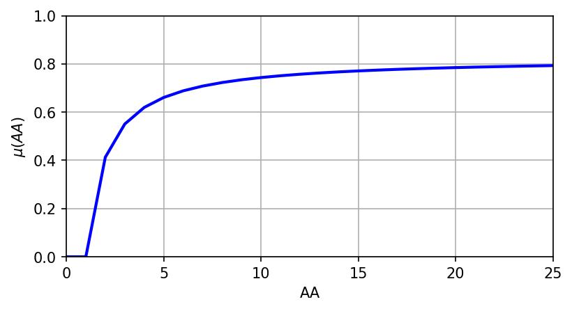
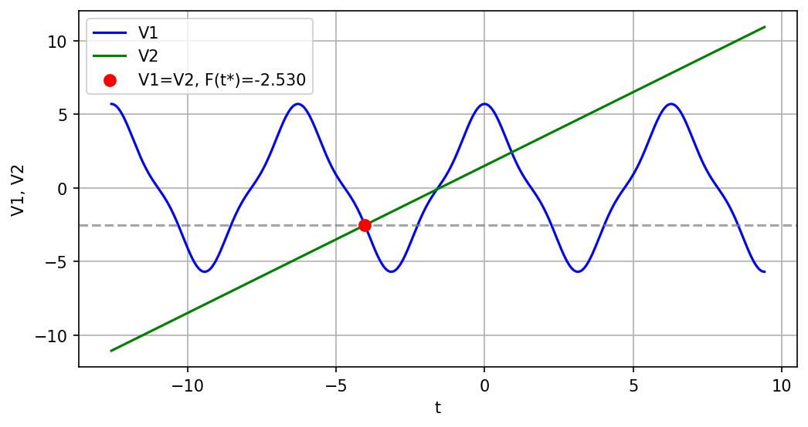

# Лабораторная работа №1

## Ознакомление с системой численных вычислений

**Вариант 7**

### Исходные данные

n = 7

**Матрица A** (5×5):

```
[[16 17 16 21 22]
 [18 15 14 17 16]
 [17 22 17 19 20]
 [16 17 24 18 17]
 [21 22 21 20 14]]
```

**Вектор B** (5×1):

```
[[120]
 [102]
 [138]
 [146]
 [117]]
```

### 1. Получить транспонированные матрицы Aᵀ и Bᵀ

Aᵀ[i,j] = A[j,i]

**Aᵀ**:

```
[[16 18 17 16 21]
 [17 15 22 17 22]
 [16 14 17 24 21]
 [21 17 19 18 20]
 [22 16 20 17 14]]
```

**Bᵀ** (1×5): [120 102 138 146 117]

### 2. Вычислить обратную матрицу A⁻¹ и проверить

A · A⁻¹ = E (единичная матрица)

**A⁻¹** (округлено до 5 знаков):

```
[[-0.16862  0.27240  0.00968  0.01120 -0.07376]
 [-0.05235 -0.10073  0.15176 -0.05036  0.04175]
 [-0.04927 -0.01315 -0.01604  0.11842 -0.02843]
 [ 0.34751 -0.25288 -0.24533 -0.12644  0.24692]
 [-0.08734  0.13068  0.12154  0.06534 -0.19364]]
```

Проверка: A · A⁻¹ ≈ E — верно.

### 3. Проверить матрицу A на ортогональность

Условие ортогональности: Aᵀ · A = E или Aᵀ = A⁻¹

Aᵀ ≠ A⁻¹ → матрица **не ортогональна**.

### 4. Получить вектор нормированных коэффициентов C

C = (Bᵀ − min(Bᵀ)) / (max(Bᵀ) − min(Bᵀ))

min(Bᵀ) = 102, max(Bᵀ) = 146  
C = [0.40909 0.00000 0.81818 1.00000 0.34091]

### 5. Выполнить умножение матриц C·B и B·C

C·B = C × B (строка × столбец) = скаляр  
C·B = 0.40909·120 + 0·102 + 0.81818·138 + 1·146 + 0.34091·117 ≈ **347.886**

B·C = B × C (столбец × строка) = матрица 5×5 ранга 1:

```
[[ 49.09   0.    98.18 120.    40.91]
 [ 41.73   0.    83.45 102.    34.77]
 [ 56.45   0.   112.91 138.    47.05]
 [ 59.73   0.   119.45 146.    49.77]
 [ 47.86   0.    95.73 117.    39.89]]
```

### 6. Найти определители матриц B·C и A

det(A) = 30180  
det(B·C) = 0 (ранг матрицы = 1 < 5)

### 7. Найти главные миноры матрицы A и матрицу алгебраических дополнений

Главные миноры:

- M₁ = -5089
- M₂ = -3040
- M₃ = -484
- M₄ = -3816
- M₅ = -5844

Матрица алгебраических дополнений (A*{ij} = (−1)^{i+j} · M*{ij}):

```
[[-5089. -1580. -1487. 10488. -2636.]
 [ 8221. -3040.  -397. -7632.  3944.]
 [  292.  4580.  -484. -7404.  3668.]
 [  338. -1520.  3574. -3816.  1972.]
 [-2226.  1260.  -858.  7452. -5844.]]
```

### 8. Решить СЛАУ Ax = B методом Гаусса

Решение (метод Гаусса):

```
x ≈ [ 1.89079  1.91716  4.49609 -7.51849  6.50484 ]ᵀ
```

Проверка: A·x − B ≈ [0 0 0 0 0]ᵀ — верно.

### 9. Решить СЛАУ методом обратной матрицы

x = A⁻¹ · B

Результат совпадает с методом Гаусса:

```
x ≈ [ 1.89079  1.91716  4.49609 -7.51849  6.50484 ]ᵀ
```

Проверка: A·x − B ≈ 0 — верно.

### 10. Построить график функции принадлежности μ(AA) на интервале AA ∈ [1, 25]



Значения возрастают от 0 до ≈0.793.

### 11. Графическое решение целевой функции

Для варианта 7: `k = 5`, `w = 1`.

Рассматриваются функции:

- `V1(t) = k·cos(wt) + (n/(n+3))·cos(3wt)` — синусоида;
- `V2(t) = k/2 + wt - 1` — прямая линия;

на интервале `[-4π; 3π]`.

По заданию требуется найти **точку пересечения синусоиды и прямой**:

`V1(t*) = V2(t*)`.

Найденное решение: `t* = -4.0302`.

Значение функции в точке пересечения: `F(t*) = V1(t*) = V2(t*) = -2.5302`.



Рисунок 2. Графики `V1(t)`, `V2(t)` и отмеченная точка их пересечения.
