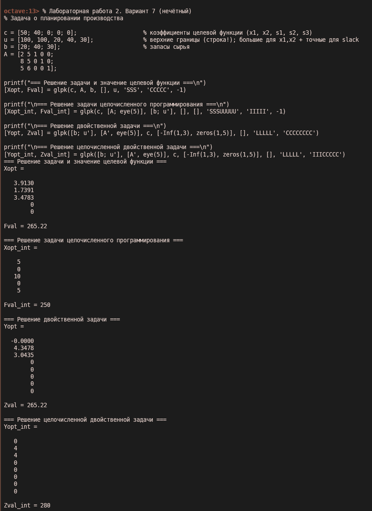

# Лабораторная работа № 2. Вариант 7

**Нахождение целевой функции и оптимального решения симплекс-методом. Решение двойственной задачи.**

## 1. Цель работы

Научиться применять симплекс-метод для нахождения оптимального плана. Сформировать целевую функцию, поставить прямую и двойственную задачи и получить их решения.

---

## 2. Формулировка задания

**Вариант 7**

Для изготовления двух видов продукции **P₁** и **P₂** используют три вида сырья **S₁**, **S₂**, **S₃**. Запасы сырья, нормы расхода на единицу продукции и прибыль от реализации единицы продукции заданы в таблице.

**Исходные данные (таблица 2.3):**

| Вид сырья            | Запас сырья | Единиц сырья на ед. прод. |     |
| -------------------- | ----------- | ------------------------- | --- |
|                      |             | P₁                        | P₂  |
| S₁                   | 20          | 2                         | 5   |
| S₂                   | 40          | 8                         | 5   |
| S₃                   | 30          | 5                         | 6   |
| Прибыль от ед. прод. |             | 50                        | 40  |

**Требуется:** построить математическую модель, направленную на получение максимальной прибыли при реализации продукции, и решить прямую и двойственную задачи.

## Результаты

{width=650}

---

## 3. Анализ полученных результатов и вывод

- Непрерывное решение: оптимальный план $ x_1 \approx 3{,}913 $, $ x_2 \approx 1{,}739 $, максимальная прибыль 265,22 усл. ед.
- Целочисленное решение: оптимальный план $ x_1 = 5 $, $ x_2 = 0 $, прибыль 250 усл. ед.
- Решение двойственной задачи совпадает по значению целевой функции (теорема двойственности), что подтверждает правильность полученного оптимума.
