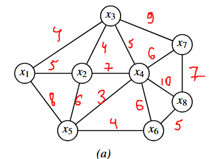

# Лабораторная работа 3  
**Принятие решения по оптимизации размещения узла доступа на сети связи района**

**Вариант 7** (нечётный — график (а))

---

## 3.1. Цель работы

Изучить варианты постановки задач размещения объектов связи, освоить применение критериев оптимальности, решить задачу размещения узла радиодоступа с точки зрения оптимизации расстояний до самых удалённых населённых пунктов (минимаксная задача — центр графа), решить задачу размещения узла проводного (кабельного) доступа с точки зрения оптимизации строительства линейных сооружений (минисуммная задача — медиана графа).

---

## 3.2. Формулировка задания

Согласно номеру варианта 7 (нечётный) используем граф сети населённых пунктов **(а)**.

Количество абонентов (веса узлов) по таблице 3.2:

$$
\mathbf{p} = (60,\ 80,\ 120,\ 90,\ 40,\ 80,\ 110,\ 120)
$$

Расстояния между населёнными пунктами (длины рёбер графа) назначаем самостоятельно в диапазоне **3–15 км**. Граф неориентированный, взвешенный.

**Постановка задач (по формулам (3.1)–(3.2) методички):**

1. **Узел радиодоступа** (минимаксная задача — центр графа):
   $$
   F_i = \max_j d_{ij} \to \min
   $$

2. **Узел проводного/кабельного доступа** (минисуммная задача — медиана графа):
   $$
   F_i = \sum_{j=1}^{8} d_{ij} \cdot p_j \to \min
   $$

---

## 3.3. Аналитическое решение

### 3.3.1. Выбранная структура графа и длины рёбер

Граф (а) для нечётных вариантов содержит 8 вершин. Выбранные рёбра и длины (км):

| Ребро   | Длина, км |
|---------|-----------|
| x1–x2   | 5         |
| x1–x5   | 8         |
| x1–x3   | 4         |
| x2–x3   | 4         |
| x2–x4   | 7         |
| x2–x5   | 6         |
| x3–x4   | 5         |
| x3–x7   | 9         |
| x4–x6   | 6         |
| x4–x8   | 10        |
| x5–x6   | 4         |
| x4–x5   | 3         | 
| x4–x7   | 6         | 
| x6–x8   | 5         |
| x7–x8   | 7         |

### 3.3.2. Матрица кратчайших расстояний \(d_{ij}\)

Матрица строится по рёбрам и длинам из п. 3.3.1 (каждое ребро без направления; вес — длина в км). Кратчайшие расстояния между всеми парами вершин найдены алгоритмом Флойда–Уоршелла.

$$
\begin{array}{c|cccccccc}
 & x_1 & x_2 & x_3 & x_4 & x_5 & x_6 & x_7 & x_8 \\
\hline
x_1 & 0 & 5 & 4 & 9 & 8 & 12 & 13 & 17 \\
x_2 & 5 & 0 & 4 & 7 & 6 & 10 & 13 & 15 \\
x_3 & 4 & 4 & 0 & 5 & 8 & 11 & 9 & 15 \\
x_4 & 9 & 7 & 5 & 0 & 3 & 6 & 6 & 10 \\
x_5 & 8 & 6 & 8 & 3 & 0 & 4 & 9 & 9 \\
x_6 & 12 & 10 & 11 & 6 & 4 & 0 & 12 & 5 \\
x_7 & 13 & 13 & 9 & 6 & 9 & 12 & 0 & 7 \\
x_8 & 17 & 15 & 15 & 10 & 9 & 5 & 7 & 0 \\
\end{array}
$$

### 3.3.3. Решение минимаксной задачи (радиодоступ)

Для каждой возможной точки размещения \(x_i\) находим «худший» по расстоянию пункт — \(\max_j d_{ij}\) (максимум по строке \(i\)):

| Вершина | \(\max_j d_{ij}\), км |
|---------|------------------------|
| x₁ | 17 |
| x₂ | 15 |
| x₃ | 15 |
| x₄ | 10 |
| **x₅** | **9** |
| x₆ | 12 |
| x₇ | 13 |
| x₈ | 17 |

Минимум из этих максимумов: **9 км**, достигается в **x₅**.

**Оптимальное размещение узла радиодоступа — вершина x₅** (центр графа по критерию минимакс).  
Наибольшее расстояние до удалённого абонента в этой точке: **9 км**.

### 3.3.4. Решение минисуммной задачи (кабельный доступ)

Веса \(p_j\) — из п. 3.2: \(\mathbf{p} = (60,\ 80,\ 120,\ 90,\ 40,\ 80,\ 110,\ 120)\). Считаем
\[
F_i = \sum_{j=1}^{8} d_{ij}\, p_j.
\]

| Вершина | \(F_i\) |
|---------|---------|
| x₁ | 6440 |
| x₂ | 5680 |
| x₃ | 5000 |
| **x₄** | **4160** |
| x₅ | 4580 |
| x₆ | 5460 |
| x₇ | 5600 |
| x₈ | 6450 |

**Минимальное значение \(F_{\min} = 4160\)** — в вершине **x₄**.

**Оптимальное размещение кабельного узла доступа — вершина x₄** (медиана графа с весами \(p_j\)).

