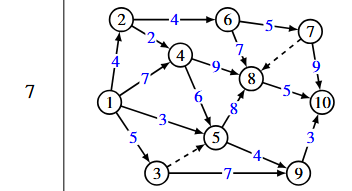

# Лабораторная работа 4  
**Оптимизация работ методом сетевого планирования и управления**

**Вариант 7**

---

## 4.1. Цель работы

Приобретение навыков решения задач и их оптимизации методом сетевого планирования и управления. Определить параметры и найти оптимальное решение технологической задачи по сетевой модели своего варианта.

---

## 4.2. Формулировка задания

**Постановка задачи:**  
- Построить сетевую модель.  
- Вычислить **ранние** и **поздние** сроки наступления событий.  
- Вычислить **полные резервы времени** событий.  
- Найти **критический путь** и **минимальное время выполнения всего комплекса работ**.

---

## 4.3. Аналитическое решение

### 4.3.1. Сетевая модель варианта 7

Граф содержит события 1–10 и следующие работы (длительности в днях):

| Работа (дуга) | Длительность, дни |
|---------------|------------------|
| 1→2           | 4                |
| 1→3           | 5                |
| 2→4           | 2                |
| 1→4           | 7                |
| 1→5           | 3                |
| 3→5           | -                |
| 3→9           | 7                |
| 5→9           | 4                |
| 2→6           | 4                |
| 4→8           | 9                |
| 4→5           | 6                |
| 5→8           | 8                |
| 8→10          | 5                |
| 9→10          | 3                |
| 6→8           | 7                |
| 6→7           | 5                |
| 7→10          | 9                |
| 7→8           | -                |

### 4.3.2. Расчёт временных параметров

Длительности работ взяты из таблицы в п. 4.3.1. Обозначение «**–**» на дугах **3→5** и **7→8** трактуется как **фиктивная работа** (логическая связь) с длительностью **0** суток.

**Ранние сроки** \(t_p(j) = \max_i \bigl[t_p(i) + t(i,j)\bigr]\) (прямой проход, \(t_p(1)=0\)):

- \(t_p(2)=4\), \(t_p(3)=5\), \(t_p(4)=\max(4{+}2,\,7)=7\), \(t_p(5)=\max(3,\,5{+}0,\,7{+}6)=13\),  
  \(t_p(6)=8\), \(t_p(7)=13\), \(t_p(8)=\max(16,\,21,\,15,\,13)=21\),  
  \(t_p(9)=\max(12,\,17)=17\), \(t_p(10)=\max(26,\,20,\,22)=26\).

**Минимальное время комплекса:** \(t_p(10)=\mathbf{26}\) суток.

**Поздние сроки** \(t_n(i) = \min_j \bigl[t_n(j) - t(i,j)\bigr]\), \(t_n(10)=t_p(10)\) (обратный проход):

- \(t_n(9)=23\), \(t_n(8)=21\), \(t_n(7)=17\), \(t_n(6)=12\), \(t_n(5)=13\), \(t_n(4)=7\), \(t_n(3)=13\), \(t_n(2)=5\), \(t_n(1)=0\).

**Полный резерв события:** \(R(j)=t_n(j)-t_p(j)\).

**Сводная таблица:**

| Событие | Ранний срок \(t_p\) | Поздний срок \(t_n\) | Полный резерв \(R\) |
|---------|---------------------|----------------------|---------------------|
| 1 | 0 | 0 | 0 |
| 2 | 4 | 5 | 1 |
| 3 | 5 | 13 | 8 |
| 4 | 7 | 7 | 0 |
| 5 | 13 | 13 | 0 |
| 6 | 8 | 12 | 4 |
| 7 | 13 | 17 | 4 |
| 8 | 21 | 21 | 0 |
| 9 | 17 | 23 | 6 |
| 10 | 26 | 26 | 0 |

**Длина критического пути = 26 суток.**

**Критический путь (события):** **1 → 4 → 5 → 8 → 10**  
**Работы на критическом пути:** 1→4 (7), 4→5 (6), 5→8 (8), 8→10 (5); сумма: \(7+6+8+5=26\).

---

## 4.4. Анализ результатов и вывод

- **Минимальное время выполнения всего комплекса работ** — **26 суток** (длина критического пути).
- Критические события (\(R=0\)): **1, 4, 5, 8, 10**.
- Работы критической цепочки без резерва по времени; задержка любой из них увеличивает срок проекта.
- Некритические события имеют положительный резерв (наибольший у **3** и **9**: 8 и 6 суток) — допускается смещение при наличии ресурсов.

