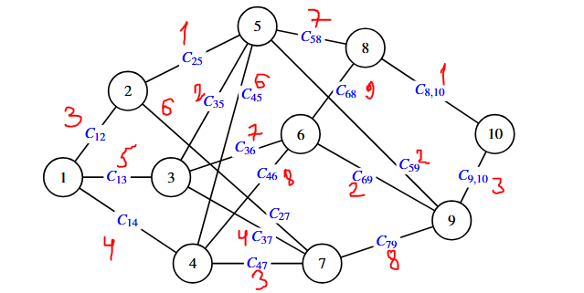

# Лабораторная работа 5  
**Решение задач оптимизации методом динамического программирования**

**Вариант 7**

---

## 5.1. Цель работы

Приобрести навыки постановки и решения задач оптимизации методом динамического программирования.

---

## 5.2. Формулировка задания

Стоимости перевозки единицы груза (тарифы \(c_{ij}\)) для варианта 7:

- \(c_{12}=3\), \(c_{13}=5\), \(c_{14}=4\)
- \(c_{25}=1\), \(c_{27}=6\)
- \(c_{35}=2\), \(c_{36}=7\), \(c_{37}=4\)
- \(c_{45}=6\), \(c_{46}=8\), \(c_{47}=3\)
- \(c_{58}=7\), \(c_{59}=2\)
- \(c_{68}=9\), \(c_{69}=2\)
- \(c_{79}=8\)
- \(c_{8,10}=1\), \(c_{9,10}=3\)

**Постановка задачи:**  
Найти наиболее экономный маршрут доставки груза из пункта 1 в пункт 10 методом динамического программирования (минимизация суммарных затрат).  
Также выписать оптимальные маршруты и минимальные затраты из **всех** остальных пунктов в пункт 10.

Процесс разбит на **4 шага** (этапа):  
| I     | II       | III      | IV     | V      |
|-------|----------|----------|--------|--------|
| 1     | 2,3,4    | 5,6,7    | 8,9    | 10     |

Основное функциональное уравнение:  
\[
F_i(x_{i-1}, u_i) = \min_{u_i} \bigl( z_i(x_{i-1}, u_i) + F_{i+1}(x_i) \bigr), \quad i=1\dots4
\]

---

## 5.3. Аналитическое решение

### 5.3.1. Обратный прогон (условная оптимизация)

**Шаг 4** (\(i=4\)): из {8,9} в 10  
\[
F_4(x_3) = \min_{u_4} z_4(x_3,u_4)
\]

| \(x_3\) | \(u_4\)   | \(z_4\) | \(F_4\) |
|---------|-----------|---------|---------|
| 8       | 8→10      | 1       | **1**   |
| 9       | 9→10      | 3       | **3**   |

**Шаг 3** (\(i=3\)): из {5,6,7} в {8,9}  
\[
F_3(x_2,u_3) = \min_{u_3} \bigl( z_3(x_2,u_3) + F_4(x_3) \bigr)
\]

| \(x_2\) | \(u_3\)     | \(z_3\) | \(F_4\) | \(z_3+F_4\) | \(F_3\) | Оптимальное управление |
|---------|-------------|---------|---------|-------------|---------|------------------------|
| 5       | 5→8         | 7       | 1       | 8           | —       | —                      |
| 5       | 5→9         | 2       | 3       | **5**       | **5**   | 5→9                    |
| 6       | 6→8         | 9       | 1       | 10          | —       | —                      |
| 6       | 6→9         | 2       | 3       | **5**       | **5**   | 6→9                    |
| 7       | 7→9         | 8       | 3       | **11**      | **11**  | 7→9                    |

**Шаг 2** (\(i=2\)): из {2,3,4} в {5,6,7}

| \(x_1\) | \(u_2\)     | \(z_2\) | \(F_3\) | \(z_2+F_3\) | \(F_2\) | Оптимальное управление |
|---------|-------------|---------|---------|-------------|---------|------------------------|
| 2       | 2→5         | 1       | 5       | **6**       | **6**   | 2→5                    |
| 2       | 2→7         | 6       | 11      | 17          | —       | —                      |
| 3       | 3→5         | 2       | 5       | **7**       | **7**   | 3→5                    |
| 3       | 3→6         | 7       | 5       | 12          | —       | —                      |
| 3       | 3→7         | 4       | 11      | 15          | —       | —                      |
| 4       | 4→5         | 6       | 5       | **11**      | **11**  | 4→5                    |
| 4       | 4→6         | 8       | 5       | 13          | —       | —                      |
| 4       | 4→7         | 3       | 11      | 14          | —       | —                      |

**Шаг 1** (\(i=1\)): из 1 в {2,3,4}

| \(x_0\) | \(u_1\)     | \(z_1\) | \(F_2\) | \(z_1+F_2\) | \(F_1\) | Оптимальное управление |
|---------|-------------|---------|---------|-------------|---------|------------------------|
| 1       | 1→2         | 3       | 6       | **9**       | **9**   | 1→2                    |
| 1       | 1→3         | 5       | 7       | 12          | —       | —                      |
| 1       | 1→4         | 4       | 11      | 15          | —       | —                      |

**Минимальные затраты из пункта 1 в пункт 10:** \(F_1 = 9\).

### 5.3.2. Прямой прогон (безусловная оптимизация)

Читаем оптимальные управления от начала к концу:  
**Оптимальный маршрут 1 → 10:** 1 → 2 → 5 → 9 → 10  
Затраты: \(3 + 1 + 2 + 3 = 9\).

### 5.3.3. Оптимальные маршруты из всех пунктов в пункт 10

| Пункт отправления | Оптимальный маршрут          | Минимальные затраты |
|-------------------|------------------------------|---------------------|
| 1                 | 1-2-5-9-10                   | 9                   |
| 2                 | 2-5-9-10                     | 6                   |
| 3                 | 3-5-9-10                     | 7                   |
| 4                 | 4-5-9-10                     | 11                  |
| 5                 | 5-9-10                       | 5                   |
| 6                 | 6-9-10                       | 5                   |
| 7                 | 7-9-10                       | 11                  |
| 8                 | 8-10                         | 1                   |
| 9                 | 9-10                         | 3                   |

---

## 5.4. Анализ результатов и вывод

- Минимальные транспортные затраты из пункта 1 в пункт 10 составляют **9** денежных единиц по маршруту **1-2-5-9-10**.

