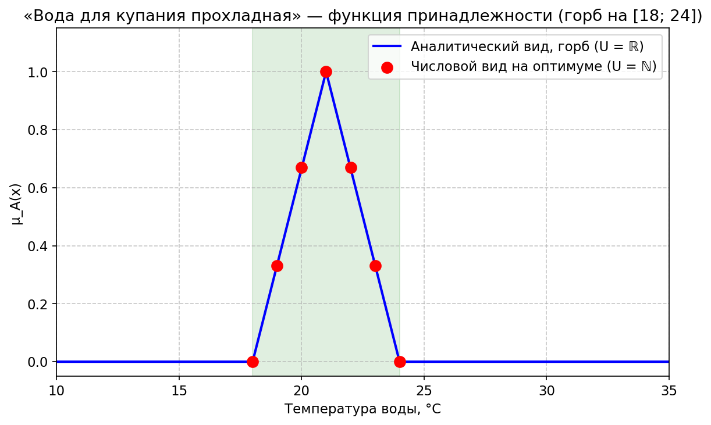

# Отчёт по практической работе 4

## Задание функций принадлежности с использованием известных вариантов

**Вариант 7** — фраза: **«Вода для купания прохладная»**.

---

## 1. Исходные данные

**Исходная фраза:** «Вода для купания прохладная»

---

## 2. Интервал рассмотрения и область допустимых значений

**Интервал рассмотрения (область допустимых значений):** \(X = [0; 45]\) °C.

Температура воды для купания рассматривается на всём заданном диапазоне от 0 °C до 45 °C.

---

## 3. Границы оптимального значения величины

**Границы оптимального значения:** интервал \([18; 24]\) °C.

В этом интервале вода в наибольшей степени соответствует понятию «прохладная»

---

## 4. Формализация в числовом и аналитическом видах

Числовой и аналитический вид задаются **только на оптимуме** \([18; 24]\) °C. 

### 4.1. Задание при \(U = \mathbb{N}\) (числовой, дискретный вид)

Дискретные значения температуры **на интервале оптимума** \([18; 24]\) °C:

Носитель: \(x \in \{18, 19, 20, 21, 22, 23, 24\}\) °C.

\[
A = \frac{0}{18} + \frac{0{,}33}{19} + \frac{0{,}67}{20} + \frac{1}{21} + \frac{0{,}67}{22} + \frac{0{,}33}{23} + \frac{0}{24}.
\]

В общем виде: \(A = \sum_{i=1}^n \frac{\mu_A(x_i)}{x_i}\), где \(x_i \in [18; 24] \cap \mathbb{N}\); \(\mu_A(x)\).

### 4.2. Задание при \(U = \mathbb{R}\) (аналитический вид)

На **интервале оптимума** \([18; 24]\) °C задаётся **треугольная** функция принадлежности (горб): плавный подъём от 0 при 18 до 1 при 21 °C и спад до 0 при 24 °C.

\[
\mu_A(x) =
\begin{cases}
0, & x < 18 \text{ или } x > 24, \\
\frac{x - 18}{3}, & 18 \le x \le 21, \\
\frac{24 - x}{3}, & 21 < x \le 24.
\end{cases}
\]

**Интегральный вид.** С учётом кусочного задания \(\mu_A(x)\):

\[
A = \int_{18}^{24} \frac{\mu_A(x)}{x}\,dx
= \int_{18}^{21} \frac{x - 18}{3x}\,dx + \int_{21}^{24} \frac{24 - x}{3x}\,dx.
\]

---

## 5. Графическое представление

